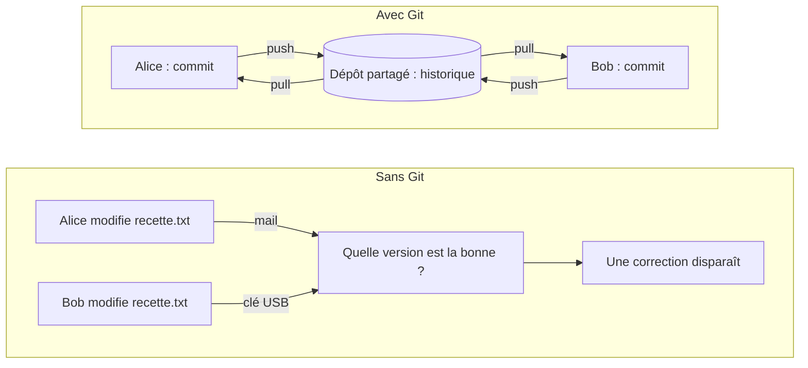
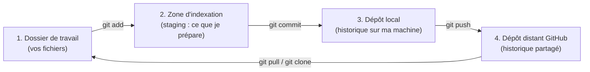
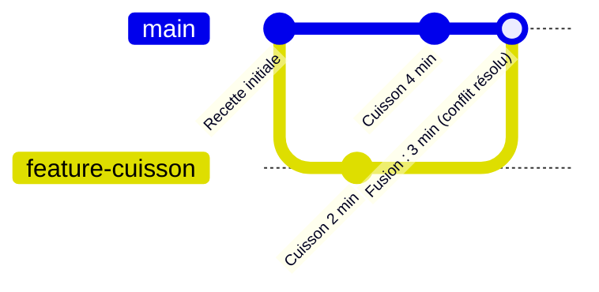
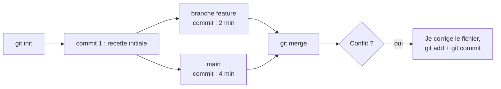
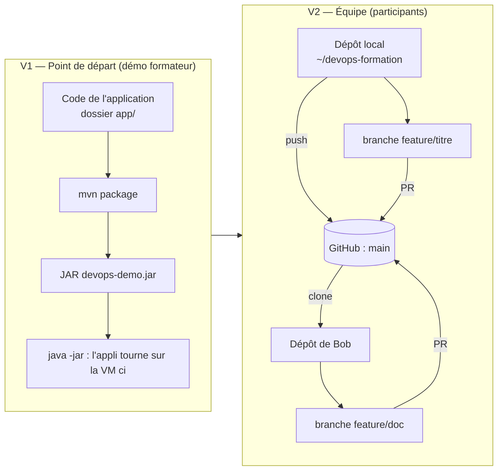
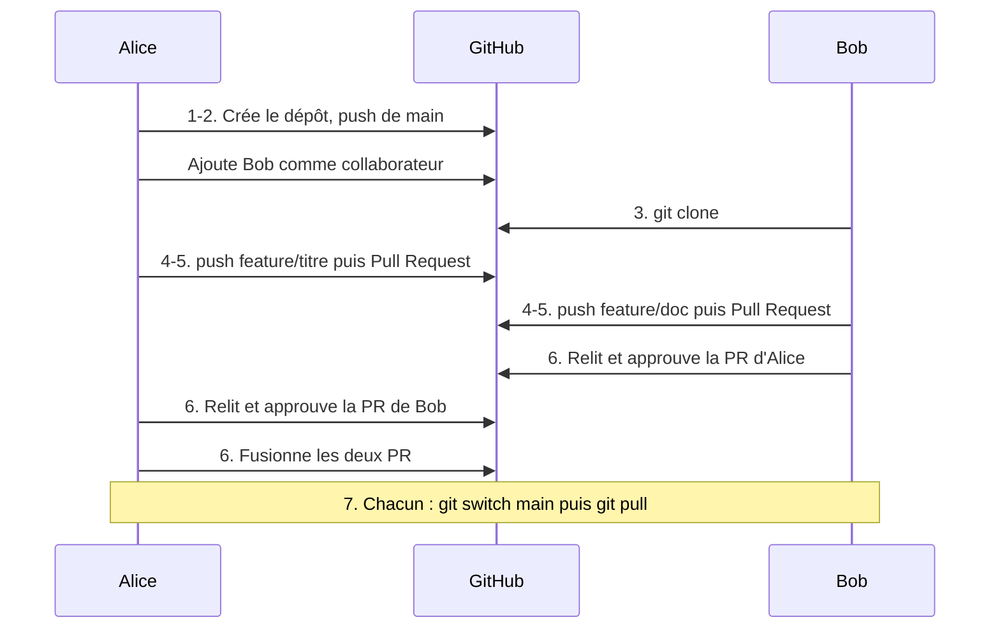

# TP 1 — Git : travailler à plusieurs sans s'écraser (V1 → V2)

**Durée : 90 min** · théorie 10 · activité 10 · mini-TP 25 · fil rouge 35 · validation 10 · **VM** : `ci` · **Format** : binômes

> **Légende** : 🖥️ à taper dans le terminal · 🌐 à faire dans le navigateur · 📝 éditer un fichier · ✅ ce que vous devez voir · ⚠️ si ça ne marche pas · 🎯 livrable (ce que l'outil produit) · 🎤 consigne formateur

---

## 0. Où sommes-nous dans la formation ?


**Rappel du fil rouge** : une petite application Java (« gestionnaire de tâches ») que l'on fait passer, TP après TP, du poste du développeur jusqu'à un serveur supervisé. **Git est le point de départ** : tout le reste (Jenkins, Ansible, Kubernetes) lit son code et sa configuration dans Git.

### Mode d'emploi du terminal (à lire une seule fois, valable pour tous les TP)

| Besoin | Comment faire |
|---|---|
| Ouvrir la VM `ci` | Depuis le dossier du `Vagrantfile` (fourni par le formateur) : `vagrant ssh ci` |
| Savoir sur quelle machine on est | Regardez le début de la ligne : `vagrant@ci:~$` = vous êtes sur `ci` |
| Coller une commande | Clic droit, ou `Ctrl+Maj+V` (pas `Ctrl+V`) |
| Lignes commençant par `#` | Ce sont des **commentaires** : inutile de les recopier |
| Arrêter une commande qui tourne | `Ctrl+C` |
| Rappeler la commande précédente | Flèche ↑ |
| Où suis-je ? / Que contient ce dossier ? | `pwd` / `ls` |
| Changer de dossier | `cd nom-du-dossier` (`cd ..` pour remonter, `cd ~` pour revenir à la maison) |
| Éditer un fichier | `nano fichier` → écrire → `Ctrl+O` puis `Entrée` (enregistrer) → `Ctrl+X` (quitter) |

---

## 1. Objectif pédagogique

À la fin du TP, le participant sait : créer un dépôt, enregistrer des modifications (*commit*), travailler sur une branche, fusionner, résoudre un conflit, puis collaborer via GitHub avec une *Pull Request*. Il comprend **pourquoi** un historique partagé remplace l'envoi de fichiers.

## 2. Prérequis

- Savoir ouvrir un terminal et éditer un fichier texte (voir le mode d'emploi ci-dessus).
- Un **compte GitHub** et un *Personal Access Token* (voir encadré ci-dessous).

> **Créer un Personal Access Token** (c'est le « mot de passe » que Git demandera lors du `push`)
> 🌐 GitHub → photo de profil → **Settings** → **Developer settings** → **Personal access tokens** → **Tokens (classic)** → **Generate new token (classic)** → cochez la case **`repo`** → **Generate token** → **copiez le jeton tout de suite** (il ne sera plus affiché) et gardez-le dans un fichier texte.

---

## 3. Théorie illustrée

### 3.1 Le problème : « un fichier qui circule » contre « un historique partagé »



### 3.2 Les quatre zones de Git (le schéma à savoir dessiner)



> **À retenir** : `add` = « je choisis ce qui entre dans la photo » ; `commit` = « je prends la photo » ; `push` = « j'envoie mes photos à l'équipe ».

### 3.3 Branche, fusion et conflit (ce que vous allez fabriquer au mini-TP)



Un **conflit** survient quand les deux branches ont modifié **la même ligne** : Git ne devine pas, il **pose la question à l'humain**.

### 3.4 Les outils et leur livrable

| Outil | Rôle | 🎯 Livrable |
|---|---|---|
| **Git** (sur la VM) | Enregistre l'historique des modifications | Un dépôt local avec ses *commits* et ses branches |
| **GitHub** | Héberge le dépôt, organise la relecture | Un dépôt partagé + des *Pull Requests* approuvées |
| **Pull Request** | Demande de fusion relue par un collègue | Une branche fusionnée dans `main`, tracée et relue |

---

## 4. Problème réel à résoudre

« Deux développeurs corrigent le même fichier en même temps. L'un envoie sa version par mail, l'autre la copie sur un partage. Le lundi, personne ne sait quelle version est la bonne, et une correction a disparu. Comment travailler à plusieurs sur le même code ? »

---

## 5. Activité de découverte **[N1 Découverte]** (10 min) — « Sans Git, simulons l'équipe »

**But** : *vivre* le problème avant de découvrir la solution. Chaque binôme joue Alice et Bob avec de simples dossiers.

### Pas à pas

**Étape 1 — Créer deux dossiers, un par personne** 🖥️
```bash
mkdir -p ~/decouverte && cd ~/decouverte && mkdir alice bob
```
*(`mkdir` crée un dossier ; `-p` évite l'erreur s'il existe déjà.)*

**Étape 2 — Créer la recette d'Alice et en donner une copie à Bob** 🖥️
```bash
printf 'Titre: Omelette\nIngredients: oeufs\nCuisson: 3 min\n' > alice/recette.txt
cp alice/recette.txt bob/recette.txt
```
✅ Vérifiez : `cat alice/recette.txt` affiche 3 lignes.

**Étape 3 — Chacun modifie la même ligne, chacun de son côté** 🖥️
```bash
sed -i 's/^Cuisson.*/Cuisson: 2 min/' alice/recette.txt   # Alice : 2 minutes
sed -i 's/^Cuisson.*/Cuisson: 4 min/' bob/recette.txt     # Bob   : 4 minutes
```
*(`sed -i` remplace du texte dans un fichier. Ici, toute ligne commençant par « Cuisson ».)*

**Étape 4 — Comparer** 🖥️
```bash
diff -u alice/recette.txt bob/recette.txt
```
✅ Vous devez voir quelque chose comme :
```
-Cuisson: 2 min
+Cuisson: 4 min
```

### Questions à débattre (3 min)
1. Qui a raison, Alice ou Bob ?
2. Si Bob copie son fichier sur celui d'Alice, que perd-on ?
3. Comment saurait-on **qui** a changé **quoi** et **quand** ?

> 🎤 **Formateur** : laissez débattre 3 minutes, puis notez au tableau les besoins exprimés : « historique », « fusion », « qui / quand / pourquoi », « revenir en arrière ». Annoncez : « Git répond à chacun de ces besoins. »

---

## 6. Mini-TP **[N2 Application]** (25 min) — « Le dépôt de recettes »

- **Contexte** : un dépôt Git local, sans lien avec le projet fil rouge.
- **Objectif** : enchaîner *commit → branche → conflit → fusion*.
- **Architecture** : un dossier, un seul fichier `recette.txt` (3 lignes).



### Pas à pas (ne sautez aucune étape)

**Étape 1 — Vérifier que Git est installé** 🖥️
```bash
git --version
```
✅ Une ligne du type `git version 2.xx`.

**Étape 2 — Dire à Git qui vous êtes** (une seule fois par machine) 🖥️
```bash
git config --global user.name  "Votre Nom"
git config --global user.email "vous@exemple.fr"
```
*(Remplacez par vos vraies valeurs. Git les écrit dans chaque commit : c'est le « qui ».)*

**Étape 3 — Créer le dépôt** 🖥️
```bash
mkdir -p ~/tp-git && cd ~/tp-git
git init -b main
```
✅ `Initialized empty Git repository in .../tp-git/.git/`. Le dossier caché `.git` **est** le dépôt.

**Étape 4 — Créer le fichier et le voir comme « non suivi »** 🖥️
```bash
printf 'Titre: Omelette\nIngredients: oeufs\nCuisson: 3 min\n' > recette.txt
git status
```
✅ `Untracked files: recette.txt` (en rouge) : Git le voit mais ne l'enregistre pas encore.

**Étape 5 — Premier commit** 🖥️
```bash
git add recette.txt
git commit -m "Recette initiale"
```
✅ `1 file changed, 3 insertions(+)`. Refaites `git status` : `nothing to commit, working tree clean`.

**Étape 6 — Créer une branche et y modifier la cuisson** 🖥️
```bash
git switch -c feature/cuisson-courte
sed -i 's/^Cuisson.*/Cuisson: 2 min/' recette.txt
git commit -am "Cuisson plus courte"
```
✅ `Switched to a new branch 'feature/cuisson-courte'`.
*(`-a` = « ajoute les fichiers déjà suivis », `-m` = message.)*

**Étape 7 — Revenir sur `main` et y modifier la **même** ligne** 🖥️
```bash
git switch main
cat recette.txt                      # vous revoyez "3 min" : la branche est bien isolée
sed -i 's/^Cuisson.*/Cuisson: 4 min/' recette.txt
git commit -am "Cuisson plus longue"
```

**Étape 8 — Fusionner : le conflit apparaît** 🖥️
```bash
git merge feature/cuisson-courte
```
✅ Vous devez voir :
```
CONFLICT (content): Merge conflict in recette.txt
Automatic merge failed; fix conflicts and then commit the result.
```
> **Ce n'est pas une erreur grave** : Git vous demande de choisir.

**Étape 9 — Lire le conflit** 🖥️
```bash
git status
cat recette.txt
```
✅ Le fichier contient des marqueurs :
```
Titre: Omelette
Ingredients: oeufs
<<<<<<< HEAD
Cuisson: 4 min
=======
Cuisson: 2 min
>>>>>>> feature/cuisson-courte
```
Lecture : entre `<<<<<<<` et `=======` = ma version (`main`) ; entre `=======` et `>>>>>>>` = la version de l'autre branche.

**Étape 10 — Résoudre** : le fichier final doit contenir **une seule** ligne `Cuisson: 3 min` et **aucun marqueur**.

*Méthode simple (recommandée pour les débutants)* 🖥️ : on réécrit le fichier entier.
```bash
printf 'Titre: Omelette\nIngredients: oeufs\nCuisson: 3 min\n' > recette.txt
cat recette.txt
```
*(Méthode alternative : `nano recette.txt`, supprimer les 3 lignes de marqueurs et la ligne en trop, enregistrer.)*

**Étape 11 — Valider la résolution** 🖥️
```bash
git add recette.txt
git commit -m "Fusion : cuisson 3 min"
git log --oneline --graph --all
```
✅ Un graphe en « boucle » :
```
*   xxxxxxx (HEAD -> main) Fusion : cuisson 3 min
|\
| * xxxxxxx (feature/cuisson-courte) Cuisson plus courte
* | xxxxxxx Cuisson plus longue
|/
* xxxxxxx Recette initiale
```

🎯 **Livrable de l'outil** : un historique de 4 commits où l'on voit **qui, quoi, quand** et où deux branches se rejoignent.

### Erreurs fréquentes

| Symptôme | Cause | Remède |
|---|---|---|
| Commit vide ou incomplet | `git add` oublié | `git status`, puis `git add` et recommencer |
| Marqueurs `<<<<<<<` dans le fichier après le commit | Fichier non nettoyé | Rééditer, puis `git commit -am "Nettoyage"` |
| Un éditeur s'ouvre (`nano`) | `git commit` sans `-m` | Écrire un message, `Ctrl+O`, `Entrée`, `Ctrl+X` |
| `unable to auto-detect email address` | Étape 2 oubliée | Refaire les `git config` |

---

## 7. Retour pédagogique

- **Appris** : un commit est une photographie datée et signée ; une branche isole un travail ; un conflit n'est pas une erreur mais une question posée à l'humain.
- **Pourquoi en DevOps** : Jenkins, Ansible, Kubernetes lisent tous leur configuration dans Git ; le dépôt est le déclencheur de la chaîne.
- **Problème résolu** : traçabilité, travail parallèle, retour arrière.
- **Limites** : Git ne remplace pas la communication (conflits fréquents = équipe qui ne se parle pas) ; les gros fichiers binaires et les secrets n'y ont pas leur place.

---

## 8. Retour au projet fil rouge **[N3 Intégration]** (35 min) — V1 puis V2

### 8.1 Avancement du fil rouge



🎯 **Livrable de V1** : l'application qui répond sur `/api/info`. 🎯 **Livrable de V2** : un dépôt GitHub dont `main` contient les deux modifications, **fusionnées par Pull Request relue**.

### 8.2 V1 — Démonstration formateur (5 min)

> 🎤 Montrer l'application qui tourne localement sur la VM `ci` pour définir le point de départ.

```bash
cd ~/devops-formation/app
mvn -B -q -DskipTests package
java -jar target/devops-demo.jar --server.port=9090 &
curl -s http://localhost:9090/api/info ; kill %1
```
✅ `curl` affiche un petit texte JSON (nom et version de l'application). `kill %1` arrête l'application lancée en arrière-plan par le `&`.

### 8.3 V2 — Simulation d'une équipe de deux développeurs (30 min)

**Les rôles** : **Alice** possède le dépôt ; **Bob** est collaborateur. Les deux travaillent chacun sur **leur** VM `ci`.



**Étape 1 — Alice crée le dépôt GitHub et invite Bob** 🌐
1. GitHub → **+** (en haut à droite) → **New repository**.
2. Nom : `devops-formation` · **Public** · **ne cochez rien** (pas de README, pas de .gitignore).
3. **Create repository** → copiez l'URL affichée (`https://github.com/<alice>/devops-formation.git`).
4. Onglet **Settings** → **Collaborators** → **Add people** → saisissez le nom d'utilisateur de Bob → **Add**.
5. Bob reçoit un mail : il doit **accepter l'invitation** avant de pouvoir pousser.

✅ Point de contrôle : le dépôt vide s'affiche avec des instructions « Quick setup ».

**Étape 2 — Alice envoie son code sur GitHub** 🖥️ (sur la VM d'Alice)
```bash
cd ~/devops-formation
git init -b main              # ignorez si c'est déjà un dépôt
cat .gitignore                # observez : target/, .shared/ ... pourquoi ?
git add . && git commit -m "V1 : application initiale"
git remote add origin https://github.com/<alice>/devops-formation.git
git push -u origin main
```
Git demande **Username** (= le nom GitHub d'Alice) puis **Password** (= le **Personal Access Token**, pas le mot de passe du compte). Rien ne s'affiche quand on colle le jeton : c'est normal.

✅ Point de contrôle : 🌐 rechargez la page du dépôt GitHub : les dossiers `app/`, `jenkins/`, etc. apparaissent.
⚠️ `remote origin already exists` → `git remote set-url origin <URL>`. ⚠️ `Authentication failed` → le jeton est faux ou n'a pas la case `repo`.

**Étape 3 — Bob récupère le projet** 🖥️ (sur la VM de Bob)
```bash
cd ~
git clone https://github.com/<alice>/devops-formation.git
cd devops-formation
git log --oneline
```
✅ Bob voit le commit « V1 : application initiale ».

**Étape 4 — Chacun crée sa branche et modifie un fichier **différent**** 🖥️

*Alice* :
```bash
git switch -c feature/titre
nano app/src/main/resources/templates/index.html     # changez le texte entre <h1> et </h1>
git commit -am "Nouveau titre"
```
*Bob* :
```bash
git switch -c feature/doc
nano README.md                                       # ajoutez une ligne à la fin
git commit -am "Doc : ligne ajoutée"
```
✅ Point de contrôle : `git status` affiche « nothing to commit » et `git branch` montre votre branche marquée d'une `*`.

**Étape 5 — Pousser sa branche et ouvrir une Pull Request** 🖥️ puis 🌐
```bash
git push -u origin feature/titre      # Alice   (Bob : feature/doc)
```
🌐 Sur GitHub, un bandeau jaune apparaît : **Compare & pull request** → laissez `base: main` → écrivez un titre clair → **Create pull request**.

✅ Point de contrôle : l'onglet **Pull requests** affiche votre PR ouverte.

**Étape 6 — Relecture croisée et fusion** 🌐
1. Chacun ouvre la PR **de l'autre** → onglet **Files changed** → regarde les lignes vertes/rouges.
2. Bouton **Review changes** → laissez un commentaire → **Approve** → **Submit review**.
3. **Alice** clique **Merge pull request** → **Confirm merge** sur **les deux** PR.

✅ Point de contrôle : les deux PR sont violettes (« Merged »).

**Étape 7 — Mettre à jour son poste et vérifier** 🖥️
```bash
git switch main
git pull
git log --oneline --graph
```
✅ `main` contient les **deux** modifications ; le graphe montre deux branches fusionnées.

> 🎤 **Formateur** : insistez sur la règle d'équipe — **on ne pousse jamais directement sur `main`**. Dans GitHub → Settings → Branches, activez « Require a pull request » si le temps le permet : Jenkins (TP03) vérifiera chaque branche.

**Résultat attendu** : `main` contient les deux modifications ; historique avec deux branches fusionnées ; aucune manipulation de fichiers par mail.

**Pourquoi V2 ?** Avant : un dossier qui circule. Après : un historique partagé et relu. **Preuve** : l'URL du dépôt et le graphe `git log`.

---

## 9. Validation

1. Quelle commande montre l'historique en graphe ?
2. Quelle différence entre `git merge` et `git push` ?
3. Pourquoi `target/` est-il dans `.gitignore` ?
4. **Tâche** : montrez que votre branche `feature/...` est bien fusionnée dans `main`.
5. Que fait Git quand deux branches modifient la même ligne ?

### Corrigé formateur
1. `git log --oneline --graph --all`.
2. `merge` combine deux branches **dans le dépôt local** ; `push` **envoie** les commits locaux vers le dépôt distant.
3. `target/` contient des fichiers **générés** (JAR, classes) : reproductibles, volumineux, source de conflits inutiles.
4. `git log --oneline --graph` sur `main`, ou `git branch --merged main` (la branche doit apparaître).
5. Il s'arrête, marque le conflit avec `<<<<<<<` / `=======` / `>>>>>>>` et attend qu'un humain tranche.

## 10. Extension / challenge

- Créez un tag `v1.0.0` sur `main` et poussez-le (`git tag v1.0.0 && git push --tags`).
- Annulez proprement un commit déjà poussé avec `git revert`, sans réécrire l'historique.
- Réécrivez l'historique d'une branche locale avec `git rebase main` et comparez le graphe avec un `merge`.

## Glossaire du TP

| Mot | Définition simple |
|---|---|
| **Dépôt (repository)** | Le dossier dont Git garde tout l'historique |
| **Commit** | Une photographie datée et signée du projet |
| **Branche** | Une ligne de travail parallèle et isolée |
| **Merge** | Réunir deux branches |
| **Conflit** | Deux modifications de la même ligne : l'humain choisit |
| **Remote / origin** | Le dépôt distant (GitHub) |
| **Pull Request** | Demande de fusion, relue par un collègue |
