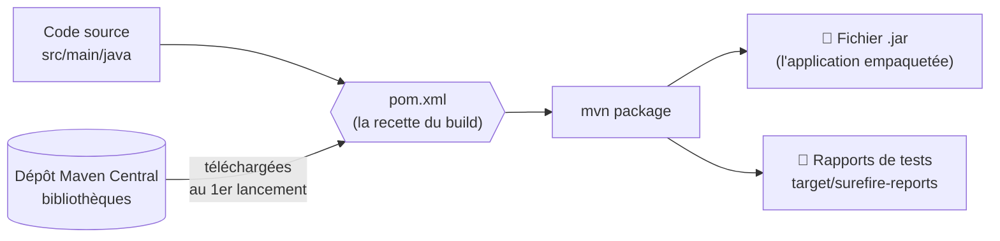
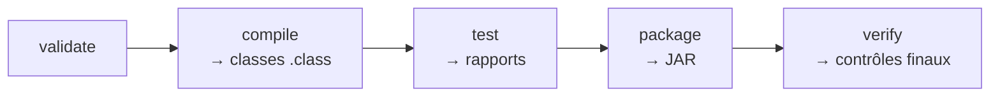
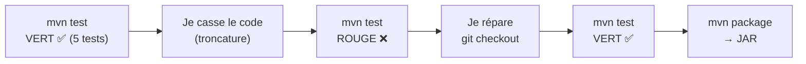
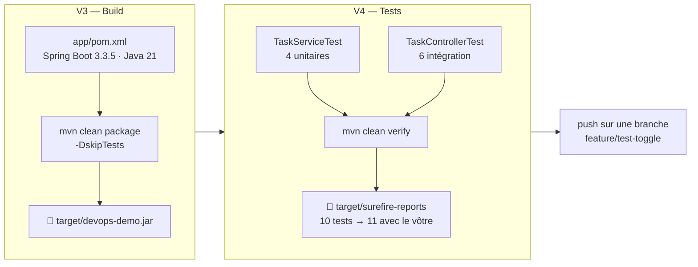

# TP 2 — Maven et tests automatisés (V3 → V4)

**Durée : 75 min** · théorie 10 · activité 15 · mini-TP 20 · fil rouge 20 · validation 10 · **VM** : `ci` · **Format** : individuel

> **Légende** : 🖥️ terminal · 🌐 navigateur · 📝 éditer un fichier · ✅ ce que vous devez voir · ⚠️ si ça ne marche pas · 🎯 livrable · 🎤 consigne formateur
> Rappel : ouvrir la VM avec `vagrant ssh ci` ; le prompt `vagrant@ci:~$` indique la machine. Éditer : `nano fichier` (`Ctrl+O`, `Entrée`, `Ctrl+X`).

---

## 0. Où sommes-nous ?


## 1. Objectif pédagogique

Comprendre qu'un build **reproductible** (Maven) et des **tests exécutables par une machine** sont les deux conditions préalables à toute intégration continue. Savoir lancer `mvn test`, lire un rapport, et écrire un test.

## 2. Prérequis

TP01 (dépôt Git de l'application). Lire quelques lignes de Java (on ne vous demande pas d'en écrire beaucoup : on copiera les exemples).

---

## 3. Théorie illustrée

### 3.1 Maven : une commande, le même résultat partout



> Sur votre poste, sur Jenkins, chez le voisin : **la commande est identique** parce que tout est décrit dans `pom.xml`.

### 3.2 Les phases Maven : chaque phase appelle les précédentes



| Commande | Ce qu'elle fait | 🎯 Ce qu'elle produit |
|---|---|---|
| `mvn compile` | Compile le code | dossier `target/classes` |
| `mvn test` | Compile **puis** exécute les tests | `target/surefire-reports/` |
| `mvn package` | Compile, teste, empaquette | `target/xxx.jar` |
| `mvn clean` | Efface le dossier `target` | (rien : on repart de zéro) |
| `-DskipTests` | Option : saute l'exécution des tests | — |
| `-B` | Option « batch » : sortie propre sans animations (utile pour Jenkins) | — |

### 3.3 La pyramide des tests

```
            /\
           /UI\          Peu · lents · fragiles        → TP11 (Selenium)
          /----\
         / API  \        Quelques-uns                  → TaskControllerTest (6 tests)
        /--------\
       / Unitaires\      Beaucoup · très rapides       → TaskServiceTest (4 tests)
      /------------\
```

| Type | Question posée | Exemple dans le projet |
|---|---|---|
| **Unitaire** | « Cette fonction isolée est-elle correcte ? » | `TaskServiceTest` |
| **Intégration** | « Les morceaux fonctionnent-ils ensemble (requête HTTP → réponse) ? » | `TaskControllerTest` |
| **Fonctionnel** | « Ce que voit l'utilisateur marche-t-il ? » | Selenium (TP11) |

### 3.4 Les outils et leur livrable

| Outil | Rôle | 🎯 Livrable |
|---|---|---|
| **Maven** | Construit de façon reproductible | Un JAR + un dossier `target/` |
| **JUnit** | Écrit et exécute les tests | Un verdict vert / rouge par test |
| **Surefire** (plugin Maven) | Lance JUnit et écrit les rapports | `target/surefire-reports/*.txt` et `*.xml` |

---

## 4. Problème réel à résoudre

« Une application évolue : 5 fonctionnalités aujourd'hui, 50 dans six mois. À chaque livraison, quelqu'un doit tout retester à la main. Les régressions passent entre les mailles. Comment vérifier tout l'existant en quelques secondes ? »

---

## 5. Activité de découverte **[N1 Découverte]** (15 min) — « Testons à la main »

**But** : mesurer le coût d'une recette manuelle. L'application est une boîte noire ; on la lance et on la teste avec `curl` (un « navigateur en ligne de commande »).

### Pas à pas

**Étape 1 — Construire et lancer l'application en arrière-plan** 🖥️
```bash
cd ~/devops-formation/app && mvn -B -q -DskipTests package
java -jar target/devops-demo.jar --server.port=9090 > /tmp/app.log 2>&1 &
sleep 20
```
*(`&` lance l'application **en arrière-plan** pour pouvoir continuer à taper. `sleep 20` attend son démarrage. `-q` = silencieux.)*

✅ Après 20 s : `curl -s localhost:9090/api/info` répond.
⚠️ Pas de réponse ? attendez 10 s de plus, ou `cat /tmp/app.log`.

**Étape 2 — Lancer chronomètre en main la check-list suivante** 🖥️ (et cocher ce qui est conforme)

| # | Action | Attendu |
|---|---|---|
| 1 | `curl -s -o /dev/null -w '%{http_code}\n' localhost:9090/api/tasks` | 200 |
| 2 | `curl -s -XPOST -H 'Content-Type: application/json' -d '{"title":"A"}' localhost:9090/api/tasks` | 201 |
| 3 | idem avec `{"title":""}` | 400 |
| 4 | `curl -s -XPUT localhost:9090/api/tasks/1/toggle` | `done: true` |
| 5 | `curl -s -XDELETE -o /dev/null -w '%{http_code}\n' localhost:9090/api/tasks/9999` | 404 |
| 6 | `curl -s localhost:9090/api/simulate/error -o /dev/null -w '%{http_code}\n'` | 500 |

*(Un code HTTP : 200 = OK, 201 = créé, 400 = requête invalide, 404 = introuvable, 500 = erreur serveur.)*

**Étape 3 — Arrêter l'application** 🖥️
```bash
kill %1
```

### Questions
Combien de temps pour 6 vérifications ? Pour 60 ? Combien de fois par semaine ? Qui le fait quand le développeur est en congés ?

> 🎤 **Formateur** : notez le temps du plus rapide (≈ 3 min). Extrapolez au tableau : 60 cas × 20 livraisons = plusieurs jours par mois. Conclusion : « ce qu'on fait toujours pareil, une machine doit le faire. »

---

## 6. Mini-TP **[N2 Application]** (20 min) — « La calculatrice »

- **Contexte** : mini-projet Maven autonome `mini-tp/calculatrice` (calcul de prix TTC).
- **Objectif** : **lancer, casser, réparer** un test.
- **Architecture** : 1 classe `Calculator`, 1 classe de test `CalculatorTest`, 1 `pom.xml`.



### Visite guidée des fichiers (fournis dans `mini-tp/calculatrice/` : **ne pas les retaper**)

`pom.xml` — la recette du build
```xml
<?xml version="1.0" encoding="UTF-8"?>
<project xmlns="http://maven.apache.org/POM/4.0.0"
         xmlns:xsi="http://www.w3.org/2001/XMLSchema-instance"
         xsi:schemaLocation="http://maven.apache.org/POM/4.0.0 http://maven.apache.org/xsd/maven-4.0.0.xsd">
  <modelVersion>4.0.0</modelVersion>
  <groupId>tn.formation</groupId>
  <artifactId>calculatrice</artifactId>
  <version>1.0</version>
  <packaging>jar</packaging>

  <properties>
    <maven.compiler.release>21</maven.compiler.release>
    <project.build.sourceEncoding>UTF-8</project.build.sourceEncoding>
  </properties>

  <dependencies>
    <dependency>
      <groupId>org.junit.jupiter</groupId>
      <artifactId>junit-jupiter</artifactId>
      <version>5.10.3</version>
      <scope>test</scope>
    </dependency>
  </dependencies>

  <build>
    <plugins>
      <plugin>
        <groupId>org.apache.maven.plugins</groupId>
        <artifactId>maven-surefire-plugin</artifactId>
        <version>3.2.5</version>
      </plugin>
    </plugins>
  </build>
</project>
```

| Balise | Signification |
|---|---|
| `groupId` / `artifactId` / `version` | L'« état civil » du projet → donne le nom du JAR `calculatrice-1.0.jar` |
| `maven.compiler.release` | Version de Java utilisée (21) |
| `<dependencies>` | Bibliothèques nécessaires (ici JUnit, uniquement pour les tests : `scope test`) |
| `maven-surefire-plugin` | Le plugin qui exécute les tests et écrit les rapports |

`src/main/java/tn/formation/calc/Calculator.java` — le code à tester
```java
package tn.formation.calc;

public class Calculator {

    /** Prix TTC arrondi au centime. taux = 0.19 pour 19 %. */
    public double prixTtc(double ht, double taux) {
        if (ht < 0) {
            throw new IllegalArgumentException("Le prix HT doit être positif");
        }
        return Math.round(ht * (1 + taux) * 100.0) / 100.0;
    }

    public double diviser(double a, double b) {
        if (b == 0) {
            throw new ArithmeticException("Division par zéro");
        }
        return a / b;
    }
}
```

`src/test/java/tn/formation/calc/CalculatorTest.java` — les tests
```java
package tn.formation.calc;

import static org.junit.jupiter.api.Assertions.*;

import org.junit.jupiter.api.Test;

class CalculatorTest {

    private final Calculator calc = new Calculator();

    @Test
    void ttcSimple() {
        assertEquals(119.0, calc.prixTtc(100, 0.19));
    }

    @Test
    void ttcArrondiAuCentime() {
        assertEquals(11.89, calc.prixTtc(9.99, 0.19));
    }

    @Test
    void ttcRefuseUnPrixNegatif() {
        assertThrows(IllegalArgumentException.class, () -> calc.prixTtc(-1, 0.19));
    }

    @Test
    void divisionNormale() {
        assertEquals(2.5, calc.diviser(5, 2));
    }

    @Test
    void divisionParZero() {
        assertThrows(ArithmeticException.class, () -> calc.diviser(1, 0));
    }
}
```

> **Comment lire un test** : `@Test` marque une méthode de test ; `assertEquals(attendu, obtenu)` vérifie l'égalité ; `assertThrows(...)` vérifie qu'une erreur précise est bien levée. Si une vérification est fausse, le test est **rouge**.

### Pas à pas

**Étape 1 — Aller dans le bon dossier** 🖥️
```bash
cd ~/devops-formation/mini-tp/calculatrice
ls
```
✅ Vous voyez `pom.xml` et `src`. (Maven ne marche **que** dans un dossier contenant `pom.xml`.)

**Étape 2 — Lancer les tests (cas nominal)** 🖥️
```bash
mvn -B test
```
Le premier lancement télécharge des bibliothèques : patientez.
✅ Dans les dernières lignes :
```
Tests run: 5, Failures: 0, Errors: 0, Skipped: 0
BUILD SUCCESS
```

**Étape 3 — Regarder les rapports produits** 🖥️
```bash
ls target/surefire-reports/
cat target/surefire-reports/*.txt
```
✅ Un fichier `.txt` (lisible) et un `.xml` (pour Jenkins, TP03) par classe de test.

**Étape 4 — Casser volontairement le code** 🖥️ : on remplace l'arrondi par une troncature.
```bash
sed -i 's|Math.round(ht \* (1 + taux) \* 100.0) / 100.0|((int) (ht * (1 + taux) * 100)) / 100.0|' src/main/java/tn/formation/calc/Calculator.java
grep -n "return" src/main/java/tn/formation/calc/Calculator.java    # vérifiez le changement
mvn -B test
```
✅ `BUILD FAILURE`, avec une ligne comme :
```
CalculatorTest.ttcArrondiAuCentime ... expected: <11.89> but was: <11.88>
```
> Le test a **localisé précisément** la régression : fichier, méthode, valeur attendue et obtenue. D'autres tests peuvent aussi échouer à cause des arrondis des nombres flottants : bonne discussion.

**Étape 5 — Réparer** 🖥️
```bash
git checkout src/main/java/tn/formation/calc/Calculator.java
mvn -B test
```
✅ Retour à `BUILD SUCCESS`.
⚠️ `git checkout` échoue si le dépôt n'a pas été commité au TP01 → demandez la version du formateur.

**Étape 6 — Produire l'artefact (le JAR)** 🖥️
```bash
mvn -B -DskipTests package && ls target/*.jar
```
✅ `target/calculatrice-1.0.jar` existe.

**Étape 7 — À vous : ajouter un test** `ttcAvecTauxZero` (`prixTtc(50, 0)` doit valoir `50.0`) 📝
1. Ouvrez le fichier de test : `nano src/test/java/tn/formation/calc/CalculatorTest.java`
2. Descendez avec les flèches jusqu'à l'**avant-dernière** accolade (celle qui ferme `divisionParZero`).
3. Ajoutez, **avant** la toute dernière `}` du fichier :
```java
    @Test
    void ttcAvecTauxZero() {
        assertEquals(50.0, calc.prixTtc(50, 0));
    }
```
4. Enregistrez (`Ctrl+O`, `Entrée`, `Ctrl+X`) puis `mvn -B test`.

✅ `Tests run: 6, Failures: 0`.

🎯 **Livrable** : un JAR + des rapports Surefire ; surtout, la preuve qu'**un test rouge désigne la ligne fautive**.

### Erreurs fréquentes

| Symptôme | Cause | Remède |
|---|---|---|
| `no POM in this directory` | `mvn` lancé hors du dossier du `pom.xml` | `cd` dans le bon dossier |
| `git checkout` refuse | Dépôt non commité au TP01 | Utiliser la version du formateur |
| Très long au 1er lancement | Téléchargement des dépendances | Patienter |
| `error: ... cannot find symbol` après ajout du test | Accolade mal placée | Revérifier que le test est **dans** la classe |

---

## 7. Retour pédagogique

- **Appris** : `mvn test` = compiler + exécuter tous les tests ; un test rouge localise précisément la régression ; le `pom.xml` rend le build identique pour tous.
- **Pourquoi en DevOps** : Jenkins n'a pas d'IDE ; il ne sait qu'exécuter une commande. Sans commande de build et de test déterministe, pas d'intégration continue.
- **Problème résolu** : recette manuelle coûteuse et non reproductible.
- **Limites** : des tests verts ne prouvent pas l'absence de bugs ; des tests mal écrits donnent une fausse confiance ; les tests lents découragent de les lancer.

---

## 8. Retour au projet fil rouge **[N3 Intégration]** (20 min) — V3 puis V4

### 8.1 Avancement



### 8.2 V3 — Le build

**Étape 1 — Lire le `pom.xml` de l'application** 📝 (lecture seulement)
```bash
cd ~/devops-formation/app
nano pom.xml        # Ctrl+X pour quitter sans rien modifier
```
Repérez : le **parent Spring Boot 3.3.5** (gère les versions), `java.version` = **21**, les **starters** (`web`, `actuator`, `test`), le **plugin Spring Boot** (fabrique un JAR exécutable).

**Étape 2 — Construire** 🖥️
```bash
mvn -B clean package -DskipTests && ls -lh target/devops-demo.jar
```
✅ `BUILD SUCCESS` puis une ligne de plusieurs dizaines de Mo : c'est votre application complète dans un seul fichier.

### 8.3 V4 — Les tests

**Étape 3 — Lancer les 10 tests existants** 🖥️
```bash
mvn -B clean verify
grep -h "Tests run" target/surefire-reports/*.txt
```
✅ Deux lignes : une avec `Tests run: 4` (service), une avec `Tests run: 6` (contrôleur) ; `BUILD SUCCESS`.

**Étape 4 — Relier la check-list manuelle aux tests automatiques** 🖥️
```bash
grep -n "void " src/test/java/tn/formation/devops/*.java
```
✅ Vous voyez les noms de tests. Retrouvez, pour **chaque ligne de la check-list de l'activité** (200, 201, 400, toggle, 404, 500), le test qui la remplace. *(Exemple : la ligne 5 → `unknownTaskReturns404`.)*

**Étape 5 — Ajouter un test unitaire** 📝 dans `src/test/java/tn/formation/devops/TaskServiceTest.java` : collez, **avant la dernière `}`** du fichier :
```java
@Test
void toggleUnknownIdThrows() {
    assertThrows(java.util.NoSuchElementException.class, () -> service.toggle(9999));
}
```
Puis :
```bash
mvn -B test
```
✅ `Tests run: 5` pour le service ; **11 tests au total** en `verify`.
⚠️ Si `assertThrows` n'est pas reconnu : vérifier la ligne `import static org.junit.jupiter.api.Assertions.*;` en haut du fichier.

**Étape 6 — Enregistrer le travail sur une branche et le pousser** 🖥️
```bash
cd ~/devops-formation
git switch -c feature/test-toggle
git commit -am "Test toggle inconnu"
git push -u origin feature/test-toggle
```
✅ GitHub propose de créer une Pull Request (vous la ferez au TP03).

**Résultat attendu** : `BUILD SUCCESS`, 11 tests, un JAR `devops-demo.jar` ; vous reliez chaque ligne de la check-list manuelle à un test automatique.

**Pourquoi V3/V4 ?** Avant : on compile dans l'IDE, on vérifie à la main. Après : une commande unique construit et prouve. **Preuve** : rapports Surefire.

---

## 9. Validation

1. Quelle commande compile, teste et empaquette ?
2. Où trouver la liste des dépendances d'un projet Maven ?
3. Différence entre test unitaire (`TaskServiceTest`) et test d'intégration (`TaskControllerTest`) ?
4. **Tâche** : cassez volontairement un test de l'application et montrez le message d'erreur Maven.
5. Quel test automatique remplace la ligne 5 de la check-list manuelle ?

### Corrigé formateur
1. `mvn package` (ou `mvn verify`) : compile, exécute les tests, puis empaquette.
2. Dans le `pom.xml`, balise `<dependencies>` (et `mvn dependency:tree` pour la liste complète).
3. L'unitaire teste une classe **isolée** ; l'intégration envoie de **vraies requêtes HTTP** au contrôleur (Spring démarré partiellement).
4. Changer une assertion → `mvn -B test` → lire `expected: <…> but was: <…>` dans le bloc `[ERROR]`.
5. `unknownTaskReturns404`.

## 10. Extension / challenge

- Ajoutez le test d'intégration « `PUT /api/tasks/9999/toggle` renvoie 404 ».
- Ajoutez le plugin JaCoCo et lisez le rapport de couverture (`target/site/jacoco/index.html`).

## Glossaire du TP

| Mot | Définition simple |
|---|---|
| **Maven** | Outil qui compile, teste, empaquette selon `pom.xml` |
| **pom.xml** | Fichier-recette du projet |
| **Dépendance** | Bibliothèque externe dont le projet a besoin |
| **JAR** | Archive Java exécutable : le « colis » de l'application |
| **JUnit** | Bibliothèque pour écrire des tests Java |
| **Surefire** | Plugin Maven qui lance les tests et écrit les rapports |
| **Régression** | Une fonctionnalité qui marchait et ne marche plus |
