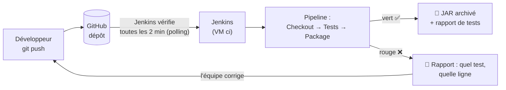
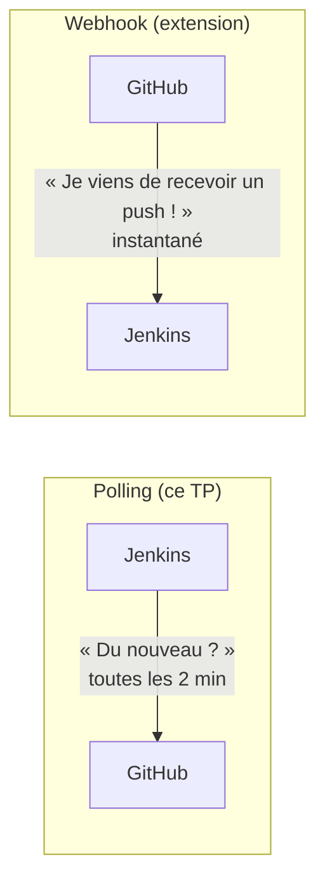
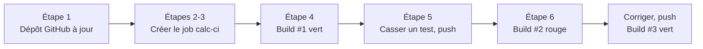
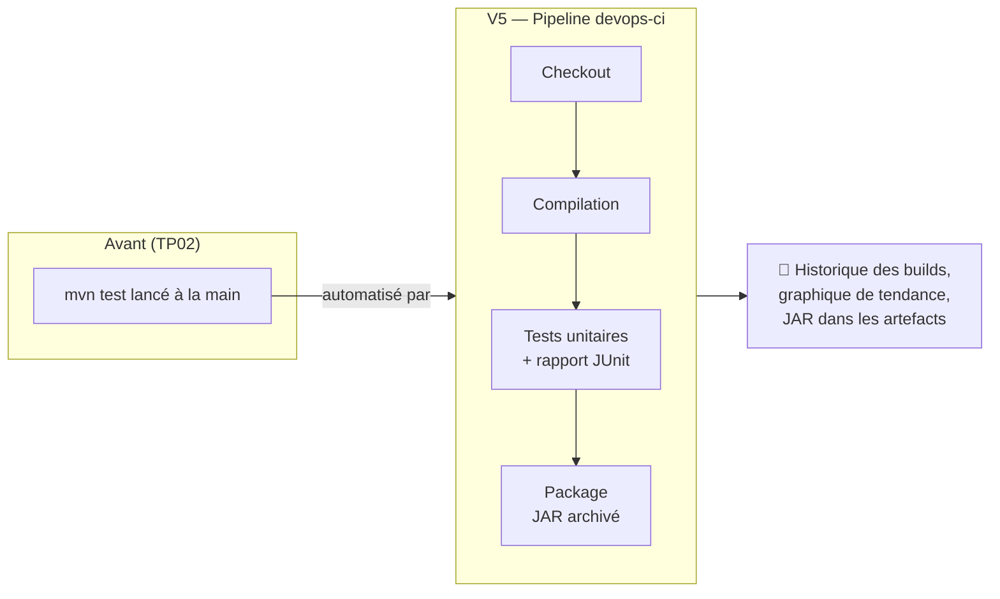
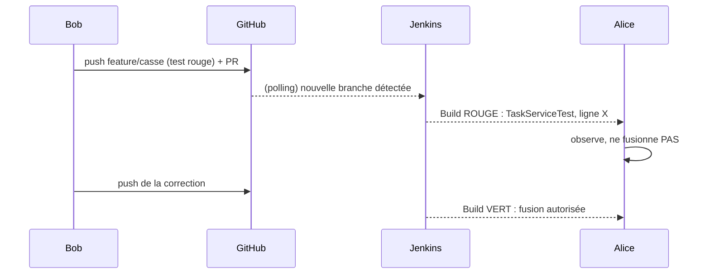

# TP 3 — Intégration continue avec Jenkins (V5)

**Durée : 90 min** · théorie 10 · activité 15 · mini-TP 25 · fil rouge 30 · validation 10 · **VM** : `ci` · **Format** : individuel

> **Légende** : 🖥️ terminal · 🌐 navigateur · 📝 éditer un fichier · ✅ ce que vous devez voir · ⚠️ si ça ne marche pas · 🎯 livrable · 🎤 consigne formateur
> Rappel : `vagrant ssh ci` ; Jenkins s'ouvre dans le navigateur : **http://192.168.56.10:8080** (identifiants `admin` / `admin`).

---

## 0. Où sommes-nous ?

```mermaid
flowchart LR
  V1["V1 App"] --> V2["V2 Git"] --> V3["V3 Maven"] --> V4["V4 Tests"] --> V5["V5 Jenkins CI"] --> V6["V6 Docker"] --> V7["V7 Registre"] --> V8["V8 Ansible"] --> V9["V9 Pipeline CD"] --> V10["V10 K8s"] --> V11["V11 Logs"] --> V12["V12 Monitoring"] --> V13["V13 Selenium"]
  classDef done fill:#c8e6c9,stroke:#2e7d32
  classDef now fill:#ffe082,stroke:#e65100,stroke-width:3px
  classDef todo fill:#eeeeee,stroke:#9e9e9e,color:#757575
  class V1,V2,V3,V4 done
  class V5 now
  class V6,V7,V8,V9,V10,V11,V12,V13 todo
```



## 1. Objectif pédagogique

Concevoir une solution d'**intégration continue** : à chaque modification du code, la compilation et les tests s'exécutent automatiquement et le résultat est visible de toute l'équipe. Savoir lire un `Jenkinsfile` et diagnostiquer un build rouge.

## 2. Prérequis

TP01 (dépôt GitHub avec le projet) et TP02 (`mvn test`).

---

## 3. Théorie illustrée

### 3.1 La boucle d'intégration continue



> Un **build rouge est un signal collectif** : on le répare avant de continuer.

### 3.2 Polling ou webhook ?


Le webhook exige que GitHub puisse **joindre** Jenkins (URL publique) : impossible dans notre réseau privé de VM.

### 3.3 Anatomie d'un `Jenkinsfile` (pipeline as code)

```groovy
pipeline {                                  // ← tout le pipeline
    agent any                               // ← sur quelle machine l'exécuter : n'importe laquelle
    triggers { pollSCM('H/2 * * * *') }     // ← déclencheur : tester GitHub toutes les 2 minutes
    stages {                                // ← la liste des étapes (chacune = une case dans la Stage View)
        stage('Tests') {                    // ← une étape
            steps { sh 'mvn -B test' }      // ← les commandes à exécuter (sh = shell)
            post { always { junit '...' } } // ← actions après l'étape : publier le rapport de tests
        }
    }
}
```

| Mot-clé | Question à laquelle il répond |
|---|---|
| `pipeline` | Quel est le pipeline ? |
| `agent` | **Où** s'exécute-t-il ? |
| `triggers` | **Quand** démarre-t-il ? |
| `stage` | Quelle **étape** ? (nom affiché dans l'interface) |
| `steps` / `sh` | Quelle **commande** ? |
| `post` | Que faire **après** (toujours / si échec / si succès) ? |

### 3.4 Outils et livrables

| Outil | Rôle | 🎯 Livrable |
|---|---|---|
| **Jenkins** | Exécute le pipeline à chaque modification | Historique des builds (vert/rouge) |
| **Jenkinsfile** | Décrit le pipeline, versionné dans Git | Un fichier relu comme du code |
| **Plugin JUnit** | Lit les rapports XML de tests | Graphique et liste des tests (« Résultats des tests ») |
| **archiveArtifacts** | Conserve les fichiers produits | JAR téléchargeable depuis le build |

---

## 4. Problème réel à résoudre

« Un développeur modifie le code mais l'équipe doit compiler et tester manuellement l'application à chaque modification. On découvre les casses le vendredi soir. Concevoir une solution CI avec Jenkins. »

---

## 5. Activité de découverte **[N1 Découverte]** (15 min) — « Le script manuel »

Dans `mini-tp/calculatrice`, **par deux** : l'un joue le « développeur », l'autre « le garant de la qualité ».

### Pas à pas
1. 🖥️ Ouvrir le dossier : `cd ~/devops-formation/mini-tp/calculatrice`
2. **Le développeur** modifie `Calculator.java` (par exemple change un message d'erreur : `nano src/main/java/tn/formation/calc/Calculator.java`) et annonce « c'est prêt ».
3. **Le garant** exécute à la main, puis note le résultat sur une feuille :
   ```bash
   mvn -B test
   mvn -B -DskipTests package
   ```
4. **Répétez 3 fois**, en cassant un test la 2ᵉ fois **sans le dire** au garant.

### Questions
Combien d'étapes répétitives ? Que se passe-t-il si le garant est absent ? Si le développeur oublie d'annoncer ? Qu'est-ce qui pourrait être automatisé ?

> 🎤 **Formateur** : dessinez au tableau la boucle « modifier → lancer → regarder → corriger » et entourez ce qui est mécanique. Terminez par : « Jenkins sera ce garant infatigable : il n'oublie jamais et prévient tout de suite. »

---

## 6. Mini-TP **[N2 Application]** (25 min) — « Un garant pour la calculatrice »

- **Contexte** : le mini-projet `calculatrice` du TP02, déjà dans votre dépôt GitHub.
- **Objectif** : un job Jenkins qui teste automatiquement à chaque push.
- **Architecture** : GitHub → Jenkins (VM `ci`) → rapport de tests.



**Fichier** `mini-tp/calculatrice/Jenkinsfile` (fourni dans le dépôt)
```groovy
pipeline {
    agent any
    triggers { pollSCM('H/2 * * * *') }
    stages {
        stage('Checkout') { steps { checkout scm } }
        stage('Tests') {
            steps { dir('mini-tp/calculatrice') { sh 'mvn -B test' } }
            post { always { junit 'mini-tp/calculatrice/target/surefire-reports/*.xml' } }
        }
        stage('Package') {
            steps {
                dir('mini-tp/calculatrice') { sh 'mvn -B -DskipTests package' }
                archiveArtifacts artifacts: 'mini-tp/calculatrice/target/*.jar'
            }
        }
    }
}
```
*(`checkout scm` = « récupère le code du dépôt configuré dans le job » ; `dir(...)` = « entre dans ce sous-dossier » ; `junit` = « publie les rapports de tests » ; `archiveArtifacts` = « garde le JAR ».)*

### Pas à pas

**Étape 1 — Vérifier que GitHub contient `mini-tp/`** 🖥️
```bash
cd ~/devops-formation
git status && git push
```
🌐 Sur GitHub, ouvrez le dépôt : le dossier `mini-tp/calculatrice/Jenkinsfile` doit exister. Le dépôt doit être **public** (sinon Jenkins n'aura pas accès).

**Étape 2 — Ouvrir Jenkins et créer le job** 🌐
1. Ouvrez http://192.168.56.10:8080 → connectez-vous : `admin` / `admin`.
2. Menu de gauche : **Nouveau Item**.
3. Nom : `calc-ci` → choisissez **Pipeline** → **OK**.

**Étape 3 — Dire à Jenkins où est le pipeline** 🌐 (page de configuration, section *Pipeline* tout en bas)
1. **Definition** : *Pipeline script from SCM*.
2. **SCM** : *Git* → **Repository URL** : l'URL de votre dépôt GitHub.
3. **Branch Specifier** : `*/main`.
4. **Script Path** : `mini-tp/calculatrice/Jenkinsfile` (chemin **relatif à la racine du dépôt**).
5. **Enregistrer** puis, à gauche, **Lancer un build**.

**Étape 4 — Observer le build #1** 🌐
- La **Stage View** montre des cases : *Checkout → Tests → Package*, qui passent au vert une à une.
- Cliquez sur la pastille du build (`#1`) → **Résultats des tests** : 5 tests.
- En bas de la page du build : **Artefacts** → le JAR.

✅ Build #1 **vert**, 5 tests, JAR archivé.

**Étape 5 — Casser un test** 🖥️
```bash
cd ~/devops-formation
sed -i 's/119.0/120.0/' mini-tp/calculatrice/src/test/java/tn/formation/calc/CalculatorTest.java
git commit -am "casse" && git push
```
Attendez le polling (≈ 2 min) ou cliquez **Lancer un build**.

**Étape 6 — Constater le rouge et trouver le coupable** 🌐
1. Le build #2 est **rouge** : la case *Tests* est rouge, *Package* n'est pas exécutée.
2. Cliquez sur le build → **Résultats des tests** → le test fautif (`ttcSimple`) avec `expected: <120.0> but was: <119.0>`.
3. Corrigez : 🖥️
   ```bash
   sed -i 's/120.0/119.0/' mini-tp/calculatrice/src/test/java/tn/formation/calc/CalculatorTest.java
   git commit -am "correction" && git push
   ```
4. Build #3 : **vert** de nouveau.

**Résultat attendu** : build #1 vert (5 tests) ; build #2 rouge (stage *Tests*, 1 échec) ; build #3 vert ; le JAR est archivé dans les artefacts des builds verts.

### Erreurs fréquentes

| Symptôme | Cause | Remède |
|---|---|---|
| `Unable to find Jenkinsfile` | *Script Path* faux | Chemin relatif à la racine du dépôt : `mini-tp/calculatrice/Jenkinsfile` |
| `Authentication failed` | Dépôt privé | Le rendre public (ou ajouter des identifiants Jenkins) |
| `mvn: command not found` | Provisionnement de `ci` inachevé | `vagrant provision ci` |
| « Rien ne se passe » après le push | C'est du polling toutes les 2 min | Patienter ou **Lancer un build** |

---

## 7. Retour pédagogique

- **Appris** : un *pipeline* est une suite de *stages* ; le résultat (rouge/vert) est le contrat de qualité ; le rapport de tests évite de chercher dans la console.
- **Pourquoi en DevOps** : la CI donne un retour en minutes et rend l'intégration banale au lieu de redoutée.
- **Problème résolu** : oublis, casses découvertes tard, « ça marche chez moi ».
- **Limites** : la CI ne vaut que par la qualité des tests ; un build lent décourage ; un job configuré uniquement dans l'interface ne se reproduit pas (d'où le `Jenkinsfile`).

---

## 8. Retour au projet fil rouge **[N3 Intégration]** (30 min) — V5

### 8.1 Avancement



### 8.2 Créer le job `devops-ci`

**Étape 1 — Lire le pipeline** 📝 (lecture)
```bash
cd ~/devops-formation
cat jenkins/Jenkinsfile.tp1
```
Repérez les 4 *stages* : *Checkout*, *Compilation*, *Tests unitaires* (avec `junit`), *Package* (avec `archiveArtifacts`). Pour chacun, dites **quelle commande** est lancée et **quel livrable** est produit.

**Étape 2 — Créer le job** 🌐
1. **Nouveau Item** → `devops-ci` → **Pipeline** → OK.
2. *Pipeline script from SCM* → Git → URL de votre dépôt.
3. **Branch Specifier** : `**` *(deux étoiles : Jenkins surveille **toutes** les branches, pas seulement `main`)*.
4. **Script Path** : `jenkins/Jenkinsfile.tp1` → **Enregistrer** → **Lancer un build**.

✅ Point de contrôle : build #1 **vert** sur `main` ; **Résultats des tests** liste les tests de l'application ; le JAR est dans les artefacts.

> 🎤 À vérifier avant la séance : avec un seul job « classique », seule la branche configurée est construite. L'option `**` permet de voir la branche cassée ; la solution propre est le **Multibranch Pipeline** (voir Extension).

### 8.3 Travail d'équipe en binôme : la branche cassée



**Étape 3 — Bob casse un test sur une branche** 🖥️
```bash
git switch -c feature/casse
nano app/src/test/java/tn/formation/devops/TaskServiceTest.java    # changez une valeur attendue dans une assertion
git commit -am "Test cassé (exercice)" && git push -u origin feature/casse
```
🌐 Puis sur GitHub, Bob ouvre une **Pull Request** vers `main`.

**Étape 4 — Alice observe, sans fusionner** 🌐
1. Attendre le polling (≈ 2 min) → dans Jenkins, le build de `feature/casse` est **rouge**.
2. Dans **Résultats des tests**, Alice lit **quel test** a échoué, et la valeur attendue/obtenue.
3. Elle répond : « qui a cassé ? sur quelle ligne ? » (le message de commit donne le « qui », le rapport donne le « où »).

**Étape 5 — Bob corrige** 🖥️
```bash
nano app/src/test/java/tn/formation/devops/TaskServiceTest.java    # remettre la valeur d'origine
git commit -am "Correction du test" && git push
```
✅ Point de contrôle : le build repasse au **vert** ; le graphique de tendance des tests montre la « bosse ».

**Étape 6 — La règle d'équipe** (à écrire au tableau) : **« Une PR ne se fusionne que si le build est vert. »**

**Pipeline obtenu** : `push → Jenkins → Checkout → mvn compile → mvn test (rapport JUnit) → package (JAR archivé)`.
**Résultat attendu** : build vert sur `main`, rouge sur la branche cassée, graphique de tendance des tests, JAR dans les artefacts.

**Pourquoi V5 ?** Avant : les tests dépendent de la discipline de chacun. Après : ils s'exécutent à chaque push. **Preuve** : historique des builds.

---

## 9. Validation

1. Quel fichier décrit le pipeline et où est-il stocké ?
2. Pourquoi le stage *Tests* est-il avant *Package* ?
3. Comment retrouver quel test a échoué sans lire toute la console ?
4. **Tâche** : montrez un build rouge puis son retour au vert dans la *Stage View*.
5. Pourquoi le déclenchement par *polling* n'est-il qu'un pis-aller ?

### Corrigé formateur
1. Le `Jenkinsfile`, **dans Git** avec le code (*pipeline as code*) : il est versionné et relu en PR.
2. Inutile de fabriquer un colis (JAR) si les tests échouent : **on s'arrête au plus tôt**.
3. Page du build → **Résultats des tests** (ou la case rouge de la Stage View).
4. Casser un test, pousser, constater le rouge, corriger, constater le vert.
5. Latence (jusqu'à 2 min), charge inutile (Jenkins interroge GitHub en permanence) ; le webhook est instantané.

## 10. Extension / challenge

- Remplacez le polling par un **webhook GitHub** (`smee.io` ou `ngrok` + déclencheur `githubPush()`).
- Ajoutez un stage qui publie un rapport de couverture JaCoCo.
- Transformez le job en **Multibranch Pipeline** pour construire automatiquement chaque branche et PR.

## Glossaire du TP

| Mot | Définition simple |
|---|---|
| **CI** | Intégration continue : tester automatiquement à chaque modification |
| **Pipeline** | Chaîne d'étapes automatisées |
| **Stage** | Une étape du pipeline |
| **Build** | Une exécution du pipeline (numérotée #1, #2…) |
| **Artefact** | Fichier produit et conservé (ici le JAR) |
| **Polling** | Jenkins interroge GitHub à intervalle régulier |
| **Webhook** | GitHub prévient Jenkins instantanément |
