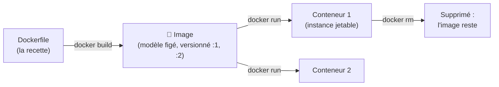
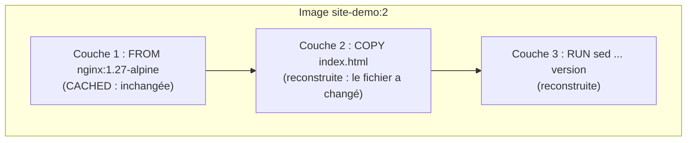
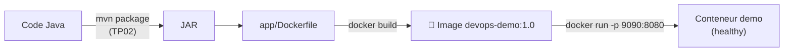
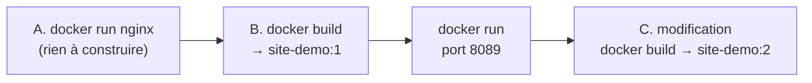
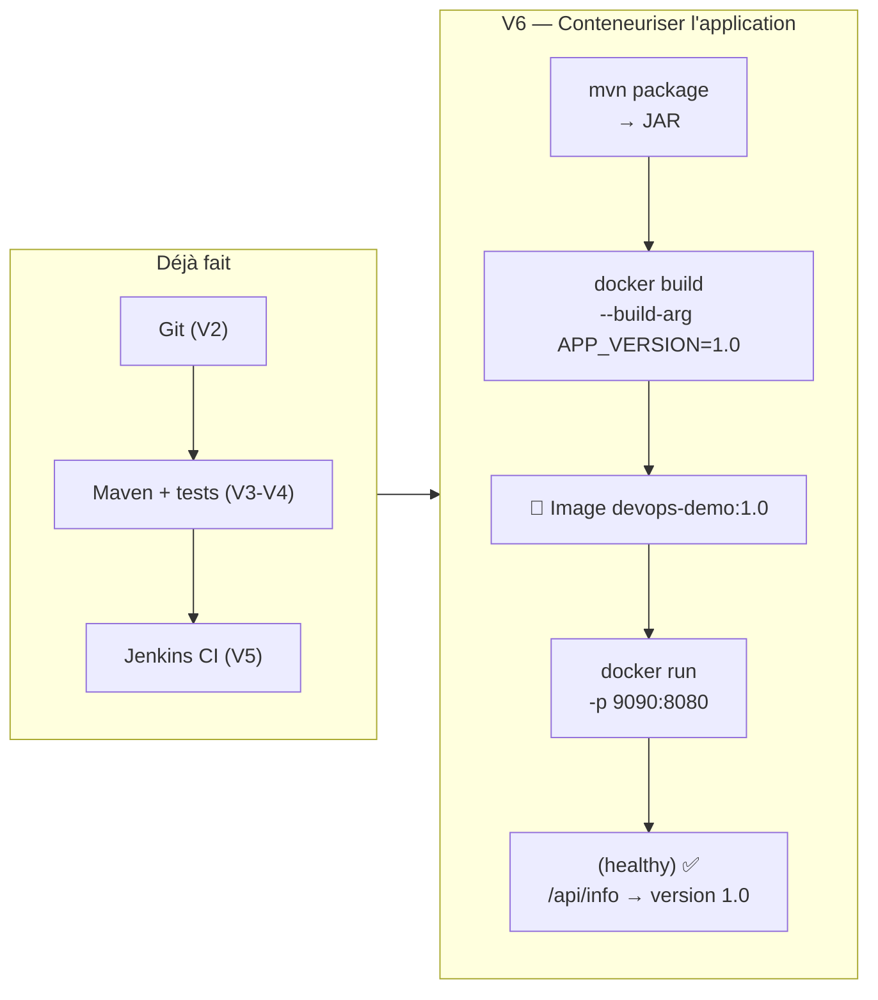

# TP 4 — Docker : image, conteneur, Dockerfile (V6)

**Durée : 105 min** · théorie 15 · activité 15 · mini-TP 35 · fil rouge 30 · validation 10 · **VM** : `ci` · **Format** : individuel
*(Couvre les « TP Docker 1 à 4 » : image/conteneur, serveur web, Dockerfile, conteneurisation de l'application Java.)*

> **Légende** : 🖥️ terminal · 🌐 navigateur · 📝 éditer un fichier · ✅ ce que vous devez voir · ⚠️ si ça ne marche pas · 🎯 livrable · 🎤 consigne formateur
> Rappel : `vagrant ssh ci` ; le prompt `vagrant@ci:~$` indique la machine.

---

## 0. Où sommes-nous ?

```mermaid
flowchart LR
  V1["V1 App"] --> V2["V2 Git"] --> V3["V3 Maven"] --> V4["V4 Tests"] --> V5["V5 Jenkins CI"] --> V6["V6 Docker"] --> V7["V7 Registre"] --> V8["V8 Ansible"] --> V9["V9 Pipeline CD"] --> V10["V10 K8s"] --> V11["V11 Logs"] --> V12["V12 Monitoring"] --> V13["V13 Selenium"]
  classDef done fill:#c8e6c9,stroke:#2e7d32
  classDef now fill:#ffe082,stroke:#e65100,stroke-width:3px
  classDef todo fill:#eeeeee,stroke:#9e9e9e,color:#757575
  class V1,V2,V3,V4,V5 done
  class V6 now
  class V7,V8,V9,V10,V11,V12,V13 todo
```



## 1. Objectif pédagogique

Comprendre **pourquoi** on empaquette une application avec son environnement ; faire la différence entre image et conteneur ; écrire un `Dockerfile` ; conteneuriser l'application Java.

## 2. Prérequis

TP02 (JAR produit par Maven). Notions de port (une « porte » numérotée d'une machine) et de processus (un programme en cours d'exécution).

---

## 3. Théorie illustrée

### 3.1 Machine virtuelle ou conteneur ?

```
 MACHINE VIRTUELLE                          CONTENEUR
┌───────────┐ ┌───────────┐              ┌─────┐ ┌─────┐ ┌─────┐
│ Appli A   │ │ Appli B   │              │App A│ │App B│ │App C│
│ Libs      │ │ Libs      │              │Libs │ │Libs │ │Libs │
│ OS invité │ │ OS invité │              └──┬──┘ └──┬──┘ └──┬──┘
└─────┬─────┘ └─────┬─────┘              ┌──┴───────┴───────┴──┐
┌─────┴─────────────┴─────┐              │   Moteur Docker     │
│ Hyperviseur             │              ├─────────────────────┤
├─────────────────────────┤              │  OS de l'hôte (1)   │
│ Machine physique        │              └─────────────────────┘
└─────────────────────────┘
 Lourd : plusieurs OS, démarrage en minutes   Léger : un seul OS partagé, démarrage en secondes
```

### 3.2 Image, conteneur, Dockerfile : la chaîne



| Notion | Analogie | Durée de vie |
|---|---|---|
| **Dockerfile** | La recette de cuisine | Dans Git |
| **Image** | Le plat surgelé : même résultat partout | Reste jusqu'à suppression volontaire |
| **Conteneur** | Le plat réchauffé et servi | **Jetable** : ce qu'on y modifie à la main disparaît |

> **Règle d'or** : ce qu'on veut garder doit être dans l'**image** (le Dockerfile), pas installé à la main dans un conteneur.

### 3.3 Les couches et le cache


Chaque instruction du Dockerfile crée une **couche**. Si une couche et celles d'avant n'ont pas changé, Docker **réutilise le cache** : le build est rapide.

### 3.4 Du code à l'image (le fil rouge)



### 3.5 Outils et livrables

| Outil | Rôle | 🎯 Livrable |
|---|---|---|
| **Docker Engine** | Construit et exécute des conteneurs | Images et conteneurs |
| **Dockerfile** | Décrit comment fabriquer l'image | Fichier versionné dans Git |
| **Image** (`nom:tag`) | Artefact livrable | Un modèle immuable, déployable partout |

---

## 4. Problème réel à résoudre

« L'application tourne chez le développeur (Java 21) mais plante en recette (Java 11) et en production (autre variable d'environnement). Chaque serveur est un cas particulier. Comment livrer exactement le même environnement partout ? »

---

## 5. Activité de découverte **[N1 Découverte]** (15 min) — « Le conteneur jetable »

### Pas à pas (ouvrez de préférence deux terminaux côte à côte)

**Étape 1 — Voir l'OS de la VM, puis celui d'un conteneur** 🖥️
```bash
cat /etc/os-release | head -2                                   # l'OS de la VM
docker run --rm alpine cat /etc/os-release | head -2            # un autre OS, en 1 s
```
✅ Deux noms d'OS **différents** (Ubuntu puis Alpine). `--rm` = « supprime le conteneur dès qu'il a fini ».

**Étape 2 — Mesurer le démarrage** 🖥️
```bash
time docker run --rm alpine echo "bonjour"
```
✅ `bonjour` puis un temps réel de l'ordre de la seconde.

**Étape 3 — Installer quelque chose **à la main** dans un conteneur** 🖥️
```bash
docker run -d --name jetable alpine sleep 600
docker exec jetable sh -c "apk add --no-cache curl && curl --version | head -1"
```
✅ `curl` s'installe et affiche sa version. *(`-d` = en arrière-plan ; `exec` = lancer une commande dans un conteneur en marche.)*

**Étape 4 — Supprimer, recréer, constater** 🖥️
```bash
docker rm -f jetable
docker run --rm alpine curl --version
```
✅ `curl: not found` : **`curl` a disparu**.

### Questions
Quel OS voit-on dans le conteneur ? En combien de temps démarre-t-il comparé à une VM ? Où est passé `curl` ? Qu'en déduire sur la façon d'installer des logiciels ?

> 🎤 **Formateur** : message clé : « Un conteneur est jetable ; ce qu'on veut garder doit être dans l'**image** (le Dockerfile), pas installé à la main dedans. »

---

## 6. Mini-TP **[N2 Application]** (35 min) — « Un site web dans une image »

- **Contexte** : une page HTML statique servie par Nginx, **sans installer Nginx** sur la VM.
- **Objectif** : lancer un serveur web (A), écrire/utiliser un Dockerfile (B), versionner l'image (C).
- **Architecture** : image `site-demo:1` → conteneur → port 8089 de la VM.



### Les options de `docker run` à connaître

| Option | Signification |
|---|---|
| `-d` | *detached* : en arrière-plan |
| `--name web` | Donne un nom au conteneur |
| `-p 8089:80` | Publie le port **80 du conteneur** sur le port **8089 de la VM** (`port VM : port conteneur`) |
| `--rm` | Supprime le conteneur à son arrêt |
| `-e NOM=valeur` | Passe une variable d'environnement |

### Fichiers (fournis dans `mini-tp/site-demo/`)

`index.html`
```html
<!doctype html>
<html lang="fr">
<head><meta charset="utf-8"><title>Site démo</title></head>
<body>
  <h1 id="titre">Site démo DevOps</h1>
  <p id="version">Version @@VERSION@@</p>
  <button id="btn" onclick="document.getElementById('message').textContent='Bonjour DevOps !'">Dire bonjour</button>
  <p id="message"></p>
</body>
</html>
```

`Dockerfile` — **lu ligne par ligne**
```dockerfile
FROM nginx:1.27-alpine                       # 1. On part d'une image Nginx toute prête (petite : Alpine)
ARG VERSION=dev                              # 2. Paramètre de construction : le numéro de version
COPY index.html /usr/share/nginx/html/index.html   # 3. On copie notre page dans l'image
RUN sed -i "s/@@VERSION@@/${VERSION}/" /usr/share/nginx/html/index.html \
 && echo "${VERSION}" > /usr/share/nginx/html/version.txt   # 4. On écrit la version dans la page et dans version.txt
HEALTHCHECK --interval=15s --timeout=3s CMD wget -qO- http://localhost/ >/dev/null || exit 1
                                             # 5. Docker vérifie toutes les 15 s que le site répond
```
> Les `#` à droite ci-dessus servent à l'explication ; le vrai fichier n'en contient pas.

### Pas à pas

**Partie A — Lancer un serveur web sans rien construire (10 min)**

**Étape A1** 🖥️
```bash
docker run -d --name web -p 8089:80 nginx:1.27-alpine
```
*(Docker télécharge l'image la première fois : `Pulling from library/nginx`.)*

**Étape A2** 🖥️
```bash
curl -s localhost:8089 | head -4
docker ps
docker logs web | tail -3
```
✅ `curl` affiche du HTML (« Welcome to nginx! ») ; `docker ps` liste le conteneur `web` avec `0.0.0.0:8089->80/tcp` ; `logs` montre la requête reçue.

**Étape A3 — Nettoyer** 🖥️
```bash
docker rm -f web
```

**Partie B — Construire notre propre image (15 min)**

**Étape B1 — Construire** 🖥️
```bash
cd ~/devops-formation/mini-tp/site-demo
docker build --build-arg VERSION=1 -t site-demo:1 .
```
> **N'oubliez pas le point final** `.` : il désigne « le dossier courant » (qui contient le Dockerfile).

✅ Des étapes `[1/3]`, `[2/3]`... puis `naming to docker.io/library/site-demo:1`.

**Étape B2 — Inspecter** 🖥️
```bash
docker images site-demo
docker history site-demo:1
```
✅ `site-demo   1   ...` dans la liste ; `history` montre les **couches**.

**Étape B3 — Lancer et vérifier la version** 🖥️
```bash
docker run -d --name site -p 8089:80 site-demo:1
curl -s localhost:8089 | grep Version
curl -s localhost:8089/version.txt
```
✅ `Version 1` et `1`.

**Partie C — Modifier et reconstruire (10 min)**

**Étape C1 — Modifier la page** 🖥️
```bash
sed -i 's/Site démo DevOps/Site démo DevOps - v2/' index.html
```

**Étape C2 — Reconstruire en version 2** 🖥️
```bash
docker build --build-arg VERSION=2 -t site-demo:2 .
```
✅ Observez **`CACHED`** sur les étapes inchangées (la couche `FROM`) et une reconstruction de `COPY`.

**Étape C3 — Remplacer le conteneur** 🖥️
```bash
docker rm -f site && docker run -d --name site -p 8089:80 site-demo:2
curl -s localhost:8089 | grep -E "Version|v2"
```
✅ `Version 2` et la ligne avec `v2`.

> **Pourquoi `docker rm -f site` avant ?** On ne remplace pas un conteneur : on **supprime l'ancien et on en crée un nouveau** à partir de la nouvelle image (c'est l'idée d'immuabilité).

🎯 **Livrable** : deux images versionnées `site-demo:1` et `site-demo:2`, déployables sur n'importe quelle machine Docker.

### Erreurs fréquentes

| Symptôme | Cause | Remède |
|---|---|---|
| `port is already allocated` | Un ancien conteneur occupe 8089 | `docker rm -f site` (ou `web`) |
| `permission denied … docker.sock` | Groupe `docker` pas encore pris en compte | `exit` puis `vagrant ssh ci` |
| `"docker build" requires exactly 1 argument` | Point final `.` oublié | Ajouter ` .` |
| La page n'a pas changé | Ancien conteneur relancé sans rebuild | `docker build` puis `rm -f` + `run` |

**Nettoyage final** 🖥️ : `docker rm -f site`.

---

## 7. Retour pédagogique

- **Appris** : image ≠ conteneur ; chaque instruction du Dockerfile crée une couche mise en cache ; une image se versionne avec un tag (`:1`, `:2`).
- **Pourquoi en DevOps** : l'image est l'artefact livrable ; ce qui a été testé est ce qui sera déployé.
- **Problème résolu** : écarts d'environnement, installations manuelles.
- **Limites** : un conteneur seul ne gère ni haute disponibilité ni orchestration (TP08) ; l'image grossit si on y met n'importe quoi ; elle n'est pas un coffre-fort (jamais de secrets dedans).

---

## 8. Retour au projet fil rouge **[N3 Intégration]** (30 min) — V6

### 8.1 Avancement



### 8.2 Pas à pas

**Étape 1 — Lire `app/Dockerfile` et justifier chaque instruction** 📝 (lecture)
```bash
cd ~/devops-formation/app
cat Dockerfile
```
Complétez ce tableau **à l'oral** :

| À repérer | Pourquoi ? (à trouver) |
|---|---|
| `FROM eclipse-temurin:21-jre-jammy` | Java 21 *runtime* seulement (pas le JDK complet) : image plus petite, version figée |
| `ARG APP_VERSION` | Le numéro de version est **injecté au build** et visible dans `/api/info` |
| `USER appuser` (non-root) | Si l'application est compromise, l'attaquant n'a pas les droits administrateur |
| `HEALTHCHECK` | Docker sait si l'application **répond vraiment**, pas seulement si le processus existe |
| `ENTRYPOINT` avec `JAVA_OPTS` | La mémoire et les options Java se règlent **sans reconstruire** l'image |

**Étape 2 — Construire le JAR** 🖥️
```bash
mvn -B -DskipTests package
```
✅ `BUILD SUCCESS` (le Dockerfile copie ce JAR).

**Étape 3 — Construire l'image** 🖥️
```bash
docker build -t devops-demo:1.0 --build-arg APP_VERSION=1.0 .
docker images devops-demo
```
✅ La ligne `devops-demo   1.0` apparaît.

**Étape 4 — Lancer le conteneur** 🖥️
```bash
docker run -d --name demo -p 9090:8080 devops-demo:1.0
```
> **Pourquoi `-p 9090:8080` ?** Jenkins occupe déjà le port 8080 de la VM `ci`. L'application écoute sur 8080 **dans** le conteneur ; on l'expose sur 9090 **côté VM**.

**Étape 5 — Attendre et vérifier la santé** 🖥️
```bash
sleep 45 && docker ps
```
✅ La colonne STATUS affiche `Up ... (healthy)`. (Pendant les premières secondes : `(health: starting)`.)

**Étape 6 — Interroger l'application** 🖥️
```bash
curl -s localhost:9090/api/info
```
✅ Un JSON contenant `"version":"1.0"`.

**Étape 7 — Inspecter l'intérieur** 🖥️
```bash
docker exec demo sh -c "whoami && ls /app"
docker logs demo | tail -5
```
✅ `whoami` affiche **`appuser`** (et non `root`) ; `ls /app` montre le JAR.

**Étape 8 — Nettoyer** 🖥️
```bash
docker rm -f demo
```

**Résultat attendu** : `healthy`, `/api/info` renvoie `"version":"1.0"`, `whoami` affiche `appuser`.

**Pourquoi V6 ?** Avant : l'application dépend du JDK et de la configuration du serveur. Après : une image portable. **Preuve** : `docker ps` en `healthy`.

---

## 9. Validation

1. Différence entre `docker run` et `docker build` ?
2. Pourquoi exécuter le processus avec un utilisateur non-root ?
3. Quelle instruction du Dockerfile fixe la version de l'application dans l'image ?
4. **Tâche** : modifiez l'`ARG` et prouvez, avec `curl`, que la version a changé.
5. Que perd-on si l'on supprime un conteneur ?

### Corrigé formateur
1. `build` **fabrique** une image à partir d'un Dockerfile ; `run` **démarre** un conteneur à partir d'une image.
2. Limiter les dégâts en cas de compromission (principe de moindre privilège).
3. `ARG APP_VERSION` (passé par `--build-arg`).
4. `docker build -t devops-demo:1.1 --build-arg APP_VERSION=1.1 .` puis `run` et `curl .../api/info`.
5. Son système de fichiers modifié (données, logiciels installés à la main) ; **pas l'image**.

## 10. Extension / challenge

Réécrivez le Dockerfile en **multi-stage** (le build Maven a lieu dans l'image) et comparez taille et temps de build :
```dockerfile
FROM maven:3.9-eclipse-temurin-21 AS build
WORKDIR /src
COPY pom.xml .
RUN mvn -B -q dependency:go-offline
COPY src ./src
RUN mvn -B -q -DskipTests package

FROM eclipse-temurin:21-jre-jammy
ARG APP_VERSION=1.0.0
ENV APP_VERSION=${APP_VERSION} JAVA_OPTS="-Xms128m -Xmx384m"
RUN useradd --system --create-home appuser
WORKDIR /app
COPY --from=build /src/target/devops-demo.jar app.jar
USER appuser
EXPOSE 8080
ENTRYPOINT ["sh", "-c", "exec java $JAVA_OPTS -jar app.jar"]
```
*(À valider avant la séance : non exécuté lors de la conception.)*

## Glossaire du TP

| Mot | Définition simple |
|---|---|
| **Image** | Modèle figé de l'application et de son environnement |
| **Conteneur** | Instance en cours d'exécution d'une image, jetable |
| **Dockerfile** | Recette de fabrication d'une image |
| **Tag** | Étiquette de version d'une image (`:1.0`) |
| **Couche / cache** | Résultat d'une instruction, réutilisé s'il n'a pas changé |
| **Port publié** | Lien « port VM : port conteneur » |
| **Healthcheck** | Test automatique de bon fonctionnement |
| **Non-root** | Processus lancé sans droits administrateur |
