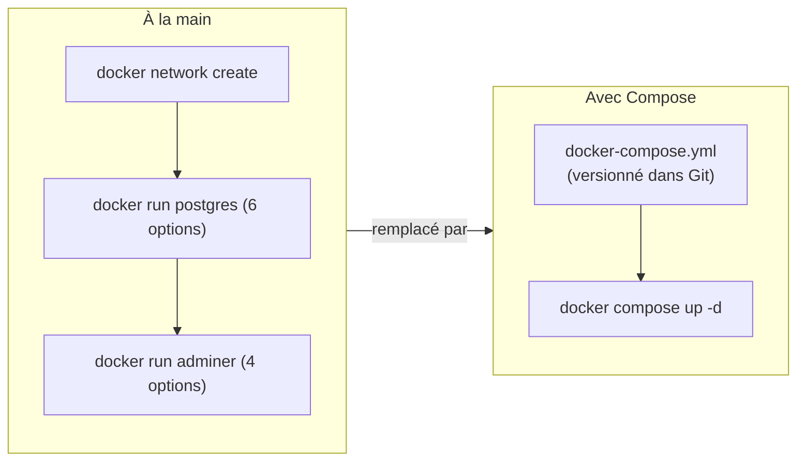
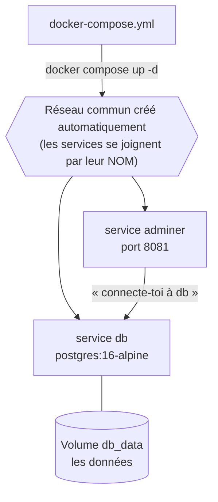
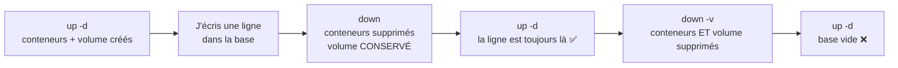
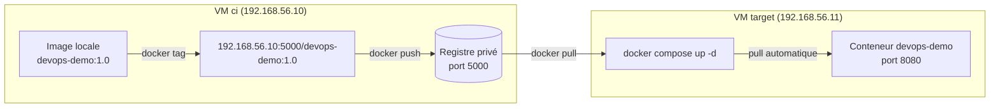
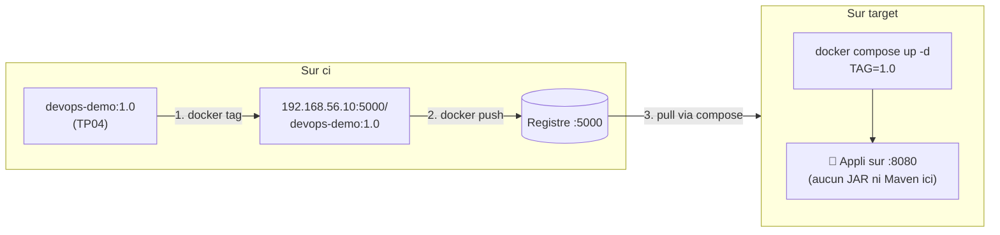

# TP 5 — Docker Compose, registre et environnement reproductible (V7)

**Durée : 60 min** · théorie 8 · activité 10 · mini-TP 20 · fil rouge 15 · validation 7 · **VM** : `ci`, `target` · **Format** : individuel
*(Couvre les « TP Docker 5 à 7 » : plusieurs services, base de données, environnement reproductible.)*

> **Légende** : 🖥️ terminal · 🌐 navigateur · 📝 éditer un fichier · ✅ ce que vous devez voir · ⚠️ si ça ne marche pas · 🎯 livrable · 🎤 consigne formateur
> Rappel : `vagrant ssh ci` pour la VM `ci`. Pour aller sur `target` depuis `ci` : `ssh vagrant@192.168.56.11` (on en sort avec `exit`). **Regardez toujours le prompt** (`vagrant@ci` ou `vagrant@target`) avant de taper.

---

## 0. Où sommes-nous ?

```mermaid
flowchart LR
  V1["V1 App"] --> V2["V2 Git"] --> V3["V3 Maven"] --> V4["V4 Tests"] --> V5["V5 Jenkins CI"] --> V6["V6 Docker"] --> V7["V7 Registre"] --> V8["V8 Ansible"] --> V9["V9 Pipeline CD"] --> V10["V10 K8s"] --> V11["V11 Logs"] --> V12["V12 Monitoring"] --> V13["V13 Selenium"]
  classDef done fill:#c8e6c9,stroke:#2e7d32
  classDef now fill:#ffe082,stroke:#e65100,stroke-width:3px
  classDef todo fill:#eeeeee,stroke:#9e9e9e,color:#757575
  class V1,V2,V3,V4,V5,V6 done
  class V7 now
  class V8,V9,V10,V11,V12,V13 todo
```



## 1. Objectif pédagogique

Décrire un ensemble de services dans un fichier (`docker-compose.yml`), comprendre la **persistance** (volumes), publier une image dans un **registre** et la redéployer sur un autre serveur.

## 2. Prérequis

TP04 (image, conteneur, Dockerfile). L'image `devops-demo:1.0` existe sur `ci`.

---

## 3. Théorie illustrée

### 3.1 De douze commandes à un fichier



### 3.2 Ce que Compose fait pour vous



### 3.3 Le cycle de vie des données (volume)



| Commande | Conteneurs | Volume (données) |
|---|---|---|
| `docker compose down` | supprimés | **conservé** |
| `docker compose down -v` | supprimés | **supprimé** |

### 3.4 Le registre : un « Git pour les images »



**Anatomie d'un nom d'image** : `192.168.56.10:5000 / devops-demo : 1.0`
→ **registre** (adresse:port) / **nom de l'image** : **tag** (version).

### 3.5 Outils et livrables

| Outil | Rôle | 🎯 Livrable |
|---|---|---|
| **Docker Compose** | Décrit et lance plusieurs services | `docker-compose.yml` relu en PR |
| **Volume** | Fait survivre les données aux conteneurs | Données persistantes |
| **Registre** | Stocke les images par tag | Image récupérable depuis n'importe quelle machine |

---

## 4. Problème réel à résoudre

« Pour démarrer l'application et sa base de données, un nouveau collègue doit suivre une page de 12 commandes que personne ne tient à jour. Et l'image construite sur le poste du développeur n'existe nulle part ailleurs. »

---

## 5. Activité de découverte **[N1 Découverte]** (10 min)

### Pas à pas

**Étape 1 — Démarrer à la main deux conteneurs qui doivent se parler** 🖥️
```bash
docker network create demo-net
docker run -d --name pg --network demo-net -e POSTGRES_USER=demo -e POSTGRES_PASSWORD=demo-pwd -e POSTGRES_DB=demo postgres:16-alpine
docker run -d --name adm --network demo-net -p 8081:8080 adminer:4
docker ps
```
✅ `pg` et `adm` apparaissent dans `docker ps`. *(PostgreSQL = une base de données ; Adminer = une page web pour l'administrer.)*

**Étape 2 — Tout arrêter, sans rien noter** 🖥️
```bash
docker rm -f adm pg && docker network rm demo-net
```

### Questions
Combien de commandes, d'options à retenir ? Que se passe-t-il si un collègue oublie `--network` ? Comment partager cette recette ?

> 🎤 **Formateur** : comptez les options au tableau (≈ 12). « Et la prod, c'est 10 services. Il nous faut un fichier. »

---

## 6. Mini-TP **[N2 Application]** (20 min) — « Base de données + interface d'administration »

- **Contexte** : PostgreSQL et Adminer, sans lien avec l'application.
- **Objectif** : décrire 2 services dans un fichier, **prouver la persistance**.
- **Architecture** : `db` (volume `db_data`) ← `adminer` (port 8081).

**Fichier** `mini-tp/compose-db/docker-compose.yml` (fourni) — **lu bloc par bloc**
```yaml
# Mini-TP : plusieurs services + persistance
services:                       # ← la liste des services
  db:                           # ← 1er service, nommé « db » (c'est ce nom qu'Adminer utilisera)
    image: postgres:16-alpine   #   quelle image
    environment:                #   variables d'environnement
      POSTGRES_USER: demo
      POSTGRES_PASSWORD: demo-pwd
      POSTGRES_DB: demo
    volumes:
      - db_data:/var/lib/postgresql/data   # données stockées dans le volume db_data
    healthcheck:                #   test de santé : la base est-elle prête ?
      test: ["CMD-SHELL", "pg_isready -U demo -d demo"]
      interval: 5s
      retries: 10

  adminer:                      # ← 2e service
    image: adminer:4
    ports:
      - "8081:8080"      # 8080 est déjà pris par Jenkins sur la VM ci
    depends_on:
      db:
        condition: service_healthy    #   démarrer SEULEMENT quand db est en bonne santé

volumes:
  db_data:                      # ← déclaration du volume
```
> **YAML** : l'indentation (espaces, **jamais de tabulations**) fait partie de la syntaxe.

### Pas à pas

**Étape 1 — Se placer dans le dossier** 🖥️
```bash
cd ~/devops-formation/mini-tp/compose-db
ls
```
✅ Vous voyez `docker-compose.yml`.

**Étape 2 — Démarrer l'ensemble en une commande** 🖥️
```bash
docker compose up -d
docker compose ps
```
✅ `db` en `healthy` (patientez 10-20 s et relancez `ps`) et `adminer` en `running`.
*(Attention : `docker compose` en **deux mots**, pas `docker-compose`.)*

**Étape 3 — Écrire une donnée dans la base** 🖥️
```bash
docker compose exec db psql -U demo -d demo -c "CREATE TABLE notes(id serial, txt text); INSERT INTO notes(txt) VALUES ('bonjour');"
docker compose exec db psql -U demo -d demo -c "SELECT * FROM notes;"
```
✅ Un tableau avec une ligne : `1 | bonjour`.

**Étape 4 — Supprimer les conteneurs (pas le volume) et relancer** 🖥️
```bash
docker compose down
docker compose up -d
sleep 10
docker compose exec db psql -U demo -d demo -c "SELECT * FROM notes;"
```
✅ La ligne `bonjour` est **toujours là** : les données ont survécu.

**Étape 5 — Supprimer aussi le volume** 🖥️
```bash
docker compose down -v
docker compose up -d
sleep 10
docker compose exec db psql -U demo -d demo -c "SELECT * FROM notes;"
```
✅ **Erreur** : `relation "notes" does not exist`. Les données ont disparu avec le volume.

**Étape 6 — Voir Adminer dans le navigateur** 🌐 : http://192.168.56.10:8081
Champs : **Système** `PostgreSQL` · **Serveur** `db` (⚠️ pas `localhost`) · **Utilisateur** `demo` · **Mot de passe** `demo-pwd` · **Base** `demo`.
✅ La base s'ouvre ; vide à ce stade.

**Étape 7 — Nettoyer** 🖥️
```bash
docker compose down -v
```

**Résultat attendu** : la ligne `bonjour` survit à `down` et disparaît avec `down -v`.

### Erreurs fréquentes

| Symptôme | Cause | Remède |
|---|---|---|
| `docker-compose: command not found` | Ancienne syntaxe | Utiliser `docker compose` |
| `yaml: ... found character that cannot start any token` | Tabulation ou mauvais retrait | Remplacer par des espaces |
| Adminer : « connexion refusée » | Serveur `localhost` saisi | Saisir **`db`** (nom du service) |

**Solution** : le service `db` n'est joignable depuis Adminer que par son **nom de service**.

---

## 7. Retour pédagogique

- **Appris** : Compose crée un réseau commun et résout les noms de service ; un volume sépare la vie des données de celle des conteneurs ; `healthcheck` + `depends_on` ordonnent le démarrage.
- **Pourquoi en DevOps** : « démarrer l'environnement » devient une seule commande, identique pour tous.
- **Problème résolu** : documentation obsolète, environnements différents d'un poste à l'autre.
- **Limites** : Compose pilote **un seul hôte**, sans reprise automatique entre machines ni mise à jour progressive (voir TP08).

---

## 8. Retour au projet fil rouge **[N3 Intégration]** (15 min) — V7

### 8.1 Avancement



### 8.2 Pas à pas

**Étape 1 — Étiqueter l'image pour le registre** 🖥️ (prompt `vagrant@ci`)
```bash
cd ~/devops-formation/app
docker tag devops-demo:1.0 192.168.56.10:5000/devops-demo:1.0
```
*(`docker tag` ne copie rien : il ajoute un **second nom** à la même image. Ce nom contient l'adresse du registre.)*

**Étape 2 — Publier** 🖥️
```bash
docker push 192.168.56.10:5000/devops-demo:1.0
```
✅ Des lignes `Pushed` puis `1.0: digest: sha256:...`.
⚠️ `http: server gave HTTP response to HTTPS client` → le registre n'est pas déclaré « insecure » sur la VM : voir le formateur.

**Étape 3 — Vérifier dans le registre** 🖥️
```bash
curl -s http://192.168.56.10:5000/v2/_catalog
curl -s http://192.168.56.10:5000/v2/devops-demo/tags/list
```
✅ `{"repositories":["devops-demo"]}` puis `{"name":"devops-demo","tags":["1.0"]}`.

**Étape 4 — Aller sur `target`** 🖥️
```bash
ssh vagrant@192.168.56.11
```
✅ Le prompt devient `vagrant@target`. *(Si on demande « yes/no » : tapez `yes`. Mot de passe éventuel : `vagrant`.)*

**Étape 5 — Déployer **sans construire**** 🖥️ (prompt `vagrant@target`)
```bash
cd /vagrant/app && cat docker-compose.yml
TAG=1.0 docker compose up -d
docker compose ps
exit
```
> `TAG=1.0` définit une variable **pour cette seule commande** : le compose y lit le tag à télécharger. `exit` ramène sur `ci`.

✅ `docker compose ps` : le service est `running` / `healthy`.

**Étape 6 — Tester depuis `ci`** 🖥️ (prompt `vagrant@ci`)
```bash
curl -s http://192.168.56.11:8080/api/info
```
✅ JSON avec `"version":"1.0"` : l'application tourne sur `target` **sans qu'aucun JAR ni Maven n'y existe**.

**Étape 7 — Reproductibilité** 🖥️ : sur `target`, `docker compose down` puis `TAG=1.0 docker compose up -d` : même résultat.

**Étape 8 — Nettoyage avant le TP06** 🖥️ (depuis `ci`)
```bash
ssh vagrant@192.168.56.11 "cd /vagrant/app && docker compose down"
```
*(Le port 8080 de `target` doit être libre pour Ansible.)*

**Résultat attendu** : le tag `1.0` est visible dans le registre ; l'application répond sur `192.168.56.11:8080`.

**Pourquoi V7 ?** Avant : l'image n'existe que sur le poste qui l'a construite. Après : un artefact versionné, récupérable partout. **Preuve** : le catalogue du registre.

---

## 9. Validation

1. Quelle différence entre `docker compose down` et `docker compose down -v` ?
2. Pourquoi Adminer joint-il la base avec le nom `db` ?
3. Que contient l'URL `192.168.56.10:5000/devops-demo:1.0` ?
4. **Tâche** : poussez un tag `1.1` et listez les tags du registre.

### Corrigé formateur
1. `down` supprime les conteneurs, **pas** le volume ; `down -v` supprime aussi le volume (donc les données).
2. Compose crée un réseau où chaque service est joignable par son **nom**.
3. Registre `192.168.56.10:5000`, image `devops-demo`, tag `1.0`.
4. `docker tag devops-demo:1.0 192.168.56.10:5000/devops-demo:1.1 && docker push 192.168.56.10:5000/devops-demo:1.1` puis `curl -s http://192.168.56.10:5000/v2/devops-demo/tags/list` → `["1.0","1.1"]`.

## 10. Extension / challenge

Ajoutez un service `db` (PostgreSQL) au `docker-compose.yml` de l'application avec un `Secret`-like via variable d'environnement, puis esquissez les modifications Java nécessaires (`spring-boot-starter-data-jpa`, driver PostgreSQL, entité `Task`). Attention : l'application actuelle stocke les tâches en mémoire.

## Glossaire du TP

| Mot | Définition simple |
|---|---|
| **Compose** | Outil qui lance plusieurs conteneurs à partir d'un fichier |
| **Service** | Un conteneur décrit dans le compose (`db`, `adminer`) |
| **Volume** | Espace disque qui survit aux conteneurs |
| **Registre** | Entrepôt d'images (« Git des images ») |
| **Tag** | Version d'une image |
| **Push / Pull** | Envoyer / télécharger une image |
