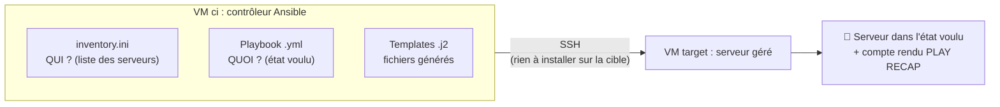
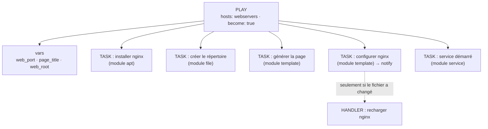
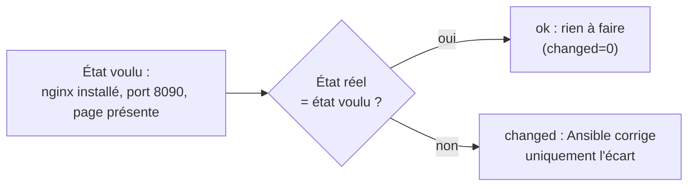
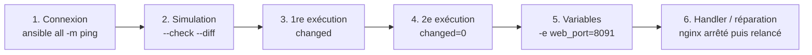
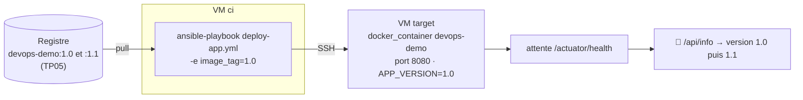

# TP 6 — Ansible : configurer sans connexion manuelle (V8)

**Durée : 105 min** · théorie 12 · activité 15 · mini-TP 35 · fil rouge 33 · validation 10 · **VM** : `ci` (contrôleur) → `target` (géré) · **Format** : individuel
*(Couvre les « TP Ansible 1 à 7 » et 9 : problème, inventaire, premier playbook, serveur web, variables, templates, handlers, déploiement. Rôles et intégration Jenkins : challenge ici, puis TP07.)*

> **Légende** : 🖥️ terminal · 🌐 navigateur · 📝 éditer un fichier · ✅ ce que vous devez voir · ⚠️ si ça ne marche pas · 🎯 livrable · 🎤 consigne formateur
> Rappel : toutes les commandes `ansible…` se tapent **sur `ci`** (prompt `vagrant@ci`). Vous ne vous connectez à `target` que pour la partie « à la main ».

---

## 0. Où sommes-nous ?

```mermaid
flowchart LR
  V1["V1 App"] --> V2["V2 Git"] --> V3["V3 Maven"] --> V4["V4 Tests"] --> V5["V5 Jenkins CI"] --> V6["V6 Docker"] --> V7["V7 Registre"] --> V8["V8 Ansible"] --> V9["V9 Pipeline CD"] --> V10["V10 K8s"] --> V11["V11 Logs"] --> V12["V12 Monitoring"] --> V13["V13 Selenium"]
  classDef done fill:#c8e6c9,stroke:#2e7d32
  classDef now fill:#ffe082,stroke:#e65100,stroke-width:3px
  classDef todo fill:#eeeeee,stroke:#9e9e9e,color:#757575
  class V1,V2,V3,V4,V5,V6,V7 done
  class V8 now
  class V9,V10,V11,V12,V13 todo
```



## 1. Objectif pédagogique

Comprendre **pourquoi** la configuration manuelle des serveurs ne tient pas ; décrire l'état souhaité d'un serveur dans un playbook **idempotent** ; utiliser inventaire, variables, templates et handlers ; déployer l'application avec Ansible.

## 2. Prérequis

TP04-05 (Docker, registre) ; savoir se connecter en SSH (`ssh utilisateur@adresse`).

---

## 3. Théorie illustrée

### 3.1 Architecture : un contrôleur, des machines gérées, aucun agent



### 3.2 Anatomie d'un playbook : qui fait quoi



| Mot | Question | Dans le mini-TP |
|---|---|---|
| **Inventaire** | **Qui** configure-t-on ? | `inventory.ini` (groupe `webservers`) |
| **Module** | **Quoi** faire (une action prête à l'emploi) ? | `apt`, `file`, `template`, `service` |
| **Variable** | Quel **paramètre** ? | `web_port: 8090` |
| **Template** | Quel **fichier généré** selon les variables ? | `demo.conf.j2` |
| **Handler** | Quelle **réaction** à un changement ? | recharger nginx |
| **Idempotence** | Peut-on **rejouer** sans danger ? | 2ᵉ exécution : `changed=0` |

### 3.3 L'idempotence : on décrit un état, pas des gestes


`apt install nginx` à la main, lancé deux fois = deux commandes. « `nginx` présent » (module `apt`, `state: present`) lancé deux fois = **un seul** changement, puis plus rien.

### 3.4 Outils et livrables

| Outil | Rôle | 🎯 Livrable |
|---|---|---|
| **Ansible** | Applique un état voulu sur des serveurs | Serveur configuré + `PLAY RECAP` |
| **Playbook** | Documentation exécutable | Fichier YAML relu en PR |
| **Inventaire** | Liste des cibles | Fichier versionné |

---

## 4. Problème réel à résoudre

« L'équipe doit préparer 20 serveurs identiques. Chaque technicien suit sa propre procédure, oublie une étape ou configure un port différent. Dix jours plus tard, personne ne sait pourquoi le serveur 14 se comporte autrement. »

---

## 5. Activité de découverte **[N1 Découverte]** (15 min) — « La procédure à la main »

### Pas à pas

**Étape 1 — Se connecter à `target`** 🖥️
```bash
ssh vagrant@192.168.56.11
```
✅ Le prompt devient `vagrant@target`.

**Étape 2 — Installer et configurer un serveur web (6 commandes)** 🖥️
```bash
sudo apt-get update -y && sudo apt-get install -y nginx
sudo mkdir -p /var/www/demo
echo "<h1>Configuré à la main</h1>" | sudo tee /var/www/demo/index.html
printf 'server {\n listen 8090;\n root /var/www/demo;\n}\n' | sudo tee /etc/nginx/conf.d/demo.conf
sudo nginx -t && sudo systemctl reload nginx
exit
```
*(`sudo` = en tant qu'administrateur ; `nginx -t` teste la configuration ; `reload` la recharge.)*

**Étape 3 — Tester depuis `ci`** 🖥️
```bash
curl -s http://192.168.56.11:8090
```
✅ `<h1>Configuré à la main</h1>`.

### Questions
Comptez les commandes. **Entre voisins**, comparez : qui a oublié le `mkdir` ? le `reload` ? Quelle serait la procédure pour 20 serveurs ? Et pour **défaire** ?

**Nettoyage** 🖥️
```bash
ssh vagrant@192.168.56.11 "sudo rm -f /etc/nginx/conf.d/demo.conf && sudo rm -rf /var/www/demo && sudo systemctl reload nginx"
```

> 🎤 **Formateur** : notez au tableau « 6 commandes × 20 serveurs = 120 occasions d'erreur ». Premier aperçu d'Ansible : `ansible all -m ping`.

---

## 6. Mini-TP **[N2 Application]** (35 min) — « Le serveur web par playbook »

- **Contexte** : refaire l'activité précédente avec Ansible.
- **Objectif** : inventaire, commandes ad hoc, playbook, variables, template, handler, idempotence.
- **Architecture** : `ci` (contrôleur) → SSH → `target` (Nginx sur le port 8090).



### Fichiers (dans `ansible/`, fournis)

`inventory.ini`
```ini
[webservers]
target ansible_host=192.168.56.11

[all:vars]
ansible_python_interpreter=/usr/bin/python3
```

`mini-tp/tp-nginx.yml`
```yaml
---
# Mini-TP Ansible : un serveur web configuré par variables, template et handler
- name: Serveur web de démonstration
  hosts: webservers
  become: true
  vars:
    web_port: 8090
    page_title: "Serveur configuré par Ansible"
    web_root: /var/www/demo
  tasks:
    - name: Installer nginx
      ansible.builtin.apt:
        name: nginx
        state: present
        update_cache: true
        cache_valid_time: 3600

    - name: Créer le répertoire du site
      ansible.builtin.file:
        path: "{{ web_root }}"
        state: directory
        mode: "0755"

    - name: Générer la page d'accueil
      ansible.builtin.template:
        src: index.html.j2
        dest: "{{ web_root }}/index.html"
        mode: "0644"

    - name: Configurer le site nginx
      ansible.builtin.template:
        src: demo.conf.j2
        dest: /etc/nginx/conf.d/demo.conf
        mode: "0644"
      notify: Recharger nginx

    - name: Nginx démarré et activé
      ansible.builtin.service:
        name: nginx
        state: started
        enabled: true

  handlers:
    - name: Recharger nginx
      ansible.builtin.service:
        name: nginx
        state: reloaded
```

`mini-tp/templates/index.html.j2`
```jinja2
<h1>{{ page_title }}</h1>
<p>Serveur : {{ ansible_hostname }} - port {{ web_port }}</p>
```

`mini-tp/templates/demo.conf.j2`
```jinja2
server {
    listen {{ web_port }};
    root {{ web_root }};
    index index.html;
}
```
> Les `{{ ... }}` sont remplacés par la valeur de la variable : **un seul modèle, autant de fichiers que de serveurs ou de paramètres**.

### Pas à pas (toujours depuis `~/devops-formation/ansible`, **jamais depuis `/vagrant`**)

**Étape 1 — Se placer au bon endroit** 🖥️
```bash
cd ~/devops-formation/ansible
ls
```
✅ Vous voyez `inventory.ini`, `mini-tp`, `deploy-app.yml`…

**Étape 2 — Tester la connexion** 🖥️
```bash
ansible all -m ping
```
✅ `target | SUCCESS => { ... "ping": "pong" }`.
⚠️ `Permission denied (publickey)` → `ssh-copy-id vagrant@192.168.56.11` (mot de passe `vagrant`), puis recommencez.

**Étape 3 — Interroger la machine (commandes ad hoc)** 🖥️
```bash
ansible webservers -m setup -a "filter=ansible_distribution*"
ansible webservers -a "df -h /"
```
✅ La distribution (Ubuntu) puis l'espace disque de `target`.

**Étape 4 — Simuler sans rien modifier** 🖥️
```bash
ansible-playbook mini-tp/tp-nginx.yml --check --diff
```
✅ Ansible indique **ce qu'il changerait** (lignes `+` en vert), sans l'appliquer.

**Étape 5 — Première exécution réelle** 🖥️
```bash
ansible-playbook mini-tp/tp-nginx.yml
curl -s http://192.168.56.11:8090
```
✅ Chaque tâche affiche `ok` ou `changed` ; en bas :
```
PLAY RECAP ***
target : ok=... changed=... unreachable=0 failed=0
```
et `curl` affiche votre page avec le titre « Serveur configuré par Ansible ».

**Étape 6 — Deuxième exécution : l'idempotence** 🖥️
```bash
ansible-playbook mini-tp/tp-nginx.yml
```
✅ **`changed=0`** : rien à faire, car l'état voulu est déjà atteint. *(C'est LA preuve à montrer.)*

**Étape 7 — Changer les variables sans toucher au playbook** 🖥️
```bash
ansible-playbook mini-tp/tp-nginx.yml -e web_port=8091 -e 'page_title="Titre modifié"'
curl -s http://192.168.56.11:8091
```
✅ Seules les tâches `template` et le **handler « Recharger nginx »** apparaissent en `changed`. `curl` affiche « Titre modifié ».

**Étape 8 — Réparation automatique (handler + service)** 🖥️
```bash
ssh vagrant@192.168.56.11 "sudo systemctl stop nginx"
curl -s --max-time 3 http://192.168.56.11:8090 ; echo "(le site est tombé)"
ansible-playbook mini-tp/tp-nginx.yml
curl -s http://192.168.56.11:8090
```
✅ Le site répond de nouveau : la tâche `service` a relancé nginx.

🎯 **Livrable** : un playbook rejouable, dont la 2ᵉ exécution affiche `changed=0` ; le serveur est identique à chaque fois.

### Erreurs fréquentes

| Symptôme | Cause | Remède |
|---|---|---|
| `Permission denied (publickey)` | Clé SSH non copiée | `ssh-copy-id vagrant@192.168.56.11` |
| `ansible.cfg` ignoré / avertissement | Lancé depuis `/vagrant` (dossier world-writable) | `cd ~/devops-formation/ansible` |
| Erreur de droits sur `apt` | `become: true` oublié | Le remettre dans le play |
| `did not find expected key` | Mauvaise indentation YAML | Espaces, pas de tabulations |
| Plus d'idempotence | Module `command: apt install` au lieu de `apt` | Utiliser le **module** dédié |

**Point à faire dire** : **le handler ne se déclenche que si le fichier de configuration a réellement changé**.

---

## 7. Retour pédagogique

- **Appris** : inventaire (qui), module (quoi), variable (paramètre), template (fichier généré), handler (réaction à un changement), idempotence (rejouable sans danger).
- **Pourquoi en DevOps** : le playbook est la documentation exécutable ; il se relit en PR comme du code.
- **Problème résolu** : dérive de configuration (*configuration drift*), erreurs manuelles, reconstruction d'un serveur.
- **Limites** : Ansible décrit des étapes (pas un état garanti comme Kubernetes) ; un module mal choisi n'est pas idempotent ; les secrets exigent Ansible Vault.

---

## 8. Retour au projet fil rouge **[N3 Intégration]** (33 min) — V8

**Objectif** : déployer le conteneur de l'application sur `target` **sans se connecter dessus**.

### 8.1 Avancement



### 8.2 Pas à pas

**Étape 1 — Lire le playbook de déploiement** 📝 (lecture)
```bash
cd ~/devops-formation/ansible
cat deploy-app.yml
```
Repérez : `docker_image` (**pull** depuis le registre), `docker_container` (**recréé**, port 8080, variable `APP_VERSION`), l'attente de `/actuator/health`, la variable `image_tag`.

**Étape 2 — Vérifier que `target` est « propre »** 🖥️ (le Compose du TP05 doit être arrêté)
```bash
ssh vagrant@192.168.56.11 "docker ps"
```
✅ Aucun conteneur sur le port 8080. Sinon : `ssh vagrant@192.168.56.11 "cd /vagrant/app && docker compose down"`.

**Étape 3 — Déployer la version 1.0** 🖥️
```bash
ansible-playbook deploy-app.yml -e image_tag=1.0
curl -s http://192.168.56.11:8080/api/info
```
✅ `"version":"1.0"` — et vous n'avez **tapé aucune commande sur `target`**.

**Étape 4 — Publier puis déployer la 1.1** 🖥️
```bash
docker tag devops-demo:1.0 192.168.56.10:5000/devops-demo:1.1
docker push 192.168.56.10:5000/devops-demo:1.1
ansible-playbook deploy-app.yml -e image_tag=1.1
curl -s http://192.168.56.11:8080/api/info
```
> *(Rappel : la version affichée vient de l'`APP_VERSION` donnée au conteneur par Ansible.)*

✅ `"version":"1.1"`.

**Étape 5 — Discussion** : cette tâche est-elle idempotente ? **Non** : `recreate: true` force la recréation du conteneur à chaque exécution ; c'est un **choix volontaire** pour garantir que la bonne version tourne.

**Étape 6 — (Option) Découvrir `site.yml`** 🖥️
```bash
cat site.yml
ansible-playbook site.yml --check --diff
```
Repérez : variables, handlers, tags. *(Java + Nginx + utilisateurs + service systemd ; simulation seulement.)*

**Résultat attendu** : `"version":"1.0"` puis `"version":"1.1"` sans qu'aucune commande n'ait été tapée sur `target`.

**Pourquoi V8 ?** Avant : on se connecte en SSH pour lancer `docker run`. Après : le déploiement est un fichier versionné, rejouable par Jenkins. **Preuve** : la version change après `ansible-playbook`.

---

## 9. Validation

1. Que signifie « idempotent » ? Comment le prouver avec Ansible ?
2. Où déclare-t-on la liste des serveurs ? Les variables ?
3. Quand un handler s'exécute-t-il ?
4. **Tâche** : changez la version via `-e image_tag=` et prouvez-le avec `curl`.
5. Pourquoi ne pas lancer `ansible-playbook` depuis `/vagrant` ?

### Corrigé formateur
1. Rejouer donne le même état sans changement ; preuve : 2ᵉ exécution avec `changed=0`.
2. Serveurs : **inventaire** (`inventory.ini`). Variables : section `vars:` du playbook, ou option `-e`.
3. Uniquement si une tâche qui le `notify` a **réellement changé** quelque chose.
4. `ansible-playbook deploy-app.yml -e image_tag=1.1` puis `curl .../api/info`.
5. `/vagrant` est un dossier partagé accessible en écriture à tous : Ansible **ignore `ansible.cfg`** par sécurité.

## 10. Extension / challenge

- Transformez `tp-nginx.yml` en **rôle** : `ansible-galaxy init roles/nginx_demo`, déplacez tâches, templates, handlers et variables par défaut.
- Chiffrez une variable avec **Ansible Vault** (`ansible-vault encrypt_string`).
- Ajoutez un utilisateur opérateur dans la variable `operators` de `site.yml` et rejouez.

## Glossaire du TP

| Mot | Définition simple |
|---|---|
| **IaC** | Infrastructure décrite dans des fichiers versionnés |
| **Playbook** | Fichier YAML décrivant l'état voulu |
| **Module** | Action prête à l'emploi (`apt`, `file`, `service`…) |
| **Inventaire** | Liste des serveurs à configurer |
| **Template (.j2)** | Modèle de fichier avec variables |
| **Handler** | Tâche déclenchée seulement si un changement a eu lieu |
| **Idempotence** | Rejouer ne change rien si l'état est déjà bon |
| **Dérive de configuration** | Serveurs qui diffèrent peu à peu les uns des autres |
