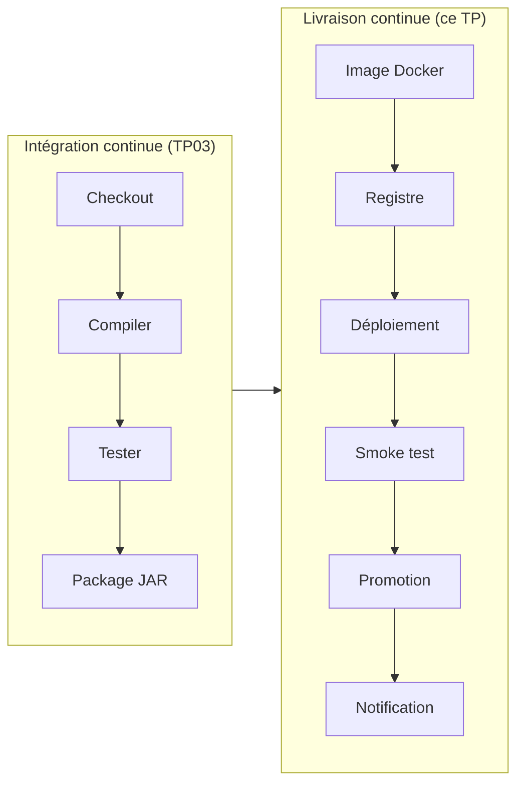
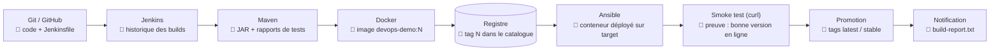
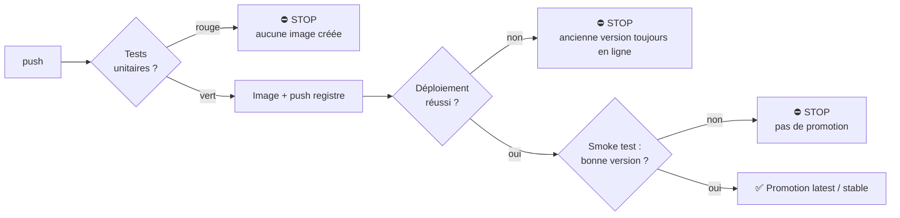
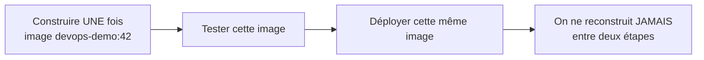
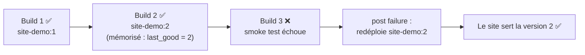
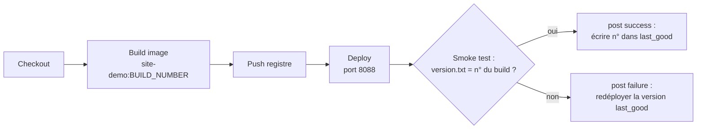
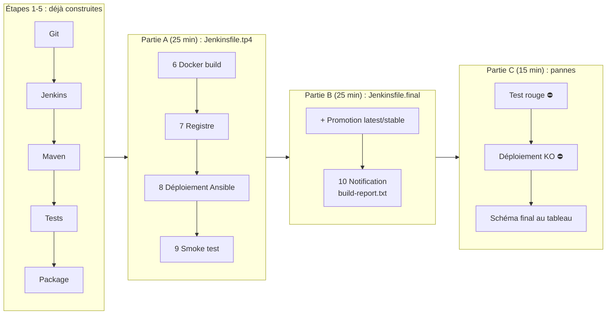

# TP 7 — Pipeline CI/CD complet (V9)

**Durée : 150 min** · théorie 15 · activité 20 · mini-TP 35 · fil rouge 70 · validation 10 · **VM** : `ci` + `target` · **Format** : binômes
*(Étapes 6 à 10 de la chaîne : Docker build, registre, déploiement, tests après déploiement, notification, puis reconstruction du pipeline complet.)*

> **Légende** : 🖥️ terminal · 🌐 navigateur · 📝 éditer un fichier · ✅ ce que vous devez voir · ⚠️ si ça ne marche pas · 🎯 livrable · 🎤 consigne formateur
> Rappel : Jenkins = http://192.168.56.10:8080 (`admin` / `admin`) ; registre = `192.168.56.10:5000` ; `target` = `192.168.56.11`.

---

## 0. Où sommes-nous ?

```mermaid
flowchart LR
  V1["V1 App"] --> V2["V2 Git"] --> V3["V3 Maven"] --> V4["V4 Tests"] --> V5["V5 Jenkins CI"] --> V6["V6 Docker"] --> V7["V7 Registre"] --> V8["V8 Ansible"] --> V9["V9 Pipeline CD"] --> V10["V10 K8s"] --> V11["V11 Logs"] --> V12["V12 Monitoring"] --> V13["V13 Selenium"]
  classDef done fill:#c8e6c9,stroke:#2e7d32
  classDef now fill:#ffe082,stroke:#e65100,stroke-width:3px
  classDef todo fill:#eeeeee,stroke:#9e9e9e,color:#757575
  class V1,V2,V3,V4,V5,V6,V7,V8 done
  class V9 now
  class V10,V11,V12,V13 todo
```



Ce TP **assemble** les briques construites séparément : Git, Maven, Jenkins, Docker, registre, Ansible.

## 1. Objectif pédagogique

Construire un pipeline qui mène un `git push` jusqu'à l'application déployée, **identifier à quelle étape il s'arrête quand quelque chose casse**, et savoir revenir à une version saine.

## 2. Prérequis

TP01 à TP06 : Git, Maven/tests, Jenkins CI, image Docker, registre, déploiement Ansible.

---

## 3. Théorie illustrée

### 3.1 CI et CD : la différence


**CI** = « mon code est-il sain ? » · **CD** = « puis-je le livrer automatiquement, sans erreur ? »

### 3.2 Les outils, leur rôle et le livrable de chacun



| Outil | Reçoit | Produit (🎯 livrable) |
|---|---|---|
| **Jenkins** | un `push` | l'orchestration, l'historique |
| **Maven** | le code | un JAR, des rapports de tests |
| **Docker** | le JAR | une image taguée `:BUILD_NUMBER` |
| **Registre** | l'image | un tag consultable |
| **Ansible** | le tag | un conteneur à jour sur `target` |
| **curl (smoke test)** | l'application en ligne | un verdict « bonne version ou non » |

### 3.3 Les portes (gates) : une version défectueuse s'arrête au plus tôt



### 3.4 Deux principes à retenir



- **Immuabilité** : l'image `:42` testée est celle qui est déployée.
- **Traçabilité** : le tag = le numéro de build ; `latest` seul ne dit pas **quelle** version tourne.

### 3.5 Le retour arrière (rollback)



---

## 4. Problème réel à résoudre

« Chaque mise en production demande de lancer à la main une dizaine d'opérations, dans l'ordre. Une étape oubliée et le serveur sert l'ancienne version sans que personne ne s'en rende compte. Comment livrer à la demande, sans erreur, et pouvoir revenir en arrière ? »

---

## 5. Activité de découverte **[N1 Découverte]** (20 min) — « Le jeu des cartes »

Chaque binôme reçoit **12 cartes** (une par étape), à imprimer ou à écrire sur des papiers :

| Carte | Étape |
|---|---|
| A | Récupérer le code |
| B | Compiler |
| C | Tests unitaires |
| D | Empaqueter le JAR |
| E | Construire l'image |
| F | Pousser au registre |
| G | Déployer |
| H | Smoke test |
| I | Tests Selenium |
| J | Promouvoir `stable` |
| K | Notifier |
| L | Déployer en production |

### Pas à pas
1. **Remettez-les dans l'ordre** (5 min). Pour chaque carte, écrivez au dos : **ce qu'elle produit** (un artefact) et **ce qu'elle exige**.
2. **Placez les portes** (5 min) : quelles cartes **bloquent** la suite en cas d'échec ?
3. **Injectez 3 pannes** (tirage au sort, 10 min) : *test unitaire rouge*, *déploiement impossible*, *mauvaise version affichée*. Pour chacune : à quelle carte le pipeline doit-il s'arrêter ? Que doit-il dire ? Que faire du serveur ?

> 🎤 **Formateur** : comparez les ordres proposés au pipeline de référence (`02-projet-fil-rouge.md`). Faites exprimer la règle : « on ne promeut que ce qui a passé toutes les portes ; on ne reconstruit jamais l'image entre deux étapes. »

### Corrigé formateur (à confirmer avec `02-projet-fil-rouge.md`)
- **Ordre** : A → B → C → D → E → F → G → H → I → J → K (→ L).
- **Portes** : C (tests), G (déploiement), H (smoke test), I (Selenium) bloquent ; K (notification) ne bloque pas.
- **Carte L « Déployer en production »** : c'est la carte de discussion : dans la formation, elle correspond à Kubernetes (TP08) ou n'est pas automatisée.
- **Pannes** : test rouge → stop à **C**, aucune image ; déploiement impossible → stop à **G**, l'ancienne version reste ; mauvaise version → stop à **H**, pas de promotion.

---

## 6. Mini-TP **[N2 Application]** (35 min) — « Livrer un site, avec retour arrière automatique »

- **Contexte** : le site statique `site-demo` (TP04), sans l'application Java.
- **Objectif** : build → push → déploiement → smoke test → **rollback** automatique en cas d'échec.
- **Architecture** : Jenkins (`ci`) construit l'image, la pousse dans le registre, l'exécute sur le port 8088 de `ci`, vérifie `version.txt`.



**Fichier** `mini-tp/site-demo/Jenkinsfile` (fourni)
```groovy
// Mini-TP CI/CD : build -> push -> deploy -> smoke test -> rollback automatique
pipeline {
    agent any
    parameters {
        booleanParam(name: 'BREAK_SMOKE', defaultValue: false, description: 'Simule une version défectueuse')
    }
    environment {
        REGISTRY = '192.168.56.10:5000'
        IMAGE    = "${REGISTRY}/site-demo"
        TAG      = "${env.BUILD_NUMBER}"
        LAST     = "${JENKINS_HOME}/site-demo.last_good"
    }
    stages {
        stage('Checkout') { steps { checkout scm } }
        stage('Build image') {
            steps { dir('mini-tp/site-demo') { sh 'docker build --build-arg VERSION=$TAG -t $IMAGE:$TAG .' } }
        }
        stage('Push registre') { steps { sh 'docker push $IMAGE:$TAG' } }
        stage('Deploy') {
            steps { sh 'docker rm -f site-demo || true; docker run -d --name site-demo -p 8088:80 $IMAGE:$TAG; sleep 3' }
        }
        stage('Smoke test') {
            steps {
                script {
                    def attendu = params.BREAK_SMOKE ? 'version-inexistante' : env.BUILD_NUMBER
                    sh "curl -fs http://localhost:8088/version.txt | grep -qx '${attendu}'"
                }
            }
        }
    }
    post {
        success { sh 'echo $TAG > $LAST' }
        failure {
            script {
                if (fileExists(env.LAST)) {
                    def prev = readFile(env.LAST).trim()
                    echo "ROLLBACK vers la version ${prev}"
                    sh "docker rm -f site-demo || true; docker run -d --name site-demo -p 8088:80 ${IMAGE}:${prev}"
                } else {
                    echo 'Aucune version précédente connue : pas de rollback possible'
                }
            }
        }
    }
}
```

### Comment lire ce Jenkinsfile

| Élément | Rôle |
|---|---|
| `parameters { booleanParam BREAK_SMOKE }` | Une **case à cocher** au lancement pour simuler une version défectueuse |
| `TAG = BUILD_NUMBER` | L'image porte le numéro du build : `site-demo:1`, `:2`, `:3`… |
| `LAST` | Fichier qui mémorise la **dernière version saine** |
| `curl -fs … \| grep -qx` | Le smoke test : le site doit servir **exactement** le numéro attendu |
| `post { success }` | Après réussite : on note le numéro dans `last_good` |
| `post { failure }` | Après échec : on relance l'image notée dans `last_good` |

### Pas à pas

**Étape 1 — Créer le job** 🌐
1. Jenkins → **Nouveau Item** → `site-demo-cd` → **Pipeline** → OK.
2. *Pipeline script from SCM* → Git → URL de votre dépôt → branche `*/main`.
3. **Script Path** : `mini-tp/site-demo/Jenkinsfile` → Enregistrer.

**Étape 2 — Lancer deux builds sains** 🌐
Cliquez **Build with Parameters** (la case `BREAK_SMOKE` **décochée**) → **Build**. Attendez le vert. Recommencez pour le build #2.

**Étape 3 — Vérifier après chaque build** 🖥️
```bash
curl -s localhost:8088/version.txt                      # le numéro du dernier build
curl -s http://192.168.56.10:5000/v2/site-demo/tags/list
```
✅ `1` puis `2` ; les tags du registre grandissent : `["1"]` puis `["1","2"]`.

**Étape 4 — Simuler une version défectueuse** 🌐
Build #3 : **Build with Parameters** → **cochez `BREAK_SMOKE`** → Build.
✅ Le stage *Smoke test* devient **rouge** ; dans la **Console**, le message `ROLLBACK vers la version 2`.

**Étape 5 — Prouver le retour arrière** 🖥️
```bash
curl -s localhost:8088/version.txt
curl -s http://192.168.56.10:5000/v2/site-demo/tags/list
```
✅ Le site sert **2** (et non 3). L'image `:3` existe dans le registre mais n'est plus déployée.

**Résultat attendu** : builds 1 et 2 verts ; build 3 rouge avec « ROLLBACK vers la version 2 » ; le site sert toujours la version 2.

### Erreurs fréquentes

| Symptôme | Cause | Remède |
|---|---|---|
| Premier build rouge sans rollback | Aucune version saine mémorisée | Normal : relancer sans cocher la case |
| `port is already allocated` (8088) | Ancien conteneur | `docker rm -f site-demo` |
| `docker: permission denied` côté Jenkins | Groupe `docker` non pris en compte | `sudo systemctl restart jenkins` |

**Idée clé** : la dernière version **saine** est mémorisée dans un fichier (`site-demo.last_good`, dans `JENKINS_HOME`, souvent `/var/lib/jenkins`) mis à jour **uniquement après** un smoke test réussi.

---

## 7. Retour pédagogique

- **Appris** : un smoke test doit vérifier *la bonne version*, pas seulement « ça répond » ; le rollback est possible parce que chaque version est une image taguée immuable.
- **Pourquoi en DevOps** : livraisons fréquentes et sûres ; l'erreur est détectée par la machine, pas par l'utilisateur.
- **Problème résolu** : mise en production manuelle, peur du changement, retour arrière improvisé.
- **Limites** : sans tests solides, la CD automatise aussi les erreurs ; un rollback ne répare pas les données (migrations) ; une seule cible de déploiement ici, pas de bascule progressive.

---

## 8. Retour au projet fil rouge **[N3 Intégration]** (70 min) — V9

**Rappel des étapes déjà construites** : 1 Git (TP01) · 2 Jenkins (TP03) · 3 Maven (TP02/03) · 4 Tests · 5 Package. Il reste les étapes **6 à 10**.

### 8.1 Avancement du fil rouge dans ce TP



### Partie A — le pipeline de l'archive (25 min)

**Étape 1 — Lire `Jenkinsfile.tp4` ligne par ligne** 📝
```bash
cd ~/devops-formation
cat jenkins/Jenkinsfile.tp4
```
Question : **qu'est-ce qui change à chaque build ?** → `TAG = BUILD_NUMBER`. Pour chaque stage, notez la **commande** et le **livrable**.

**Étape 2 — Créer le job `devops-cicd`** 🌐
**Nouveau Item** → `devops-cicd` → Pipeline → *Pipeline script from SCM* → Git → URL du dépôt → **Script Path** `jenkins/Jenkinsfile.tp4` → Enregistrer → **Lancer un build**.
✅ Toutes les cases de la *Stage View* passent au vert (patience : le build d'image et le déploiement prennent quelques minutes).

**Étape 3 — Vérifier le résultat** 🖥️
```bash
curl -s http://192.168.56.10:5000/v2/devops-demo/tags/list
curl -s http://192.168.56.11:8080/api/info
```
✅ Le tag du build (par exemple `"1"`) est dans le registre ; `/api/info` renvoie `"version":"<n° du build>"`.

**Étape 4 — Cycle complet : un changement de code arrive en ligne** 🖥️ puis 🌐
1. `git switch -c feature/titre-v9`
2. Modifiez le titre (`nano app/src/main/resources/templates/index.html`), puis `git commit -am "Titre V9" && git push -u origin feature/titre-v9`.
3. 🌐 Pull Request → relecture → **fusion dans `main`**.
4. 🌐 Observez Jenkins : un build démarre **tout seul** (polling).
5. 🌐 Ouvrez http://192.168.56.11:8080 : le **nouveau titre** est en ligne.

✅ Point de contrôle : un `git push` (via PR) a produit **une nouvelle version déployée**, sans aucune commande manuelle.

### Partie B — le pipeline final, étape par étape (25 min)

**Étape 5 — Créer le job `devops-final` et comparer** 🌐
Nouveau job **`devops-final`** → Script Path `jenkins/Jenkinsfile.final`. Ouvrez les deux fichiers (`Jenkinsfile.tp4` et `Jenkinsfile.final`) et **complétez le tableau** :

| Étape | Stage (nom exact dans le fichier) | Preuve visible |
|---|---|---|
| 6 Docker build | ? | image `devops-demo:<n>` |
| 7 Registre | ? | tag dans le catalogue |
| 8 Déploiement | ? | version qui change |
| 9 Tests après déploiement | ? | stage vert + `grep` de la version |
| 10 Notification | ? | `build-report.txt` archivé |

**Étape 6 — Lancer avec les paramètres par défaut** 🌐
**Build with Parameters** → `RUN_SELENIUM` et `DEPLOY_K8S` **décochés** (ils seront activés aux TP11 et TP08) → Build.
✅ Pipeline entièrement vert.

**Étape 7 — Récupérer le rapport** 🌐
Page du build → **Artefacts** → téléchargez `build-report.txt` et ouvrez-le : numéro de build, version, résultat.

### Partie C — le pipeline qui s'arrête au bon endroit (15 min)

**Étape 8 — Panne 1 : un test cassé** 🖥️
Cassez un test unitaire (cf. TP03), poussez, lancez le job.
✅ Le pipeline s'arrête au stage des tests, **avant** la construction de l'image : pas de nouveau tag dans le registre (vérifiez avec `curl .../tags/list`).

**Étape 9 — Panne 2 : déploiement impossible** 🖥️
Pendant un build, entre *Déploiement* et *Smoke test*, arrêtez le conteneur :
```bash
ssh vagrant@192.168.56.11 "docker stop devops-demo"
```
*(Alternative : changer `TARGET_HOST` pour une IP erronée dans une branche.)*
✅ Le smoke test échoue (ne trouve pas la bonne version) : **aucune promotion**.
Remettre en état : `ssh vagrant@192.168.56.11 "docker start devops-demo"`.

**Étape 10 — Reconstruire le pipeline au tableau avec le formateur** : un schéma de 10 cases, où chaque case porte son *stage*, sa *preuve* et sa *porte* (bloque / ne bloque pas). Comparez-le au schéma du §3.2.

**Pipeline obtenu** :
```
push → Checkout → Build+Tests → Package → Docker build → Push registre → Ansible deploy → Smoke test (version) → [Selenium] → Promotion latest/stable → [K8s] → Notification
```
**Résultat attendu** : page et `/api/info` affichent le numéro du dernier build réussi ; un test rouge empêche l'image d'exister ; le rapport de build est archivé.

**Pourquoi V9 ?** Avant : des briques isolées (Jenkins, Docker, Ansible). Après : une chaîne unique déclenchée par `git push`. **Preuve** : la version en ligne suit le numéro de build.

---

## 9. Validation

1. Pourquoi tagguer l'image avec `BUILD_NUMBER` plutôt que seulement `latest` ?
2. À quelle étape un test unitaire cassé arrête-t-il la chaîne ?
3. Que vérifie exactement le smoke test de `Jenkinsfile.final` ?
4. **Tâche** : prouvez qu'un build échoué n'a pas changé la version en ligne.
5. Où retrouve-t-on le résultat d'un build sans ouvrir Jenkins ?

### Corrigé formateur
1. Pour savoir **quelle** version tourne, tracer, et pouvoir **revenir** à un numéro précis ; `latest` est un nom mouvant.
2. Avant la construction de l'image (stage de tests) : aucune image n'existe pour cette version.
3. Que la version renvoyée par l'application en ligne (`/api/info`) correspond **au numéro du build** (et pas seulement qu'elle répond).
4. Comparer `curl .../api/info` avant et après le build rouge : la version est inchangée.
5. Dans `build-report.txt` (artefact archivé) et via le webhook de notification (`NOTIFY_URL`).

## 10. Extension / challenge

- Renseignez `NOTIFY_URL` avec un récepteur de test (par exemple un `nc -l` sur `ci`) et vérifiez la requête.
- Ajoutez un stage **manuel** (`input`) avant la promotion pour valider une version.
- Ajoutez le stage de rollback automatique du mini-TP au pipeline du fil rouge.

## Glossaire du TP

| Mot | Définition simple |
|---|---|
| **CD** | Livraison continue : déployer automatiquement une version saine |
| **Gate (porte)** | Contrôle qui bloque la suite si échec |
| **Smoke test** | Test rapide après déploiement : « la bonne version tourne-t-elle ? » |
| **Promotion** | Marquer une version validée (`latest`, `stable`) |
| **Rollback** | Retour automatique à la dernière version saine |
| **Artefact immuable** | Image jamais modifiée après sa construction |
| **BUILD_NUMBER** | Numéro automatique du build Jenkins |
