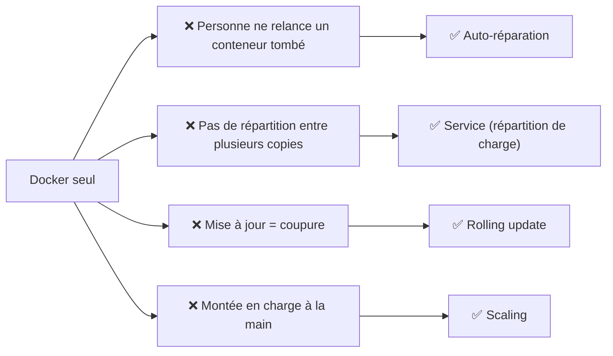
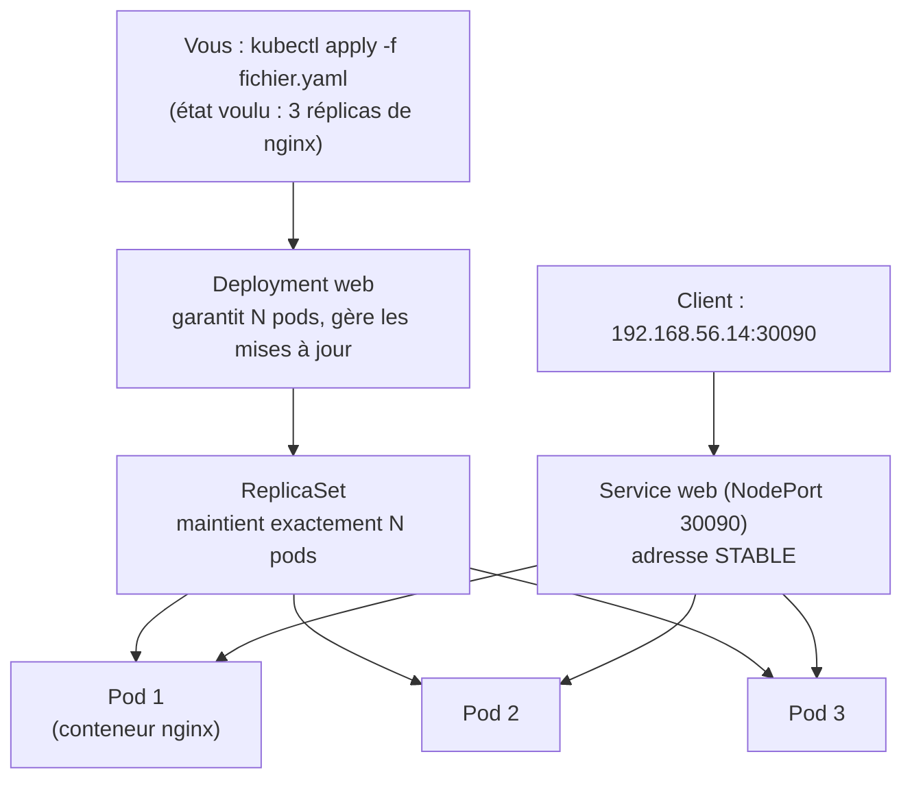
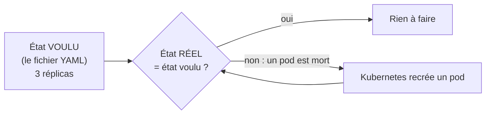
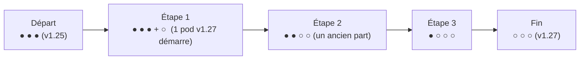
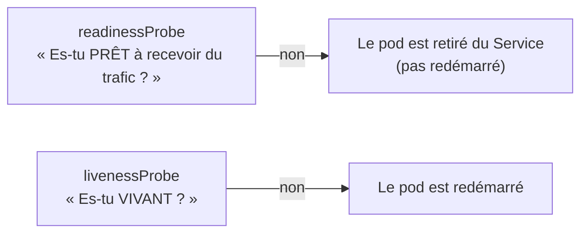
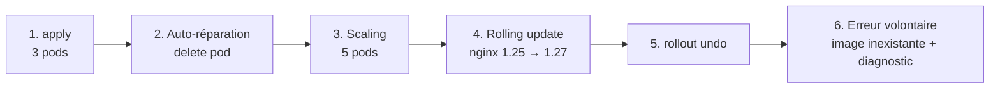
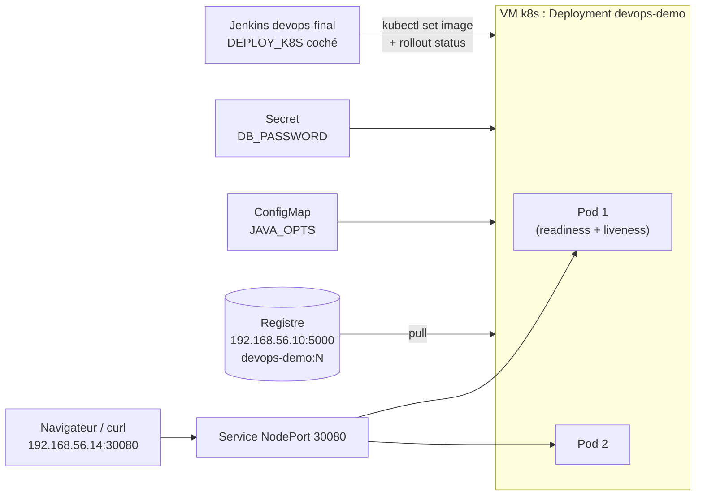

# TP 8 — Kubernetes : exploiter plusieurs conteneurs (V10)

**Durée : 105 min** · théorie 12 · activité 15 · mini-TP 33 · fil rouge 35 · validation 10 · **VM** : `ci`, `k8s` · **Format** : individuel
*(Couvre les « TP Kubernetes 1 à 9 » : Pod, Deployment, Service, exposition, scaling, rolling update, configuration, secrets, déploiement de l'application. Le 10ᵉ — déploiement depuis Jenkins — se fait avec `Jenkinsfile.final`.)*

> **Légende** : 🖥️ terminal · 🌐 navigateur · 📝 éditer un fichier · ✅ ce que vous devez voir · ⚠️ si ça ne marche pas · 🎯 livrable · 🎤 consigne formateur
> Rappel : les commandes `kubectl` se tapent **sur la VM `k8s`** (`vagrant ssh k8s`, prompt `vagrant@k8s`). Son adresse : `192.168.56.14`. Pour un **second terminal** : ouvrez une nouvelle fenêtre et refaites `vagrant ssh k8s`.

---

## 0. Où sommes-nous ?

```mermaid
flowchart LR
  V1["V1 App"] --> V2["V2 Git"] --> V3["V3 Maven"] --> V4["V4 Tests"] --> V5["V5 Jenkins CI"] --> V6["V6 Docker"] --> V7["V7 Registre"] --> V8["V8 Ansible"] --> V9["V9 Pipeline CD"] --> V10["V10 K8s"] --> V11["V11 Logs"] --> V12["V12 Monitoring"] --> V13["V13 Selenium"]
  classDef done fill:#c8e6c9,stroke:#2e7d32
  classDef now fill:#ffe082,stroke:#e65100,stroke-width:3px
  classDef todo fill:#eeeeee,stroke:#9e9e9e,color:#757575
  class V1,V2,V3,V4,V5,V6,V7,V8,V9 done
  class V10 now
  class V11,V12,V13 todo
```



## 1. Objectif pédagogique

Comprendre **pourquoi** les conteneurs seuls deviennent difficiles à gérer ; manipuler Pod, Deployment, Service ; mettre à l'échelle, mettre à jour sans coupure, revenir en arrière ; déployer l'application fil rouge.

## 2. Prérequis

TP04-05 (images, registre). Notion de port et de réplication (plusieurs copies identiques).

---

## 3. Théorie illustrée

### 3.1 Les 4 besoins que Kubernetes comble



### 3.2 Les objets : qui contient qui ?



| Objet | Rôle | Analogie |
|---|---|---|
| **Pod** | Un ou plusieurs conteneurs ; **éphémère** | Un ouvrier |
| **Deployment** | Garantit N pods identiques, gère les mises à jour | Le chef d'équipe |
| **Service** | Adresse stable devant des pods qui naissent et meurent | Le standard téléphonique |
| **ConfigMap / Secret** | Configuration / données sensibles injectées dans les pods | Le dossier de consignes |

### 3.3 La boucle de réconciliation (le cœur de Kubernetes)


On ne dit pas « lance ce conteneur » (impératif) ; on dit « je veux 3 copies » (**déclaratif**), et Kubernetes s'en occupe **en permanence**.

### 3.4 La mise à jour progressive (rolling update)


Pendant toute la mise à jour, **il reste toujours des pods en service** : aucun client n'est coupé. Un pod neuf n'entre dans la rotation que s'il passe sa **readinessProbe**.

### 3.5 Les sondes (probes)



### 3.6 Outils et livrables

| Outil | Rôle | 🎯 Livrable |
|---|---|---|
| **kubectl** | Pilote le cluster | Objets créés, états observés |
| **Fichiers YAML** (`deployment.yaml`, `service.yaml`…) | Décrivent l'état voulu | Manifestes versionnés dans Git |
| **k3s** (VM `k8s`) | Le cluster mono-nœud | Application disponible sur le NodePort |

---

## 4. Problème réel à résoudre

« L'application tourne dans 10 conteneurs sur 3 serveurs. Un conteneur plante la nuit : personne ne le relance. On déploie une nouvelle version : une minute d'indisponibilité. Le jour de la promotion, le trafic triple et il faut ajouter des instances à la main. »

---

## 5. Activité de découverte **[N1 Découverte]** (15 min) — « Le chaos des conteneurs »

**But** : constater que Docker seul ne relance rien. Cette activité se fait sur **`ci`** (pas encore Kubernetes).

### Pas à pas

**Étape 1 — Lancer 3 conteneurs web** 🖥️ (prompt `vagrant@ci`)
```bash
for i in 1 2 3; do docker run -d --name web$i -p 809$i:80 nginx:1.27-alpine; done
docker ps --format '{{.Names}} {{.Status}}'
```
✅ `web1`, `web2`, `web3` sont `Up`.

**Étape 2 — En tuer un** 🖥️
```bash
docker kill web2
sleep 5 && docker ps --format '{{.Names}} {{.Status}}'
```
✅ `web2` **ne revient pas**.

**Étape 3 — Constater l'impact** 🖥️
```bash
curl -s -o /dev/null -w '%{http_code}\n' localhost:8092
```
✅ `000` (connexion refusée).

### Questions
Qui a relancé `web2` ? Comment répartir les requêtes entre 3 ports ? Comment passer de `nginx:1.27` à `1.28` sans coupure ? Que se passe-t-il si le serveur entier tombe ?

**Nettoyage** 🖥️ : `docker rm -f web1 web2 web3`

> 🎤 **Formateur** : écrivez les 4 besoins : *redémarrage automatique*, *répartition de charge*, *mise à jour progressive*, *montée en charge*. Annoncez : « Kubernetes est un robot qui garantit cela pour vous, à partir d'un fichier. »

---

## 6. Mini-TP **[N2 Application]** (33 min) — « Nginx sur Kubernetes »

- **Contexte** : trois réplicas de Nginx derrière un Service, sans lien avec l'application Java.
- **Objectif** : voir l'auto-réparation, le scaling et la mise à jour progressive.
- **Architecture** : VM `k8s` (k3s mono-nœud) ; Service NodePort 30090.



**Fichier** `mini-tp/k8s-nginx/web.yaml` (fourni) — **lu bloc par bloc**
```yaml
apiVersion: apps/v1
kind: Deployment               # ← 1er objet : un Deployment
metadata:
  name: web
spec:
  replicas: 3                  # ← état voulu : 3 pods
  selector:
    matchLabels: { app: web }  # ← « mes pods sont ceux étiquetés app=web »
  template:                    # ← modèle des pods
    metadata:
      labels: { app: web }
    spec:
      containers:
        - name: nginx
          image: nginx:1.25-alpine
          ports:
            - containerPort: 80
---
apiVersion: v1
kind: Service                  # ← 2e objet : un Service
metadata:
  name: web
spec:
  type: NodePort               # ← accessible depuis l'extérieur du cluster
  selector: { app: web }       # ← envoie le trafic aux pods app=web
  ports:
    - port: 80                 # ← port INTERNE au cluster
      targetPort: 80           # ← port du conteneur
      nodePort: 30090          # ← port EXTERNE (sur 192.168.56.14)
```
> `nodePort` (30090, externe) ≠ `port` (80, interne au cluster) : confusion fréquente.

### Pas à pas (terminal 1 sur `k8s`)

**Étape 1 — Vérifier le cluster** 🖥️
```bash
kubectl get nodes
```
✅ Un nœud en `Ready`.

**Étape 2 — Déployer** 🖥️
```bash
kubectl apply -f /vagrant/mini-tp/k8s-nginx/web.yaml
kubectl get pods -o wide -w
```
`-w` (*watch*) suit les changements en direct : **`Ctrl+C`** quand les 3 pods sont `Running`.

**Étape 3 — Tester le Service** 🖥️
```bash
kubectl get svc web
curl -s -o /dev/null -w '%{http_code}\n' http://192.168.56.14:30090
```
✅ `NodePort ... 80:30090/TCP` puis `200`.

**Étape 4 — Auto-réparation** 🖥️
```bash
kubectl delete pod $(kubectl get pods -l app=web -o name | head -1)
kubectl get pods
```
✅ Toujours 3 pods ; l'un est tout jeune (`AGE` de quelques secondes) : **Kubernetes l'a recréé**.

**Étape 5 — Scaling** 🖥️
```bash
kubectl scale deployment web --replicas=5
kubectl get pods
```
✅ 5 pods.

**Étape 6 — Mise à jour progressive sans coupure**
- **Terminal 2** (nouvelle fenêtre → `vagrant ssh k8s`) : lancez la boucle de test
  ```bash
  while true; do curl -s -o /dev/null -w '%{http_code}\n' http://192.168.56.14:30090; sleep 0.5; done
  ```
- **Terminal 1** :
  ```bash
  kubectl set image deployment/web nginx=nginx:1.27-alpine
  kubectl rollout status deployment/web
  kubectl rollout history deployment/web
  ```
✅ Le terminal 2 n'affiche **que des `200`**. `rollout status` finit par `successfully rolled out`.

**Étape 7 — Retour arrière** 🖥️ (terminal 1)
```bash
kubectl rollout undo deployment/web
```
✅ Retour à `nginx:1.25-alpine`.

**Étape 8 — Diagnostiquer une erreur** 🖥️
```bash
kubectl set image deployment/web nginx=nginx:inexistant
kubectl get pods
```
✅ Des pods en `ErrImagePull` / `ImagePullBackOff`, **mais les anciens continuent de servir** (le terminal 2 reste à `200`).
```bash
kubectl describe pod $(kubectl get pods -l app=web -o name | grep -v Running | head -1) | tail -8
kubectl rollout undo deployment/web
```
✅ La section **Events** explique : image introuvable. `undo` rétablit le service.

**Étape 9 — Nettoyer** 🖥️ (puis `Ctrl+C` dans le terminal 2)
```bash
kubectl delete -f /vagrant/mini-tp/k8s-nginx/web.yaml
```

**Résultat attendu** : pod supprimé → recréé ; 5 pods après `scale` ; pendant la mise à jour la boucle `curl` n'affiche que des `200` ; le tag inexistant bloque seulement les **nouveaux** pods.

### Erreurs fréquentes

| Symptôme | Cause | Remède |
|---|---|---|
| `kubectl: command not found` | Vous êtes sur `ci` | `vagrant ssh k8s` |
| `connection refused` sur 30090 | Pods pas encore `Running` | Attendre, `kubectl get pods` |
| Pod en erreur sans comprendre | Pas de lecture des événements | `kubectl describe pod <nom>` → **Events** |

**Solution** : le diagnostic s'appuie sur `kubectl describe pod` (section *Events*).

---

## 7. Retour pédagogique

- **Appris** : on décrit un état, Kubernetes le maintient ; un Service masque les pods qui naissent et meurent ; une mise à jour progressive protège la disponibilité.
- **Pourquoi en DevOps** : exploitation fiable à grande échelle, déploiements sans interruption.
- **Problème résolu** : relance manuelle, coupure lors des mises à jour, capacité fixe.
- **Limites** : complexité réelle (réseau, stockage, sécurité) ; surdimensionné pour une petite application ; courbe d'apprentissage ; on ne l'utilise ici que dans sa version la plus simple (pas de Helm).

---

## 8. Retour au projet fil rouge **[N3 Intégration]** (35 min) — V10

### 8.1 Avancement



### 8.2 Pas à pas

**Étape 1 — Lire `k8s/deployment.yaml`** 📝 (lecture)
```bash
cat /vagrant/k8s/deployment.yaml
```
Repérez : **2 réplicas** ; `RollingUpdate` avec **`maxUnavailable: 0`** (jamais un pod de moins que prévu) ; `requests/limits` (ressources) ; **`readinessProbe`** et **`livenessProbe`** (sondes de l'actuator).
Question : pourquoi la sonde de disponibilité est-elle **essentielle** pendant une mise à jour ? → pour que Kubernetes n'envoie du trafic au nouveau pod **qu'une fois l'application démarrée**.

**Étape 2 — Déployer** 🖥️ (sur `k8s`)
```bash
kubectl apply -f /vagrant/k8s/deployment.yaml -f /vagrant/k8s/service.yaml
kubectl get pods -o wide -w
```
✅ 2 pods qui passent à `Running` puis `1/1` (patientez : Java démarre en 20-40 s). `Ctrl+C` pour quitter le suivi.

**Étape 3 — Voir la répartition de charge** 🌐
Ouvrez http://192.168.56.14:30080 et **rafraîchissez** plusieurs fois : le **nom d'hôte change** (vous tombez sur l'un ou l'autre pod).

**Étape 4 — Configuration et secret** 🖥️
```bash
kubectl apply -f /vagrant/k8s/configmap.yaml -f /vagrant/k8s/secret.yaml
kubectl set env deployment/devops-demo --from=configmap/devops-demo-config
kubectl set env deployment/devops-demo --from=secret/devops-demo-secret
kubectl rollout status deployment/devops-demo
kubectl exec deploy/devops-demo -- sh -c 'echo $JAVA_OPTS; [ -n "$DB_PASSWORD" ] && echo "secret présent"'
```
✅ La valeur de `JAVA_OPTS` puis `secret présent`.
Le Secret est **encodé, pas chiffré** :
```bash
kubectl get secret devops-demo-secret -o jsonpath='{.data.DB_PASSWORD}' | base64 -d
```
✅ Le mot de passe apparaît **en clair** : n'importe qui avec accès au cluster peut le lire.

**Étape 5 — Mise à jour depuis le pipeline** 🌐 puis 🖥️
1. Jenkins → job `devops-final` → **Build with Parameters** → cochez **`DEPLOY_K8S`** → Build.
2. Pendant le build, sur `k8s` : 🖥️
   ```bash
   while true; do curl -s http://192.168.56.14:30080/api/info; echo; sleep 0.5; done
   ```
3. Observez le stage *Déploiement Kubernetes* (`kubectl set image` + `rollout status`).

✅ **Aucune requête n'échoue** pendant la mise à jour ; la `version` affichée finit par changer.

**Étape 6 — Incident** 🖥️
```bash
kubectl rollout undo deployment/devops-demo
kubectl set image deployment/devops-demo app=192.168.56.10:5000/devops-demo:999
kubectl get pods
```
✅ Un pod neuf en `ImagePullBackOff`, mais **l'ancienne version continue de servir** (relancez la boucle `curl` : pas d'erreur). Réparez : `kubectl rollout undo deployment/devops-demo`.

**Résultat attendu** : 2 pods `Running` joignables sur 30080 ; `JAVA_OPTS` visible dans le pod ; version mise à jour par Jenkins sans erreur côté client.

**Pourquoi V10 ?** Avant : un conteneur sur un serveur, relancé à la main. Après : un état déclaré, maintenu et mis à jour progressivement. **Preuve** : `kubectl get pods`, et l'absence d'erreur pendant la mise à jour.

---

## 9. Validation

1. Quelle est la différence entre un Pod et un Deployment ?
2. Pourquoi la boucle `curl` ne voit-elle aucune erreur pendant un *rolling update* ?
3. À quoi servent `readinessProbe` et `livenessProbe` ?
4. **Tâche** : passez le déploiement à 4 réplicas puis revenez à 2.
5. Le `Secret` est-il chiffré ?

### Corrigé formateur
1. Le **Pod** est l'unité éphémère (un ou plusieurs conteneurs) ; le **Deployment** garantit N pods identiques et gère mises à jour et reprise.
2. Les nouveaux pods ne reçoivent du trafic qu'une fois **prêts** (readiness) et `maxUnavailable: 0` garantit qu'aucun ancien pod ne part avant.
3. *Readiness* : « prêt à recevoir du trafic ? » (sinon retiré du Service). *Liveness* : « toujours vivant ? » (sinon redémarré).
4. `kubectl scale deployment devops-demo --replicas=4`, `kubectl get pods`, puis `--replicas=2`.
5. **Non** : simplement encodé en base64 (`base64 -d` suffit à le lire).

## 10. Extension / challenge

Ajoutez un **HorizontalPodAutoscaler** : `kubectl autoscale deployment devops-demo --cpu-percent=50 --min=2 --max=5`, générez de la charge (`/api/simulate/slow` en boucle) et observez `kubectl get hpa -w`.

## Glossaire du TP

| Mot | Définition simple |
|---|---|
| **Pod** | Plus petite unité déployable : un ou plusieurs conteneurs |
| **Deployment** | Garantit N pods et gère les mises à jour |
| **Service** | Adresse stable devant des pods changeants |
| **NodePort** | Service exposé sur un port de la machine (30000-32767) |
| **Scaling** | Changer le nombre de réplicas |
| **Rolling update** | Remplacement progressif des pods |
| **Probe** | Sonde de santé (readiness / liveness) |
| **Déclaratif** | On décrit l'état voulu ; le système s'en charge |
