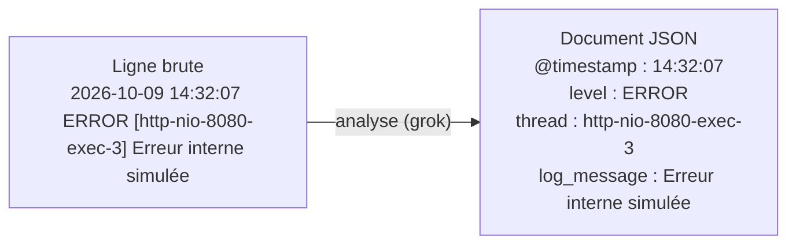
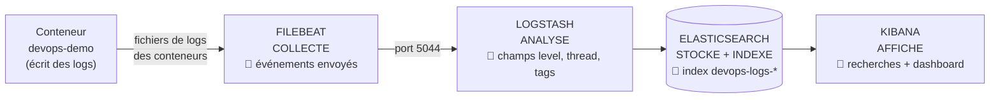
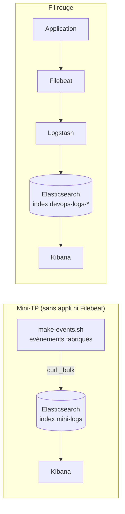
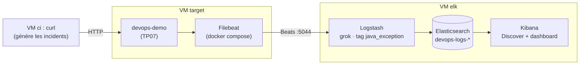

# TP 9 — Centraliser les logs avec ELK (V11)

**Durée : 75 min** · théorie 8 · activité 10 · mini-TP 20 · fil rouge 30 · validation 7 · **VM** : `ci`, `target`, `elk` · **Format** : individuel
*(Couvre les « TP ELK 1 à 8 » : comprendre les logs, collecter, Filebeat/Logstash, Elasticsearch, Kibana, recherche, dashboard, logs du projet.)*

> **Légende** : 🖥️ terminal · 🌐 navigateur · 📝 éditer un fichier · ✅ ce que vous devez voir · ⚠️ si ça ne marche pas · 🎯 livrable · 🎤 consigne formateur
> Adresses : Elasticsearch `http://192.168.56.13:9200` · Kibana `http://192.168.56.13:5601` · application `http://192.168.56.11:8080`. Les commandes se tapent sur `ci` sauf indication contraire.

---

## 0. Où sommes-nous ?

```mermaid
flowchart LR
  V1["V1 App"] --> V2["V2 Git"] --> V3["V3 Maven"] --> V4["V4 Tests"] --> V5["V5 Jenkins CI"] --> V6["V6 Docker"] --> V7["V7 Registre"] --> V8["V8 Ansible"] --> V9["V9 Pipeline CD"] --> V10["V10 K8s"] --> V11["V11 Logs"] --> V12["V12 Monitoring"] --> V13["V13 Selenium"]
  classDef done fill:#c8e6c9,stroke:#2e7d32
  classDef now fill:#ffe082,stroke:#e65100,stroke-width:3px
  classDef todo fill:#eeeeee,stroke:#9e9e9e,color:#757575
  class V1,V2,V3,V4,V5,V6,V7,V8,V9,V10 done
  class V11 now
  class V12,V13 todo
```



## 1. Objectif pédagogique

Comprendre qu'on ne se connecte pas aux serveurs pour lire des logs ; indexer des événements, les rechercher dans Kibana, diagnostiquer des incidents réalistes et construire un tableau de bord.

## 2. Prérequis

TP05 à TP07 (application déployée sur `target`, en conteneur).

---

## 3. Théorie illustrée

### 3.1 Qu'est-ce qu'un log ?

Un log est un **événement daté** : il dit *ce qui s'est passé*. Une simple ligne de texte devient, après analyse, un **document avec des champs** recherchables :



### 3.2 La chaîne ELK : un rôle, un livrable par composant



| Composant | Verbe | Question | 🎯 Livrable |
|---|---|---|---|
| **Filebeat** | Collecter | Où sont les logs ? | Événements acheminés |
| **Logstash** | Analyser | Quels champs ? | Documents structurés |
| **Elasticsearch** | Stocker, indexer | Où chercher vite ? | Index `devops-logs-*` |
| **Kibana** | Afficher | Comment explorer ? | Discover + dashboard |

### 3.3 Le mini-TP raccourcit la chaîne



### 3.4 Pourquoi regrouper une *stack trace* en un seul événement ?

```
SANS regroupement (1 ligne = 1 événement)      AVEC regroupement (multiline)
├─ ERROR Erreur interne                         └─ 1 SEUL événement :
├─   at tn.formation.devops.Controller...            ERROR Erreur interne
├─   at org.springframework...                       at tn.formation.devops.Controller...
└─   at java.base/...                                at org.springframework...
→ 30 « événements » inexploitables                   at java.base/...
```

### 3.5 Aide-mémoire KQL (le langage de recherche de Kibana)

| Je cherche… | Requête KQL |
|---|---|
| les erreurs | `level : "ERROR"` |
| erreurs d'un serveur précis | `level : "ERROR" and service : "web2"` |
| un mot dans le message | `message : *base*` |
| les exceptions Java | `tags : "java_exception"` |
| une requête invalide | `level : "WARN" and "Requête invalide"` |

> **Piège n°1** : « No results » → la **plage de temps** (en haut à droite) est trop courte. Mettez « Last 15 minutes » ou plus.

---

## 4. Problème réel à résoudre

« Une application fonctionne mais les erreurs sont réparties sur plusieurs serveurs. Un client signale un problème survenu à 14 h 32. Il faut ouvrir plusieurs consoles, chercher à la main dans des fichiers énormes, et on ne sait pas si l'incident est isolé ou répété. Comment retrouver rapidement une erreur ? »

---

## 5. Activité de découverte **[N1 Découverte]** (10 min) — « Chercher dans deux fichiers »

### Pas à pas

**Étape 1 — Générer deux fichiers de logs** 🖥️
```bash
cd ~/devops-formation/mini-tp/logs && ./genlogs.sh
```
✅ Deux fichiers `web1.log` et `web2.log` apparaissent (`ls`).
⚠️ `Permission denied` → `chmod +x genlogs.sh` puis recommencer.

**Étape 2 — Compter les erreurs** 🖥️
```bash
grep -c ERROR web1.log web2.log
```
✅ Un nombre d'erreurs par fichier.

**Étape 3 — Lire quelques erreurs** 🖥️
```bash
grep ERROR web1.log | head -3
```

**Chronométrez-vous** pour répondre : quelle **minute** concentre le plus d'erreurs, sur **quel serveur** ? Combien de lignes `WARN` ? Combien de temps pour 2 fichiers de 300 lignes ? Pour 20 serveurs ?

> 🎤 **Formateur** : « 1 minute pour 2 petits fichiers. Avec des millions de lignes sur 20 serveurs, impossible. Il nous faut un moteur de recherche pour les logs. »

---

## 6. Mini-TP **[N2 Application]** (20 min) — « Indexer et chercher »

- **Contexte** : événements fabriqués, **sans** l'application ni Filebeat.
- **Objectif** : envoyer des documents dans Elasticsearch et les interroger dans Kibana.
- **Architecture** : `ci` → API HTTP → Elasticsearch (`elk`) → Kibana.

**Fichier** `mini-tp/logs/make-events.sh` (fourni) : produit 9 événements au format NDJSON (une ligne d'en-tête + une ligne de données par événement).
```bash
#!/usr/bin/env bash
# Produit des événements au format NDJSON (API _bulk d'Elasticsearch), horodatés "maintenant"
now() { date -u -d "-$1 minutes" +%Y-%m-%dT%H:%M:%SZ; }
emit() { printf '{"index":{"_index":"mini-logs"}}\n{"@timestamp":"%s","service":"%s","level":"%s","message":"%s"}\n' "$(now $1)" "$2" "$3" "$4"; }
emit 9 web1 INFO  "Tache creee id=1"
emit 8 web1 INFO  "Tache creee id=2"
emit 7 web2 WARN  "Requete invalide : titre vide"
emit 6 web2 ERROR "Erreur interne : connexion base de donnees refusee"
emit 5 web1 INFO  "Tache supprimee id=1"
emit 4 web2 ERROR "Erreur interne : timeout base de donnees"
emit 3 web1 WARN  "Ressource absente : tache 999"
emit 2 web2 INFO  "Tache creee id=3"
emit 1 web1 ERROR "Erreur interne : NullPointerException"
```
> Les événements sont datés « il y a 1 à 9 minutes » : **cherchez-les dans Kibana sur les 15 dernières minutes**, et faites le TP sans trop traîner.

### Pas à pas

**Étape 1 — Vérifier qu'Elasticsearch répond** 🖥️ (VM `elk` démarrée depuis 2-3 min)
```bash
curl -s http://192.168.56.13:9200 | head -5
```
✅ Un JSON avec le nom du cluster et un numéro de version.
⚠️ `Connection refused` → Elasticsearch démarre encore (il est gourmand) : attendez 1-2 minutes.

**Étape 2 — Fabriquer les événements** 🖥️
```bash
cd ~/devops-formation/mini-tp/logs
./make-events.sh > events.ndjson
cat events.ndjson | head -4
```
✅ Les lignes alternent : en-tête `{"index":...}` puis le document. *(`>` écrit la sortie dans un fichier.)*

**Étape 3 — Les envoyer à Elasticsearch** 🖥️
```bash
curl -s -H 'Content-Type: application/x-ndjson' -XPOST http://192.168.56.13:9200/_bulk --data-binary @events.ndjson | head -c 200
```
✅ Une réponse commençant par `{"took":...,"errors":false,...`.
⚠️ `errors:true` ou erreur 406 → l'en-tête `Content-Type: application/x-ndjson` a été oublié.

**Étape 4 — Interroger en ligne de commande** 🖥️
```bash
curl -s 'http://192.168.56.13:9200/mini-logs/_search?q=level:ERROR&pretty' | head -40
```
✅ `"total" : { "value" : 3 ...` : **3 erreurs**.

**Étape 5 — Créer la « data view » dans Kibana** 🌐 http://192.168.56.13:5601
1. Menu (≡, en haut à gauche) → **Stack Management** → **Data Views** → **Create data view**.
2. **Name** : `mini-logs` · **Index pattern** : `mini-logs` · **Timestamp field** : `@timestamp`.
3. **Save data view to Kibana**.

**Étape 6 — Explorer dans Discover** 🌐
1. Menu → **Discover** → vérifiez la data view `mini-logs` (liste déroulante en haut à gauche).
2. En haut à droite : plage de temps **Last 15 minutes**.
3. ✅ **9 documents** s'affichent.

**Étape 7 — Tester les requêtes KQL** 🌐 (barre de recherche en haut ; **Entrée** pour lancer)

| # | Requête | ✅ Résultat attendu |
|---|---|---|
| 1 | `level : "ERROR"` | 3 documents |
| 2 | `level : "ERROR" and service : "web2"` | 2 documents (connexion refusée, timeout base de données) |
| 3 | `message : *base*` | les 2 problèmes de base de données |

🎯 **Livrable** : un index `mini-logs` interrogeable ; une requête remplace des minutes de `grep`.

### Erreurs fréquentes

| Symptôme | Cause | Remède |
|---|---|---|
| « No results » dans Discover | Plage de temps trop courte (ou événements trop anciens) | Élargir à *Last 1 hour* ; sinon refaire `make-events.sh` + envoi |
| `curl` échoue | Elasticsearch pas prêt | Attendre 2-3 min |
| `errors:true` | En-tête `Content-Type` oublié | Remettre `-H 'Content-Type: application/x-ndjson'` |

---

## 7. Retour pédagogique

- **Appris** : un log devient un document avec des champs ; une requête remplace des heures de `grep` ; l'horodatage permet de corréler plusieurs serveurs.
- **Pourquoi en DevOps** : le diagnostic ne dépend plus de l'accès aux serveurs ; on voit des tendances, pas seulement des lignes.
- **Problème résolu** : recherche dispersée, délai de diagnostic.
- **Limites** : un log ne dit pas *combien* ni *à quelle vitesse* (métriques, TP10) ; stocker beaucoup coûte cher ; un format de log instable casse l'analyse ; ELK est gourmand en mémoire.

---

## 8. Retour au projet fil rouge **[N3 Intégration]** (30 min) — V11

### 8.1 Avancement



### 8.2 Pas à pas

**Étape 1 — Lire la configuration** 📝 (lecture)
```bash
cd ~/devops-formation
cat elk/logstash/pipeline/logstash.conf
cat elk/filebeat/filebeat.yml
```
Dans `logstash.conf`, repérez les 3 blocs : **entrée** (Beats), **filtre** (`grok` qui extrait `level`, `thread`, `log_message` ; tag `java_exception`), **sortie** (index `devops-logs-*`). Dans `filebeat.yml` : la collecte des conteneurs et le **regroupement multi-lignes** des *stack traces*.

**Étape 2 — Démarrer Filebeat sur `target`** 🖥️ (l'application doit tourner : TP07)
```bash
ssh vagrant@192.168.56.11
cd /vagrant/elk/filebeat && docker compose up -d
docker logs filebeat --tail 20
exit
```
✅ Filebeat affiche des lignes de démarrage sans erreur de connexion. *(Prompt `vagrant@target` pendant les 3 commandes, retour sur `ci` après `exit`.)*

**Étape 3 — Provoquer des incidents (depuis `ci`)**

| Scénario | Déclencheur | À chercher dans Kibana |
|---|---|---|
| HTTP 500 | `curl http://192.168.56.11:8080/api/simulate/error` | `level : "ERROR"` |
| Exception Java | idem | `tags : "java_exception"` — **une seule** entrée avec la stack trace complète |
| Requête invalide (400) | `curl -XPOST -H 'Content-Type: application/json' -d '{"title":""}' http://192.168.56.11:8080/api/tasks` | `level : "WARN"` et `Requête invalide` |
| Ressource inconnue (404) | `curl -XDELETE http://192.168.56.11:8080/api/tasks/9999` | `log_message : *introuvable*` |
| Problème de base de données | (pas de BDD dans l'application) | rejouer la recherche `*base*` du mini-TP |
| Temps de réponse élevé | `curl http://192.168.56.11:8080/api/simulate/slow?ms=3000` | **Introuvable dans les logs** : rien n'est écrit ; c'est exactement ce que le TP10 résoudra |

**Étape 4 — Générer du trafic** 🖥️ (pour alimenter le dashboard)
```bash
for i in $(seq 1 40); do curl -s http://192.168.56.11:8080/api/info >/dev/null; curl -s http://192.168.56.11:8080/api/simulate/error >/dev/null; done
```
✅ Aucune sortie (normal) ; 80 requêtes ont été envoyées.

**Étape 5 — Créer la data view `devops-logs-*`** 🌐
Kibana → **Stack Management** → **Data Views** → **Create data view** → Name et pattern `devops-logs-*` → champ temps `@timestamp` → **Save**.
✅ Dans **Discover**, choisissez `devops-logs-*` (plage *Last 15 minutes*) : des documents apparaissent.
⚠️ Aucun document ? Vérifiez `docker logs filebeat` (Étape 2) et la plage de temps.

**Étape 6 — Vérifier l'exception Java en **un seul** document** 🌐
Dans Discover, requête : `tags : "java_exception"` → ouvrez un document (flèche ›) : le champ `message` contient **toute** la stack trace.
✅ Une entrée = une exception complète (preuve du regroupement multi-lignes).

**Étape 7 — Construire le dashboard « Santé de l'application »** 🌐
1. Menu → **Dashboard** → **Create dashboard** → **Create visualization**.
2. Sélectionnez la data view `devops-logs-*`.

*Visualisation 1 — Volume de logs par niveau dans le temps*
- Type : **Bar vertical stacked**.
- Axe horizontal : `@timestamp` · Axe vertical : **Count** · **Break down by** : `level` (ou `level.keyword`).
- **Save and return**.

*Visualisation 2 — Répartition des niveaux (anneau)*
- **Create visualization** → type **Donut** (anneau).
- **Slice by** : `level` · **Size by** : Count → **Save and return**.

*Visualisation 3 — Messages d'erreur les plus fréquents*
- **Create visualization** → type **Bar horizontal** ou **Table**.
- Champ : `log_message.keyword` (**Top values**, 5 à 10) · Mesure : Count.
- Filtre de la visualisation : `level : "ERROR"` → **Save and return**.

3. En haut à droite : **Save** → titre **Santé de l'application** → **Save**.

✅ Le dashboard contient **3 visualisations** avec des données.

**Résultat attendu** : l'index `devops-logs-*` contient des documents ; l'exception Java tient dans un seul document ; le dashboard contient 3 visualisations.

**Pourquoi V11 ?** Avant : les logs restent dans les conteneurs. Après : un point de recherche unique. **Preuve** : l'erreur du 500 retrouvée en quelques secondes dans Kibana.

---

## 9. Validation

1. Quel composant collecte les logs ? Lequel les analyse ? Lequel les stocke ? Lequel les affiche ?
2. Pourquoi regrouper les lignes d'une *stack trace* en un seul événement ?
3. Quelle requête KQL isole les exceptions Java ?
4. **Tâche** : montrez le nombre d'erreurs 500 sur les 15 dernières minutes.
5. Pourquoi l'incident de lenteur n'apparaît-il pas ? Que faudrait-il pour le voir ?

### Corrigé formateur
1. Filebeat collecte · Logstash analyse · Elasticsearch stocke et indexe · Kibana affiche.
2. Sinon chaque ligne devient un « événement » : on perd le sens, on fausse les comptages et la recherche.
3. `tags : "java_exception"`.
4. Discover, data view `devops-logs-*`, plage **Last 15 minutes**, requête `level : "ERROR"` : le nombre de *hits* s'affiche en haut.
5. L'application **n'écrit rien** quand une réponse est lente : un log décrit un événement, pas une durée. Il faut des **métriques** (TP10) ou ajouter le temps de réponse aux logs.

## 10. Extension / challenge

- Créez dans Kibana une **règle d'alerte** : plus de 10 erreurs en 5 minutes.
- Ajoutez dans Logstash un champ `severity_num` calculé à partir de `level`.
- Ajoutez le temps de réponse dans les logs Nginx (`$request_time`) et exploitez-le.

## Glossaire du TP

| Mot | Définition simple |
|---|---|
| **Log** | Événement daté écrit par un programme |
| **Index** | « Table » Elasticsearch où sont rangés les documents |
| **Document** | Un événement structuré en champs (JSON) |
| **Data view** | Déclaration, dans Kibana, d'un index à explorer |
| **KQL** | Langage de recherche de Kibana |
| **Stack trace** | Pile d'appels affichée lors d'une exception Java |
| **Multiline** | Regroupement de plusieurs lignes en un événement |
| **grok** | Motif qui extrait des champs d'une ligne de texte |
