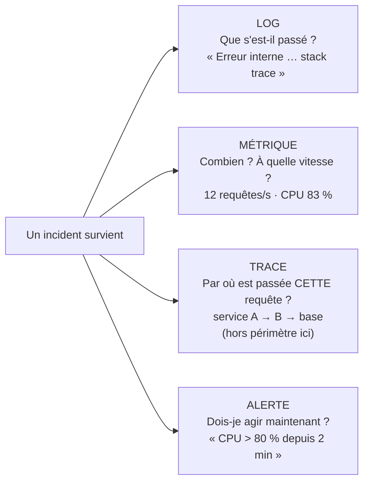
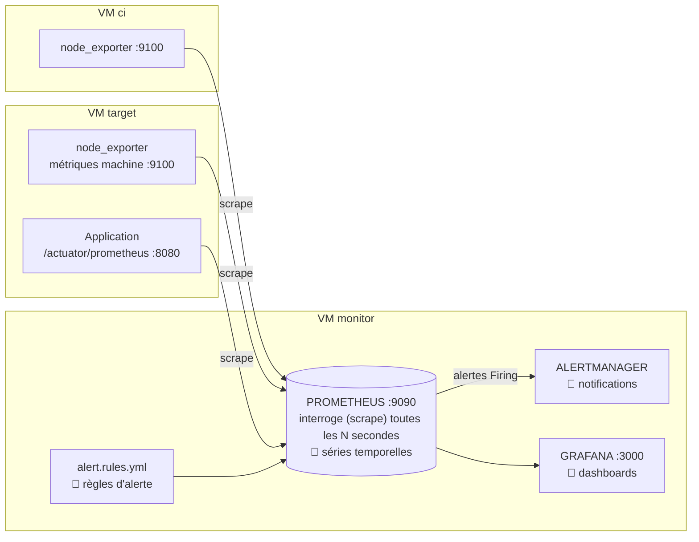
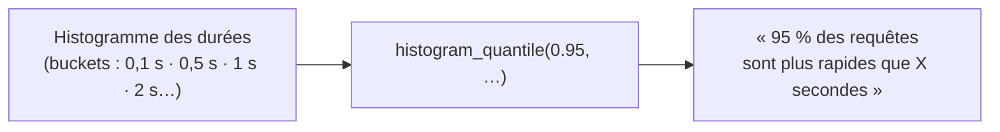
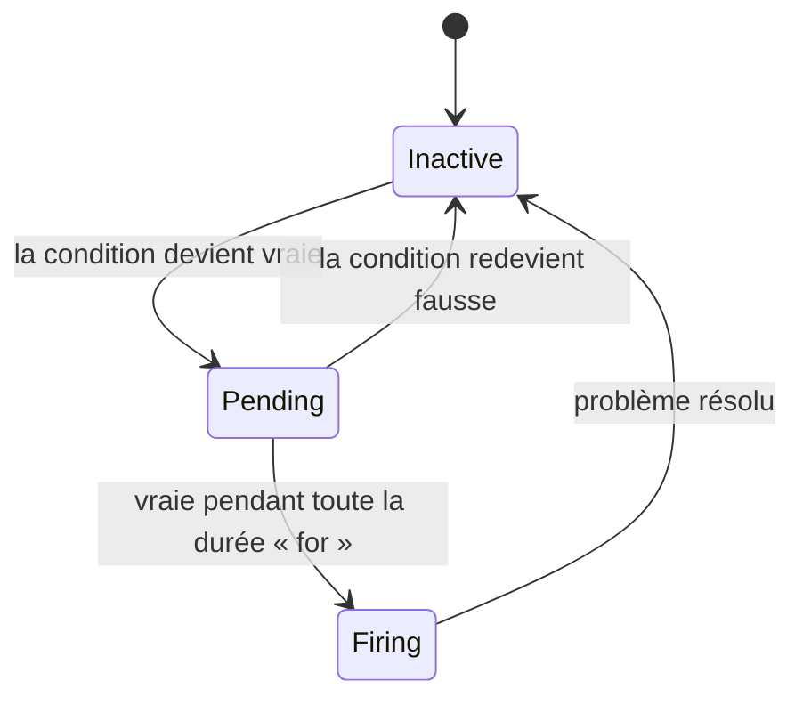
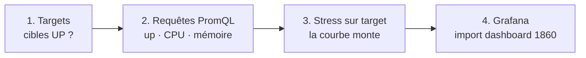
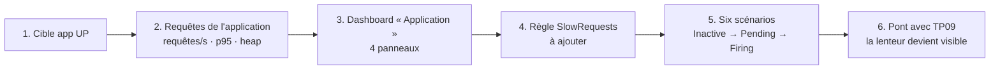

# TP 10 — Superviser avec Prometheus et Grafana (V12)

**Durée : 75 min** · théorie 8 · activité 10 · mini-TP 20 · fil rouge 30 · validation 7 · **VM** : `ci`, `target`, `monitor` · **Format** : individuel
*(Couvre les « TP Monitoring 1 à 7 » : observer CPU/RAM, exporter des métriques, Prometheus, Grafana, dashboard, alertes, monitoring du projet.)*

> **Légende** : 🖥️ terminal · 🌐 navigateur · 📝 éditer un fichier · ✅ ce que vous devez voir · ⚠️ si ça ne marche pas · 🎯 livrable · 🎤 consigne formateur
> Adresses : Prometheus `http://192.168.56.12:9090` · Grafana `http://192.168.56.12:3000` (`admin` / `admin`) · application `http://192.168.56.11:8080`.

---

## 0. Où sommes-nous ?

```mermaid
flowchart LR
  V1["V1 App"] --> V2["V2 Git"] --> V3["V3 Maven"] --> V4["V4 Tests"] --> V5["V5 Jenkins CI"] --> V6["V6 Docker"] --> V7["V7 Registre"] --> V8["V8 Ansible"] --> V9["V9 Pipeline CD"] --> V10["V10 K8s"] --> V11["V11 Logs"] --> V12["V12 Monitoring"] --> V13["V13 Selenium"]
  classDef done fill:#c8e6c9,stroke:#2e7d32
  classDef now fill:#ffe082,stroke:#e65100,stroke-width:3px
  classDef todo fill:#eeeeee,stroke:#9e9e9e,color:#757575
  class V1,V2,V3,V4,V5,V6,V7,V8,V9,V10,V11 done
  class V12 now
  class V13 todo
```



## 1. Objectif pédagogique

Distinguer **log, métrique, trace, alerte** ; interroger des métriques avec PromQL ; construire un dashboard ; déclencher et comprendre une alerte ; superviser l'application fil rouge.

## 2. Prérequis

TP07 (application déployée sur `target`), TP09 (logs).

---

## 3. Théorie illustrée

### 3.1 Log, métrique, trace, alerte : quatre questions différentes



> **Complémentarité** : la **métrique** détecte (« ça va mal »), le **log** explique (« voici pourquoi »).

### 3.2 Architecture de supervision : qui interroge qui ?



**Point clé** : Prometheus **va chercher** les métriques (modèle *pull*) ; les cibles ne font qu'exposer une page `/metrics`.

| Composant | Rôle | 🎯 Livrable |
|---|---|---|
| **node_exporter** | Expose CPU / RAM / disque / réseau de la machine | Page de métriques système |
| **Actuator + Micrometer** | Expose les métriques de l'application | `/actuator/prometheus` |
| **Prometheus** | Collecte et stocke l'historique | Séries temporelles interrogeables (PromQL) |
| **Grafana** | Affiche | Dashboards |
| **Alertmanager** | Notifie | Alertes envoyées |

### 3.3 Compteur et `rate()` : pourquoi un compteur seul ne sert à rien

```
Compteur http_requests_total (ne fait que monter) :
  t=0 → 100   t=1 min → 160   t=2 min → 220   t=3 min → 520   ← pic !

Valeur brute : 100, 160, 220, 520  → on ne voit pas le pic
rate([1m])  : 1,0  1,0  5,0 requêtes/s → le pic saute aux yeux
```
`rate(compteur[1m])` = « **vitesse** moyenne d'augmentation sur la dernière minute ».

### 3.4 La latence p95 en une phrase


Le p95 ignore les 5 % de cas extrêmes et reflète **ce que vit presque tout le monde** : bien plus parlant qu'une moyenne.

### 3.5 Le cycle de vie d'une alerte


`for: 1m` = « ne déclenche que si le problème **dure** » : évite les fausses alertes (fatigue d'alerte).

---

## 4. Problème réel à résoudre

« L'application répond lentement depuis ce matin. Personne ne le sait : ce sont les utilisateurs qui téléphonent. Les logs ne montrent aucune erreur. Comment voir les problèmes **avant** les utilisateurs ? »

---

## 5. Activité de découverte **[N1 Découverte]** (10 min)

### Pas à pas (sur `target`)

**Étape 1 — Se connecter à `target`** 🖥️
```bash
ssh vagrant@192.168.56.11
```
✅ Prompt `vagrant@target`.

**Étape 2 — Regarder l'état de la machine** 🖥️
```bash
top -bn1 | head -5 ; free -m ; df -h /
```
✅ Charge CPU, mémoire (en Mo), espace disque : des chiffres **instantanés**.

**Étape 3 — Regarder le format des métriques de l'application** 🖥️
```bash
curl -s http://localhost:8080/actuator/prometheus | grep -E "^(http_server_requests_seconds_count|jvm_memory_used_bytes)" | head -6
```
✅ Des lignes `nom{étiquettes} valeur` : le **format texte de Prometheus**.

**Étape 4 — Créer de la charge et regarder `top` bouger** 🖥️
```bash
sudo apt-get install -y stress-ng >/dev/null && stress-ng --cpu 2 --timeout 40s &
sleep 5 && top -bn1 | head -5
```
✅ Le CPU monte nettement. *(Le `&` lance `stress-ng` en arrière-plan pendant 40 s.)* Tapez `exit` quand vous avez fini.

### Questions
Où voit-on la charge monter ? Qui regarde `top` à 3 h du matin ? Que contient le format `/actuator/prometheus` ? Comment garder l'historique ?

> 🎤 **Formateur** : « On a des chiffres instantanés ; il manque l'historique et le regard permanent. »

---

## 6. Mini-TP **[N2 Application]** (20 min) — « La machine sous stress »

- **Contexte** : supervision de **machines**, sans l'application.
- **Objectif** : lire des métriques système dans Prometheus et Grafana, provoquer une charge.
- **Architecture** : `node_exporter` (installé sur chaque VM) → Prometheus (`monitor:9090`) → Grafana (`monitor:3000`).



### Pas à pas (VM `monitor` démarrée)

**Étape 1 — Vérifier les cibles** 🌐 http://192.168.56.12:9090
Menu **Status → Targets** (ou *Targets*).
✅ Les cibles du job `node` sont **UP** (vert).
⚠️ `DOWN` (rouge) → la VM est éteinte ou `node_exporter` arrêté.

**Étape 2 — Exécuter trois requêtes PromQL** 🌐 (onglet **Graph**, coller la requête, bouton **Execute**, puis onglet **Graph** pour la courbe)

| # | Requête | Signification |
|---|---|---|
| 1 | `up` | 1 = cible joignable, 0 = injoignable |
| 2 | `100 - (avg by (host) (rate(node_cpu_seconds_total{mode="idle"}[2m])) * 100)` | % de CPU **utilisé** par machine |
| 3 | `(1 - node_memory_MemAvailable_bytes / node_memory_MemTotal_bytes) * 100` | % de mémoire **utilisée** |

✅ `up` vaut **1** pour toutes les cibles ; le CPU des VM est bas (quelques %).

**Étape 3 — Provoquer de la charge sur `target`** 🖥️ (depuis `ci`)
```bash
ssh vagrant@192.168.56.11 "stress-ng --cpu 2 --timeout 240s"
```
Laissez tourner. Dans Prometheus, ré-exécutez la requête 2 (plage **15m**).
✅ La courbe CPU de `target` **monte vers 100 %** pendant 4 min, puis retombe.

**Étape 4 — Importer un dashboard prêt à l'emploi dans Grafana** 🌐 http://192.168.56.12:3000 (`admin` / `admin` ; ignorez la proposition de changer le mot de passe)
1. Menu ≡ → **Dashboards** → **New** → **Import**.
2. Champ « Grafana.com dashboard URL or ID » : **`1860`** → **Load**.
3. **Prometheus** (source de données) : sélectionnez la source dans la liste → **Import**.
4. Repérez le panneau **CPU** de `target` (menu *Host* en haut pour choisir la machine ; plage de temps : *Last 15 minutes*).

✅ CPU, mémoire, disque, réseau : le dashboard « Node Exporter Full » est alimenté.

🎯 **Livrable** : un historique des métriques système, visible dans Prometheus et dans un dashboard Grafana.

### Erreurs fréquentes

| Symptôme | Cause | Remède |
|---|---|---|
| Cible `DOWN` | VM éteinte ou `node_exporter` arrêté | Démarrer la VM / le service |
| Pic invisible dans Grafana | Plage de temps trop large | Choisir *Last 15 minutes* |
| Panneaux « No data » | Source de données non choisie à l'import | Réimporter en choisissant **Prometheus** |

---

## 7. Retour pédagogique

- **Appris** : un compteur seul ne sert à rien ; ce qui compte, c'est son **taux** (`rate`) et sa **tendance** ; Prometheus stocke des séries temporelles ; Grafana les rend lisibles.
- **Pourquoi en DevOps** : détecter, comprendre et prévoir avant la panne ; fournir des preuves après un incident.
- **Problème résolu** : pannes découvertes par les utilisateurs, absence d'historique.
- **Limites** : mauvaise alerte = fatigue d'alerte ; une métrique ne donne pas la cause (il faut revenir aux logs) ; la cardinalité excessive coûte cher.

---

## 8. Retour au projet fil rouge **[N3 Intégration]** (30 min) — V12

### 8.1 Avancement



### 8.2 Pas à pas

**Étape 1 — Vérifier la cible de l'application** 🌐 Prometheus → **Status → Targets**.
✅ Le job **`app`** (`target:8080`) est **UP**.

**Étape 2 — Interroger l'application** 🌐 (Graph → Execute)
```promql
sum(rate(http_server_requests_seconds_count{job="app"}[1m])) by (uri)
histogram_quantile(0.95, sum by (le) (rate(http_server_requests_seconds_bucket{job="app"}[1m])))
jvm_memory_used_bytes{job="app",area="heap"}
```
Pour voir de l'activité, lancez avant : 🖥️ `for i in $(seq 1 50); do curl -s http://192.168.56.11:8080/api/info >/dev/null; done`
✅ 1ʳᵉ requête : une courbe par `uri` ; 2ᵉ : la latence p95 en secondes ; 3ᵉ : la mémoire Java utilisée.

**Étape 3 — Construire le dashboard « Application »** 🌐 Grafana
1. Menu → **Dashboards** → **New** → **New dashboard** → **Add visualization** → source **Prometheus**.
2. Pour **chaque** panneau : collez la requête dans la zone *Query* (mode **Code**), donnez un **Title** (à droite), puis **Back to dashboard** et **Add → Visualization** pour le suivant.

| Panneau | Titre | Requête |
|---|---|---|
| 1 | CPU par VM | `100 - (avg by (host) (rate(node_cpu_seconds_total{mode="idle"}[2m])) * 100)` |
| 2 | Mémoire | `(1 - node_memory_MemAvailable_bytes / node_memory_MemTotal_bytes) * 100` |
| 3 | Requêtes/s de l'application | `sum(rate(http_server_requests_seconds_count{job="app"}[1m])) by (uri)` |
| 4 | Latence p95 | `histogram_quantile(0.95, sum by (le) (rate(http_server_requests_seconds_bucket{job="app"}[1m])))` |

3. Icône **Save dashboard** (disquette) → nom **Application** → **Save**.
*(Option : importer aussi le dashboard JVM `4701`.)*

✅ Point de contrôle : 4 panneaux avec des données (plage *Last 15 minutes*).

**Étape 4 — Lire les règles d'alerte et ajouter `SlowRequests`** 📝
Ouvrez `monitoring/prometheus/alert.rules.yml` et repérez : `InstanceDown`, `HighCpuUsage`, `HighMemoryUsage`, `LowDiskSpace`, `AppDown`, `AppHighErrorRate`. Pour chacune : **quelle condition ? pendant combien de temps (`for`) ?**

**Ajoutez** la règle `SlowRequests` **dans le groupe `application`** (même retrait que les autres règles de ce groupe) :
```yaml
      # À ajouter dans le groupe "application" de monitoring/prometheus/alert.rules.yml
      - alert: SlowRequests
        expr: histogram_quantile(0.95, sum by (le) (rate(http_server_requests_seconds_bucket{job="app"}[1m]))) > 1
        for: 1m
        labels: { severity: warning }
        annotations:
          summary: "Latence p95 > 1 s sur l'application"
```
> Si la VM `monitor` utilise le dossier partagé `/vagrant/monitoring`, **éditez le fichier côté hôte** (le formateur indique où). Attention à l'indentation YAML : espaces uniquement.

**Étape 5 — Recharger Prometheus** 🖥️
```bash
curl -X POST http://192.168.56.12:9090/-/reload
```
✅ Pas de message d'erreur. 🌐 Prometheus → **Alerts** : `SlowRequests` apparaît (état *Inactive*).
⚠️ Elle n'apparaît pas ? vérifiez l'indentation et le groupe, puis relancez le `reload`.

**Étape 6 — Jouer les scénarios** (chacun se suit dans 🌐 **Alerts** : *Inactive → Pending → Firing*)

| Scénario | Déclenchement | Alerte attendue |
|---|---|---|
| CPU élevé | `ssh vagrant@192.168.56.11 "stress-ng --cpu 2 --timeout 300s"` | `HighCpuUsage` |
| Mémoire élevée | `ssh vagrant@192.168.56.11 "stress-ng --vm 1 --vm-bytes 92% --timeout 240s"` *(risque : arrêt du processus par le noyau, sans danger)* | `HighMemoryUsage` |
| Application indisponible | `ssh vagrant@192.168.56.11 "docker stop devops-demo"` | `AppDown` (30 s) |
| Nombre de requêtes élevé | `while true; do curl -s http://192.168.56.11:8080/api/info >/dev/null; done` (plusieurs terminaux) | pic sur le panneau « requêtes/s » |
| Erreurs 5xx | `while true; do curl -s http://192.168.56.11:8080/api/simulate/error >/dev/null; sleep 0.5; done` | `AppHighErrorRate` |
| Temps de réponse élevé | `while true; do curl -s "http://192.168.56.11:8080/api/simulate/slow?ms=2000" >/dev/null; done` | `SlowRequests` |

**Mode d'emploi pour chaque scénario** : (1) lancez le déclencheur ; (2) rafraîchissez **Alerts** toutes les 15-30 s ; (3) notez le moment de passage *Pending* puis *Firing* ; (4) arrêtez le déclencheur (`Ctrl+C`) ; (5) vérifiez le retour à *Inactive*.
Après chaque scénario : `ssh vagrant@192.168.56.11 "docker start devops-demo"` **si nécessaire** (après `AppDown`).

**Étape 7 — Pont avec le TP09** : le scénario « temps de réponse élevé », **invisible dans les logs**, est maintenant visible dans le panneau latence p95 et dans l'alerte `SlowRequests`.

**Résultat attendu** : dashboard à 4 panneaux avec données ; `AppDown` et `HighCpuUsage` passent à *Firing* puis disparaissent après correction ; `SlowRequests` est chargée.

**Pourquoi V12 ?** Avant : on découvre les pannes par les utilisateurs. Après : on les voit venir. **Preuve** : une alerte *Firing* avant tout appel utilisateur.

---

## 9. Validation

1. Citez une question à laquelle répond un log et une à laquelle répond une métrique.
2. Que fait `rate(...[1m])` ?
3. Pourquoi `for: 1m` dans une règle d'alerte ?
4. **Tâche** : provoquez `AppDown` puis montrez-la en *Firing* dans Prometheus.
5. Quelle donnée utilisez-vous pour trouver la **cause** d'une alerte 5xx ?

### Corrigé formateur
1. Log : « que s'est-il passé ? » ; métrique : « combien / à quelle vitesse ? ».
2. Calcule la **vitesse moyenne d'augmentation** d'un compteur sur la dernière minute (requêtes par seconde).
3. Pour que l'alerte ne se déclenche que si le problème **dure** (évite les fausses alertes ponctuelles).
4. `docker stop devops-demo` sur `target`, attendre ~30 s, ouvrir **Alerts** : `AppDown` en *Firing* ; puis `docker start devops-demo`.
5. Les **logs**, dans Kibana (`level : "ERROR"`, `tags : "java_exception"`).

## 10. Extension / challenge

- Configurez un récepteur **webhook** dans `monitoring/prometheus/alertmanager.yml`.
- Exportez votre dashboard en JSON et provisionnez-le automatiquement dans `grafana/provisioning`.
- Ajoutez le job `app-k8s` (préparé en commentaire dans `prometheus.yml`) pour superviser l'application sur Kubernetes.

## Glossaire du TP

| Mot | Définition simple |
|---|---|
| **Métrique** | Mesure chiffrée qui évolue dans le temps |
| **Scrape** | Prometheus va lire la page `/metrics` d'une cible |
| **Exporter** | Programme qui expose des métriques (node_exporter) |
| **PromQL** | Langage de requêtes de Prometheus |
| **rate()** | Vitesse d'augmentation d'un compteur |
| **p95** | 95 % des valeurs sont inférieures à ce seuil |
| **Alerte (Pending / Firing)** | Condition vraie mais pas encore durable / durablement vraie |
| **Fatigue d'alerte** | Trop de fausses alertes : on cesse de les lire |
