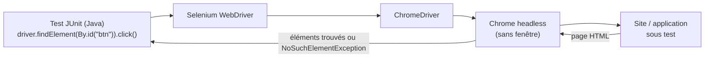
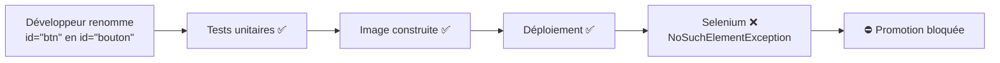
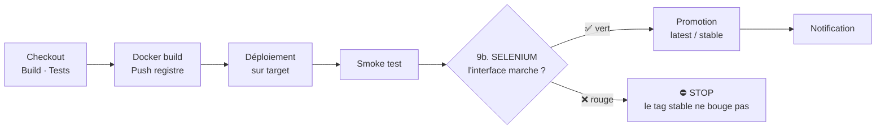
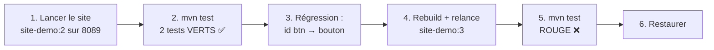
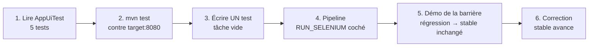

# TP 11 — Tests fonctionnels Selenium et barrière qualité (V13)

**Durée : 45 min** · théorie 5 · activité 5 · mini-TP 10 · fil rouge 20 · validation 5 · **VM** : `ci`, `target` · **Format** : individuel
*(Si le groupe a du retard : mini-TP en démonstration formateur, fil rouge conservé. Progression test manuel → unitaire → intégration → API → fonctionnel, vue dans les TP02, TP07 et ici.)*

> **Légende** : 🖥️ terminal · 🌐 navigateur · 📝 éditer un fichier · ✅ ce que vous devez voir · ⚠️ si ça ne marche pas · 🎯 livrable · 🎤 consigne formateur
> Rappel : Jenkins `http://192.168.56.10:8080` · application `http://192.168.56.11:8080` · registre `192.168.56.10:5000`.

---

## 0. Où sommes-nous ?

```mermaid
flowchart LR
  V1["V1 App"] --> V2["V2 Git"] --> V3["V3 Maven"] --> V4["V4 Tests"] --> V5["V5 Jenkins CI"] --> V6["V6 Docker"] --> V7["V7 Registre"] --> V8["V8 Ansible"] --> V9["V9 Pipeline CD"] --> V10["V10 K8s"] --> V11["V11 Logs"] --> V12["V12 Monitoring"] --> V13["V13 Selenium"]
  classDef done fill:#c8e6c9,stroke:#2e7d32
  classDef now fill:#ffe082,stroke:#e65100,stroke-width:3px
  classDef todo fill:#eeeeee,stroke:#9e9e9e,color:#757575
  class V1,V2,V3,V4,V5,V6,V7,V8,V9,V10,V11,V12 done
  class V13 now
```



## 1. Objectif pédagogique

Comprendre qu'un test fonctionnel simule un utilisateur dans un navigateur ; l'intégrer au pipeline pour **bloquer la promotion** d'une version qui casse l'interface.

## 2. Prérequis

TP07 (pipeline `Jenkinsfile.final`, application déployée sur `target`).

---

## 3. Théorie illustrée

### 3.1 La pyramide des tests, complétée

```
            /\
           /UI\          Selenium : ce que VOIT l'utilisateur
          /----\         peu de tests · lents · fragiles · sur l'appli DÉPLOYÉE
         / API  \        TaskControllerTest : requêtes HTTP (TP02)
        /--------\
       / Unitaires\      TaskServiceTest : beaucoup · très rapides
      /------------\
```

| Niveau | Vérifie | Où et quand | Vitesse |
|---|---|---|---|
| Unitaire | une fonction isolée | build Maven (avant l'image) | ⚡⚡⚡ |
| Intégration / API | le code derrière HTTP | build Maven | ⚡⚡ |
| **Fonctionnel (Selenium)** | **l'interface réelle** | **après déploiement** | 🐢 |

### 3.2 Comment Selenium « pilote » un navigateur


- **Localisateur** (`By.id`, `By.cssSelector`) : « quel élément de la page ? »
- **Attente explicite** (`WebDriverWait`) : « attends que ce texte apparaisse », au lieu de deviner un délai.
- **Headless** : Chrome fonctionne **sans écran** (indispensable sur un serveur).

### 3.3 Le test fragile : un identifiant renommé casse tout



### 3.4 La barrière qualité dans le pipeline


**Pourquoi après le déploiement ?** Selenium teste l'application **réellement en ligne**, pas du code isolé.

### 3.5 Outils et livrables

| Outil | Rôle | 🎯 Livrable |
|---|---|---|
| **Selenium** | Simule un utilisateur | Verdict vert / rouge par parcours |
| **JUnit + Maven** | Exécutent les tests | Rapports Surefire |
| **Jenkins (stage 9b)** | Bloque la promotion si rouge | Build rouge · tag `stable` **inchangé** |

---

## 4. Problème réel à résoudre

« Un développeur renomme un champ de l'interface. Les tests unitaires passent, l'image se construit, le déploiement réussit… mais la page n'a plus de bouton qui fonctionne. L'utilisateur le découvre avant l'équipe. »

---

## 5. Activité de découverte **[N1 Découverte]** (5 min)

### Pas à pas
1. 🌐 Ouvrez http://192.168.56.11:8080.
2. **Chronomètre en main**, vérifiez **à la main** les 4 parcours : (1) le **titre** s'affiche ; (2) **ajouter** une tâche ; (3) la **terminer** ; (4) la **supprimer**.
3. Notez votre temps. Multipliez par **20 livraisons par semaine** et **3 navigateurs**.

> 🎤 **Formateur** : « Répétitif, ennuyeux, donc oublié. Selenium sait faire ces 4 parcours pour nous. »

---

## 6. Mini-TP **[N2 Application]** (10 min) — « Un robot devant le site »

- **Contexte** : le site `site-demo` (TP04), sans l'application.
- **Objectif** : exécuter un test Selenium, puis le faire échouer par une régression.
- **Architecture** : test Selenium (`ci`) → Chrome headless → site Nginx sur le port 8089.



**Fichier** `mini-tp/selenium/src/test/java/tn/formation/selenium/SiteDemoTest.java` (fourni)
```java
package tn.formation.selenium;

import static org.junit.jupiter.api.Assertions.assertTrue;

import java.time.Duration;

import org.junit.jupiter.api.AfterAll;
import org.junit.jupiter.api.BeforeAll;
import org.junit.jupiter.api.Test;
import org.openqa.selenium.By;
import org.openqa.selenium.WebDriver;
import org.openqa.selenium.chrome.ChromeDriver;
import org.openqa.selenium.chrome.ChromeOptions;
import org.openqa.selenium.support.ui.ExpectedConditions;
import org.openqa.selenium.support.ui.WebDriverWait;

/** Mini-TP Selenium : mvn test -Dsite.url=http://localhost:8089 */
class SiteDemoTest {

    private static final String URL = System.getProperty("site.url", "http://localhost:8089");
    private static WebDriver driver;

    @BeforeAll
    static void setUp() {
        ChromeOptions o = new ChromeOptions();
        o.addArguments("--headless=new", "--no-sandbox", "--disable-dev-shm-usage");
        driver = new ChromeDriver(o);
    }

    @AfterAll
    static void tearDown() {
        if (driver != null) driver.quit();
    }

    @Test
    void lePageAUnTitre() {
        driver.get(URL);
        assertTrue(driver.findElement(By.id("titre")).getText().contains("Site démo"));
    }

    @Test
    void leBoutonAfficheUnMessage() {
        driver.get(URL);
        driver.findElement(By.id("btn")).click();
        new WebDriverWait(driver, Duration.ofSeconds(5)).until(
                ExpectedConditions.textToBe(By.id("message"), "Bonjour DevOps !"));
    }
}
```

### Comment lire ce test

| Morceau | Rôle |
|---|---|
| `@BeforeAll setUp` | Démarre Chrome **headless** une fois avant les tests |
| `@AfterAll tearDown` | Ferme le navigateur à la fin |
| `driver.get(URL)` | Ouvre la page |
| `By.id("titre")` | Localisateur : l'élément `id="titre"` du HTML |
| `.click()` | Clique sur le bouton |
| `WebDriverWait … textToBe` | Attend (max 5 s) que `#message` affiche « Bonjour DevOps ! » |

### Pas à pas

**Étape 1 — Lancer le site à tester** 🖥️
```bash
docker rm -f site 2>/dev/null; docker run -d --name site -p 8089:80 site-demo:2     # ou site-demo:1
curl -s localhost:8089 | grep titre
```
✅ Une ligne contenant `id="titre"`.

**Étape 2 — Lancer les tests Selenium** 🖥️
```bash
cd ~/devops-formation/mini-tp/selenium
mvn -B test -Dsite.url=http://localhost:8089
```
✅ `Tests run: 2, Failures: 0` · `BUILD SUCCESS`. (Le premier lancement télécharge le pilote Chrome : patientez.)

**Étape 3 — Introduire une régression (le « développeur » renomme l'identifiant)** 🖥️
```bash
cd ../site-demo && sed -i 's/id="btn"/id="bouton"/' index.html
grep -n bouton index.html
```
✅ La ligne du bouton contient maintenant `id="bouton"`.

**Étape 4 — Reconstruire et relancer le site cassé** 🖥️
```bash
docker build -t site-demo:3 . && docker rm -f site && docker run -d --name site -p 8089:80 site-demo:3
```

**Étape 5 — Relancer les tests : ils doivent échouer** 🖥️
```bash
cd ../selenium && mvn -B test -Dsite.url=http://localhost:8089
```
✅ **ROUGE** : `leBoutonAfficheUnMessage` en erreur :
```
no such element: Unable to locate element: {"method":"css selector","selector":"[id="btn"]"}
```
> Le test a **détecté** que le bouton n'existe plus sous l'identifiant attendu : exactement la régression que personne n'avait vue.

**Étape 6 — Restaurer** 🖥️
```bash
git checkout ../site-demo/index.html
docker rm -f site
```

🎯 **Livrable** : la preuve qu'un test fonctionnel **repère** une régression d'interface invisible aux tests unitaires.

### Erreurs fréquentes

| Symptôme | Cause | Remède |
|---|---|---|
| `session not created` | Chrome absent ou pilote non téléchargé | `google-chrome --version` ; vérifier l'accès Internet |
| `connection refused` / page introuvable | Mauvais port ou site arrêté | `docker ps` ; vérifier `-Dsite.url` |
| Les tests restent verts alors qu'on a cassé | Ancien conteneur toujours actif | `docker rm -f site` puis relancer la **nouvelle** image |

---

## 7. Retour pédagogique

- **Appris** : localisateurs (`By.id`), attentes explicites (`WebDriverWait`), mode *headless*.
- **Pourquoi en DevOps** : dernière barrière avant la promotion ; l'automatisation protège contre les régressions d'interface.
- **Problème résolu** : régressions visibles seulement par l'utilisateur.
- **Limites** : lent, fragile (un identifiant modifié casse tout), coûteux à maintenir ; ne remplace pas les tests unitaires (pyramide des tests).

---

## 8. Retour au projet fil rouge **[N3 Intégration]** (20 min) — V13

### 8.1 Avancement



### 8.2 Pas à pas

**Étape 1 — Lire les tests de l'application** 📝
```bash
cd ~/devops-formation/selenium-tests
cat src/test/java/tn/formation/selenium/AppUiTest.java
```
Repérez les **5 tests** : titre, ajout + terminaison, suppression, santé, `/api/info`. Pour chacun, notez le **localisateur** (`By.id(...)`) utilisé.

**Étape 2 — Les exécuter contre l'environnement de test** 🖥️
```bash
mvn -B test -Dapp.url=http://192.168.56.11:8080
```
✅ `Tests run: 5, Failures: 0` · `BUILD SUCCESS`.

**Étape 3 — Écrire un test : « ajouter une tâche vide ne crée aucune ligne »** 📝
Ouvrez `AppUiTest.java` (`nano …`) et ajoutez, **avant la dernière `}`**, un test construit sur ce squelette (reprenez les **noms exacts** du `driver`, de l'URL et des identifiants utilisés par le test d'ajout existant) :
```java
@Test
void ajouterTacheVideNeCreeRien() throws InterruptedException {
    driver.get(BASE_URL);                                   // adaptez au nom utilisé dans le fichier
    int avant = driver.findElements(By.cssSelector("#task-list li")).size();
    driver.findElement(By.id("ID_DU_BOUTON_AJOUT")).click(); // clic SANS rien saisir (reprendre l'id du test d'ajout)
    Thread.sleep(500);                                      // laisse le temps à la page de réagir
    int apres = driver.findElements(By.cssSelector("#task-list li")).size();
    org.junit.jupiter.api.Assertions.assertEquals(avant, apres);
}
```
Puis `mvn -B test -Dapp.url=http://192.168.56.11:8080`.
✅ `Tests run: 6, Failures: 0`.
> `findElements` (au pluriel) renvoie une **liste**, ce qui permet de **compter** les `<li>` avant et après.

**Étape 4 — Lancer le pipeline avec Selenium** 🌐
Jenkins → job `devops-final` → **Build with Parameters** → cochez **`RUN_SELENIUM`** → Build.
✅ Dans la *Stage View*, le stage **9b** (Selenium) s'exécute **après** le smoke test et **avant** la promotion `latest`/`stable`. Build **vert**.

**Étape 5 — Démontrer la barrière qualité** 🖥️ puis 🌐
1. Notez l'état actuel de `stable` : `curl -s http://192.168.56.10:5000/v2/devops-demo/tags/list`
2. Créez une branche : `git switch -c feature/regression-ui`
3. Dans `app/src/main/resources/templates/index.html`, **renommez** `id="page-title"` en `id="titre"` :
   ```bash
   sed -i 's/id="page-title"/id="titre"/' app/src/main/resources/templates/index.html
   git commit -am "Renomme le titre (régression)" && git push -u origin feature/regression-ui
   ```
4. Fusionnez (PR) et lancez `devops-final` avec **`RUN_SELENIUM` coché**.
5. ✅ Le pipeline **échoue au stage 9b** ; le stage **Promotion n'est pas exécuté** ; `stable` ne bouge pas :
   ```bash
   curl -s http://192.168.56.10:5000/v2/devops-demo/tags/list
   ```
   Comparez avec l'état noté au point 1 : **le tag `stable` est inchangé**.

**Étape 6 — Corriger** 🖥️
Remettez `id="page-title"` (ou corrigez le test), poussez, relancez.
✅ Le pipeline **repasse au vert** et `stable` **avance**.

**Pipeline obtenu** : `… → Déploiement → Smoke test → Selenium → Promotion (latest/stable)`.
**Résultat attendu** : une régression d'interface bloque la promotion ; la correction la débloque.

**Pourquoi V13 ?** Avant : une régression visuelle arrive jusqu'à `stable`. Après : elle est arrêtée par la machine. **Preuve** : tag `stable` inchangé après un build rouge.

---

## 9. Validation

1. Quelle différence entre un test d'intégration (MockMvc) et un test Selenium ?
2. Pourquoi Selenium s'exécute-t-il **après** le déploiement ?
3. À quoi sert `WebDriverWait` ?
4. **Tâche** : montrez qu'un build rouge Selenium n'a pas déplacé le tag `stable`.

### Corrigé formateur
1. MockMvc teste le **code derrière HTTP** sans navigateur, très vite, avant l'image ; Selenium pilote un **vrai navigateur** sur l'application **déployée** et vérifie ce que voit l'utilisateur.
2. Il faut une application **réellement en ligne** à tester ; avant le déploiement il n'y a rien à ouvrir dans un navigateur.
3. À **attendre explicitement** qu'une condition soit vraie (élément visible, texte affiché) au lieu de deviner un délai : tests plus stables.
4. Lister les tags du registre avant et après le build rouge : `stable` pointe toujours vers la même version (`curl .../v2/devops-demo/tags/list`).

## 10. Extension / challenge

- Capturez une copie d'écran en cas d'échec (`TakesScreenshot`) et archivez-la dans Jenkins.
- Exécutez les tests sur plusieurs navigateurs (Selenium Grid) ou en parallèle.

## Glossaire du TP

| Mot | Définition simple |
|---|---|
| **Test fonctionnel** | Test qui simule un utilisateur devant l'interface |
| **Selenium WebDriver** | Bibliothèque qui pilote un navigateur par programme |
| **Localisateur** | Moyen de désigner un élément de la page (`By.id`) |
| **Headless** | Navigateur sans fenêtre, utilisable sur un serveur |
| **WebDriverWait** | Attente explicite d'une condition |
| **Barrière qualité** | Étape qui bloque la promotion si elle échoue |
| **Promotion** | Marquer une version validée (`latest`, `stable`) |
